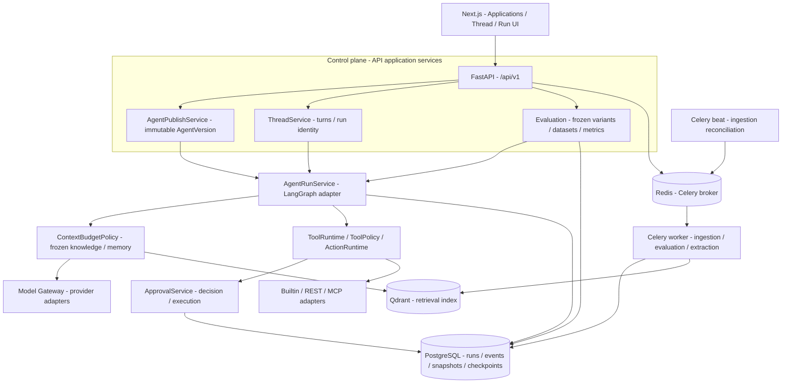

# AgentHub

**Enterprise Agent Runtime & Control Plane** — 一个围绕工具执行、人工审批与可复现评测构建的 Agent 工程项目。

AgentHub 让一次请求经历上下文准备、模型推理、工具治理、持久审批和执行观测。模型提出操作，运行时决定是否执行；审批等待与恢复共享同一 Run，历史配置、知识和记忆输入可追溯。

架构是 **Modular Monolith + Worker**：Next.js、FastAPI、LangGraph 适配器、PostgreSQL、Redis 和 Qdrant。Enterprise 描述治理场景；真实企业生产规模和完整公网部署尚未证明。功能开发已收口。

[核心 Demo](docs/report/07-现场演示脚本.md) · [架构与运行生命周期](docs/architecture.md) · [求职与面试](docs/portfolio/README.md) · [代码学习](docs/learning/README.md) · [证据与边界](docs/current-state.md)

## Why AgentHub

| 执行中遇到的问题 | 本项目的处理 |
| --- | --- |
| 模型提出危险工具操作，谁决定能否执行？ | 发布 ToolRevision + ToolPolicy；READ/WRITE 与风险分开，READ + NEVER 才自动执行，其余进入审批 |
| 长时间等待审批，服务重启后怎么继续？ | PostgreSQL checkpoint、独立审批决策/执行状态、same-run resume，计数预算不重置 |
| 配置与知识变化后如何解释历史结果？ | 不可变 AgentVersion 和规范哈希；Run 保存有效知识/Memory 快照，正式实验冻结输入身份 |
| 如何知道一次修改是否有效？ | Run steps / 生命周期事件 / 脱敏 trace；发布数据集、成对比较、消融、独立指标与失败记录 |

## Architecture Overview



模块箭头是职责/数据流，不表示独立微服务。Knowledge 经适配器检索 Qdrant 并校验 PostgreSQL 快照；Memory 从 PostgreSQL 加载。Redis 不承载审批权威状态。[第二张图：治理执行与恢复](docs/architecture.md#governed-agent-run-lifecycle)。

## Key Engineering Decisions

| 设计 | 为什么这样做 | 代码入口 |
| --- | --- | --- |
| Immutable AgentVersion | 发布后规格不可变；LATEST 是绑定策略，有效知识另冻结到 Run/实验 | [publish](packages/agent_runtime/publish.py) |
| Governed Tool Runtime | 模型只能提议工具；发布修订、参数校验和策略决定执行 | [policy](packages/tools/policy.py)、[runtime](packages/tools/runtime.py) |
| Durable Approval & Resume | 决策与动作执行分开持久化；批准不等于动作成功 | [approvals](packages/approvals/service.py)、[resume](packages/agent_runtime/runtime.py) |
| Side-effect Safety | 逻辑身份约束重复执行；已派发但无法确认的写入标记 UNKNOWN_OUTCOME → NEEDS_ATTENTION | [actions](packages/tools/actions.py)、[MCP](packages/mcp/runtime.py) |
| Context Budget & Snapshot | 所有模型上下文经预算准入，历史知识/记忆校验冻结身份 | [context_budget](packages/agent_runtime/context_budget.py) |
| Knowledge / RAG | 修订与快照保留、异步入库恢复、Dense/Hybrid、固定引用与有界分片预览 | [knowledge](packages/knowledge) |
| Run Observability | Run 详情/步骤、持久生命周期事件与脱敏 trace，各自职责分开 | [event_store](packages/agent_runtime/event_store.py) |
| Evaluation & Evidence | 发布数据集/holdout 暴露、实验冻结、成对/消融与门禁，保留失败而非只展示成功 | [evaluation](packages/evaluation) |

共享 Memory 默认关闭，提供异步抽取、去重、停用/启用、快照与 UNTRUSTED 准入。精确引文不能证明应写入共享记忆；相关性与冲突质量仍有不足，见下方证据。

## Applications

Research（文献证据）、Incident（调查与受控回滚）、Data Analyst（只读分析）、Customer Support（政策与受控工单）共用 Thread / Turn / Artifact / Runtime。每个应用提供 prompt、工具与产物投影；审批与运行预算由共同运行时处理。

## Hero Demo：调查 → 提议回滚 → 审批 → 同一 Run 恢复

[5–8 分钟演示脚本](docs/report/07-现场演示脚本.md)使用仓库 Ops MCP 固定数据与回滚模拟，不连接生产部署系统。包含隔离环境、MCP 导入/工具策略、数据库与事件检查、失败排查和代码入口。

本轮状态：**DOCUMENTED_ONLY**（已核对源码与历史证据，未重新启动服务/调用模型）。模型工具顺序与次数不保证；审批与执行结果以实际 Run 为准。[既有真实截图](docs/report/18-截图演示.md)保留原时点，不当作本轮运行结果。

## Engineering Evidence

| 证据 | 已验证内容与限制 |
| --- | --- |
| [基线 CI](https://github.com/lijihao-0804/AgentHub/actions/runs/37327384930) | `a12e8abf7e1f55d07fe6429d5a618737f782efe0` success；不是后续文档提交的 CI 声明 |
| [持久审批验收](docs/reviews/post-M5-independent-review-closure.md) | PostgreSQL/checkpoint、并发与 crash 窗口的历史集成证据；不能泛化为跨机 exactly-once |
| [正式客服评测](docs/reviews/AgentHub-面试增强M-I3-M-I4验收报告-20261003.md) | 60 条合成任务、两个变体各三次；HOLDOUT 业务 47/60→60/60，结合助手语义 41/60→57/60；非线上成功率/真人一致性 |
| [RAG / 安全 / 故障 / 负载](docs/reviews/AgentHub-面试增强M-I3-M-I4验收报告-20261003.md) | 24 DEV 问题、144 次检索生成；最终目标召回两策略均 72/72。含隔离/注入/worker crash/重连/1、4、8 并发受控负载，非资源饱和容量 |
| [Memory 质量收口](docs/reviews/AgentHub-closure-memory-quality-20261005.md) | 11 确定性场景，强制候选 Write precision 6/9，禁止召回 5/8；脚本任务 10/10 不是 LLM 成功率，复杂真实 USE 未测 |
| [前端排版](docs/reviews/AgentHub-前端文字排版修正报告-20261003.md)、[快照预览/复制](docs/reviews/AgentHub-前端补缺批次一验收报告-20261003.md) | 专项浏览器与脚本证据，非所有交互持续 E2E |

已实现不等于本轮复测、正式里程碑验收或生产可用。历史记录固定各自 SHA，不汇总成“当前测试覆盖率”。

## Known Limits

未完成项已归档延期：逐轮参数、新派生草稿/关系、完整 Dashboard、成员邀请/角色 UI、Memory TTL/衰减/容量清理、自动副作用对账、M8 公网部署。M7-G UI 存在，不补造独立验收记录。Memory 冲突事实可共存，临时/私人/恶意语义拒写仍依赖 prompt。

[当前状态与证据口径](docs/current-state.md)区分已验证、未知和延期；真实企业收益、长期大规模 Memory、跨机故障与全面 E2E 未证明。**FEATURE DEVELOPMENT: STOP**。

## Quick Start & Documentation

- 最小展示：阅读 [Demo](docs/report/07-现场演示脚本.md)与历史截图、运行源码走读，无需模型密钥。
- 本机业务运行：以下完整依赖启动；模型凭据、发布 Agent、工具导入仍须配置。
- Hero Demo：独立 lab 数据库/Redis namespace/blob、显式 checkpoint bootstrap、Ops MCP 与有效工具调用模型；不自动建立所有配置。
- CI：工作流使用自己的集成依赖，见 [workflow](.github/workflows/ci.yml)，与付费业务实验分开。
- 真实模型验证：已有冻结证据，复现可能产生费用，本轮不重复。

[文档导航](docs/README.md) · [架构](docs/architecture.md) · [求职材料](docs/portfolio/README.md) · [学习顺序](docs/learning/README.md) · [验收索引](docs/reviews/README.md)

## 本地启动

需要 Python 3.12、uv、Node.js 20+、Git；以下使用 Docker 提供 PostgreSQL、Redis、Qdrant、API 和 worker，Web 在本机运行。

```powershell
Copy-Item .env.example .env
uv sync --locked
```

编辑 `.env`：设置自己的 `AGENTHUB_AUTH_JWT_SECRET`，并添加 `AGENTHUB_CREDENTIAL_MASTER_KEY`。
Docker 环境需要有效密钥；API 与 worker 必须使用相同凭据主密钥。可分别用以下命令生成并保存到本机 `.env`：

```powershell
uv run --locked python -c "import secrets; print(secrets.token_urlsafe(48))"
uv run --locked python -c "from cryptography.fernet import Fernet; print(Fernet.generate_key().decode())"
```

```powershell
docker compose up -d postgres redis qdrant
uv run --locked alembic upgrade head
uv run --locked python -m scripts.bootstrap_langgraph_checkpoint
docker compose up -d --build api worker beat

cd apps/web
npm ci --no-audit --no-fund
npm run dev
```

打开 `http://localhost:3000`，通过登录/注册界面进入工作区，配置供应商凭据和模型档案后发布 Agent。
访问令牌仅存于前端内存；页面已有 Auth UI，不需要手动粘贴 Bearer token。
API 为 `http://localhost:8000`，OpenAPI 在 `/docs`；健康入口为 `/api/v1/health`、`/api/v1/ready`、`/api/v1/dependencies`。

Web 的 `/api/...` 同源代理默认转发至 `http://127.0.0.1:8000`；其他端口使用服务端变量
`AGENTHUB_API_PROXY_TARGET`。原生 Windows API 使用持久 checkpoint 时需要兼容 psycopg 的 Selector 事件循环；
上面的 Linux 容器 API 避开该平台差异。数据库迁移与 checkpoint bootstrap 是显式部署步骤，不由 API 自动执行。

首次 RAG 会加载 BGE-M3/重排权重；Compose 已启用进程预热和持久缓存，下载/加载时间与环境有关。
`uv sync --locked` 使用仓库的 PyTorch 平台配置（Windows CUDA / Linux CPU）；不要复用其他 Python 环境的 wheel。
容器真机链路已有记录，完整公网部署验收仍未完成。

## 开发检查

按实际改动选择检查，不要求重跑历史付费实验：

```powershell
uv run --locked ruff check .
uv run --locked pytest -m "not integration"
node scripts/test_web_review.cjs
node scripts/test_stream_timing.cjs
cd apps/web
npm run build
```

PostgreSQL 集成测试使用独立、已迁移的 `AGENTHUB_TEST_DATABASE_URL`；持久审批测试还需该测试库的显式 checkpoint bootstrap。
Memory 小探针入口为 `python -m benchmarks.evaluation.memory_quality.runner`，只用于隔离测试库，默认模型费用为零；
证据与复现说明见 [评测索引](docs/benchmark/README.md)。仅修改文档时检查链接、路径和 diff，无须重跑模型或浏览器矩阵。

## 工程约束

依赖方向：`Transport/API → Application → Domain/Contracts → Adapters`。
框架隐藏在适配器之后；版本/知识/数据的不可变身份有规范哈希；租户与内容权限分开校验；
工具和记忆作为不可信证据；未确认的外部写入不静默重试；历史修订与运行证据保留。
完整规则见 [AGENTS.md](AGENTS.md) 与 [产品/语义总计划](plan/plan.md)。
