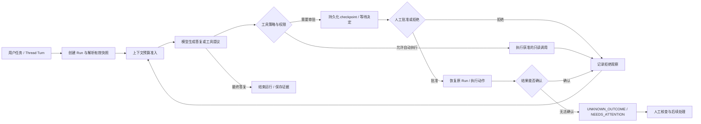
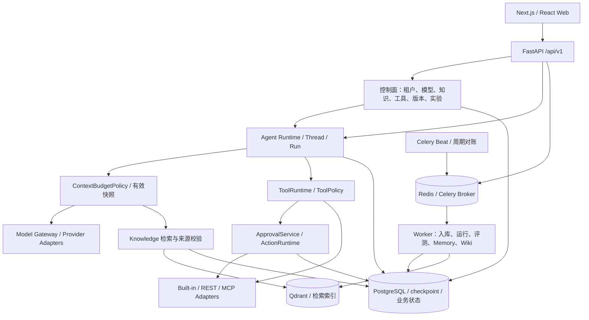

# AgentHub

**面向企业场景的 Agent Runtime 与控制平面。**

AgentHub 将模型、知识、工具、权限与人工审批接入同一套执行流程，让 Agent 的每次运行
都有可追溯的版本、明确的执行状态和可核查的证据。项目采用模块化单体加异步 Worker 的架构，
覆盖从配置与发布，到执行、暂停恢复、故障定位和评测比较的完整开发流程。

[架构设计](docs/architecture.md) · [快速体验](#快速体验) · [文档导航](docs/README.md) ·
[能力与验证状态](docs/current-state.md) · [CI](https://github.com/lijihao-0804/AgentHub/actions/workflows/ci.yml)

## 项目解决什么问题

当 Agent 开始读取内部资料、调用业务系统和修改外部状态时，仅有模型对话接口还不够。
AgentHub 关注这些执行环节：

- **调用能否执行**：模型提出工具调用，平台根据发布版本、工具策略和用户权限决定是否放行。
- **操作是否需要人确认**：需要审批的动作先持久化并暂停，决定与执行结果分别记录。
- **中断后如何继续**：通过 PostgreSQL checkpoint 恢复原 Run，而不是重新发起一轮业务操作。
- **历史结果如何解释**：保留版本、知识来源、上下文快照、运行步骤与评测输入的对应关系。
- **修改是否有效**：用版本化数据集、实验、指标和逐题证据比较配置，区分工程通过与模型质量。

前端提供研究、故障排查、数据分析和客户支持等任务入口，复用相同的 Agent、Thread、Run
和治理机制。不同场景由模板、模型、知识与工具绑定组合，不为每个应用另建一套运行时。

数据分析工作台可绑定 Warehouse MCP 的四项通用只读工具，用于查询指标定义、列出表、查看表结构和运行 SQL。注册转化率另有可单独导入的第五项只读工具 `get_registration_conversion`。绑定到智能体后发布新版本，即可比较一至两个不重叠的 UTC 日期窗口（首尾日期均包含），筛选平台或按平台和版本细分，同时取回注册数、注册页浏览数及百分点变化。分母为空的期间没有可比较的转化率。

在已验证的数据分析配置中，DeepSeek 的输出上限设为 2048 token，可完整交付双期平台与版本对比。[四个业务场景的设计与实测](docs/reviews/business-agent-api-20261120.md)

可以从客服工单看完整的使用过程。专员录入客户，模型查重后发起建单申请，另一账号批准，
专员从回执打开工单、处理并结案。验收材料保留了真实阿里云调用、拒绝分支、并发冲突和重新登录后的读回结果。
[操作与复跑](docs/reviews/support-operator-closure-20261114.md) · [公开 HTTP 回执](docs/reviews/evidence/support-desk-20261114/public-http.json)

## 核心能力

| 模块 | 主要能力 |
| --- | --- |
| 多租户与权限 | Organization / Workspace 分层，成员与角色权限独立管理，API、知识与运行记录按租户授权 |
| 模型网关 | Provider Credential 与 Model Profile 管理、凭据加密、能力校验、超时/重试/回退及调用用量记录 |
| Agent 与版本 | Draft 配置与不可变 AgentVersion；发布冻结 Prompt、模型行为、工具修订及运行策略，使用版本化规范 JSON 标识规格 |
| 工具治理 | Built-in、REST、MCP 工具接入；区分 effect 与 risk，结合审批策略控制调用；出站目标执行 SSRF 校验 |
| 审批与持久恢复 | 审批决定和动作执行分别保存；checkpoint 暂停/恢复；稳定逻辑动作身份；未知副作用转人工关注 |
| Knowledge / RAG | 文档异步入库、历史修订与知识快照、稠密/稀疏混合检索、重排、可选 API Embedder/Reranker 适配器，以及封装为受治理 `search_knowledge` 工具的 Agentic RAG（支持多轮补查、跨轮去重与定向过滤） |
| Wiki 与上下文 | 带原文来源的派生 Wiki、编译/审阅/发布与版本绑定；ContextBudgetPolicy 最终准入与 KV-Cache 稳定前缀布局（静态前缀 + 尾部动态提醒 + 可选显式缓存断点与命中率统计） |
| Memory | 默认关闭的长期 Memory、来源记录、异步抽取与恢复、有效快照回放；语义质量与治理限制单独披露 |
| 运行观测与接管 | Run 步骤、持久生命周期事件、脱敏 Trace、用量与失败分类，以及反馈和人工接管入口 |
| Evaluation | 版本化数据集、实验变体、重复试验、配对比较、消融分析与发布门禁；Web 展示摘要、筛选分页和安全逐题证据 |

正式实验绑定已发布 DatasetVersion、解析后的 AgentVersion、有效知识快照、定价快照、
构建提交与评测器版本。历史结果读取不重新解析当前的 LATEST 配置。

### 近期工程优化与实测结论

- **KV-Cache 友好上下文与命中率观测**：将冻结的 System Prompt、规范排序的工具定义（递归排序参数 JSON key）与 append-only 历史记录保持在前缀稳定区，把轮次级动态上下文（动态召回的 Memory、当前数据表状态）后置到历史之后/当前问题尾部，并支持按 Profile 开关下发显式 `cache_control: {"type": "ephemeral"}` 断点与 `cache_hit_rate` 汇总统计。在阿里云 `deepseek-v4.1-flash-1017` 6 轮多工具 RAG 长上下文实测（第 6 轮 ~7.6k tokens）中：动态 Memory 后置组单轮最高命中 **82.0%**（第 6 轮 **80.3%**，`6,144 / 7,653`），Memory 前置对照组第 6 轮仅 **40.1%**（`3,072 / 7,657`，历史段全部失效），改写系统前缀对照组为 **0%**。
- **RAG 模型与策略配对评测**：在保留本地 `BGE-M3 + BGE-reranker-v2-m3` 默认栈的基础上，新增可选的 OpenAI/百炼兼容 `OpenAICompatibleDenseEmbedder` 与 `OpenAICompatibleReranker` 适配器。完整 SciFact / QASPER / MuSiQue 对比数据与按场景选型建议见 [2026-11-24 基准报告](docs/reviews/rag-qwen37-api-benchmark-20261124.md) 与 [RAG 进度入口](docs/reviews/AGENTHUB_RAG_PROGRESS.md)。
- **文档与审查索引归档**：核心验收与最新基准保留在 [`docs/reviews/`](docs/reviews/README.md) 顶层，早期阶段性过程稿统一归档至 `docs/reviews/archive/`。

## 一次受治理的运行


```mermaid
flowchart LR
    Task[用户任务 / Thread Turn] --> Run[创建 Run 与解析有效快照]
    Run --> Context[上下文预算准入]
    Context --> Model[模型生成答复或工具提议]
    Model --> Policy{工具策略与权限}
    Policy -->|允许自动执行| Read[执行获准的只读调用]
    Policy -->|需要审批| Wait[持久化 checkpoint / 等待决定]
    Wait --> Decision{人工批准或拒绝}
    Decision -->|批准| Action[恢复原 Run / 执行动作]
    Decision -->|拒绝| Observation[记录拒绝观察]
    Read --> Observation
    Action --> Outcome{结果能否确认}
    Outcome -->|确认| Observation
    Outcome -->|无法确认| Attention[UNKNOWN_OUTCOME / NEEDS_ATTENTION]
    Observation --> Context
    Model -->|最终答复| Finish[结束运行 / 保存证据]
    Attention --> Evidence[人工核查与后续处理]
```

这里有几个关键约束：

- `READ` 与风险等级是不同维度，不能把所有只读工具都视为可自动执行。
- 审批通过不等于动作成功；拒绝被正确处理后，Run 可以成功结束，但动作没有执行。
- 外部写入已派发、结果无法确认时保留 `UNKNOWN_OUTCOME`，不静默重试。
- 审批恢复继续原 Run，不重置已有计数预算；模型回退只允许发生在首个可见 token 之前。
- 运行事件回放与模型重新执行是不同操作；流式 token delta 不承诺逐条永久保存。

## 系统架构


```mermaid
flowchart TB
    Web[Next.js / React Web] --> API[FastAPI /api/v1]
    API --> Control[控制面：租户、模型、知识、工具、版本、实验]
    API --> Runtime[Agent Runtime / Thread / Run]
    Control --> Runtime
    Runtime --> Context[ContextBudgetPolicy / 有效快照]
    Context --> Gateway[Model Gateway / Provider Adapters]
    Runtime --> Tool[ToolRuntime / ToolPolicy]
    Tool --> Approval[ApprovalService / ActionRuntime]
    Tool --> Adapters[Built-in / REST / MCP Adapters]
    Approval --> Adapters
    Runtime --> PG[(PostgreSQL / checkpoint / 业务状态)]
    Control --> PG
    Approval --> PG
    API --> Redis[(Redis / Celery Broker)]
    Beat[Celery Beat / 周期对账] --> Redis
    Redis --> Worker[Worker：入库、运行、评测、Memory、Wiki]
    Worker --> PG
    Worker --> Qdrant[(Qdrant / 检索索引)]
    Context --> Knowledge[Knowledge 检索与来源校验]
    Knowledge --> Qdrant
    Knowledge --> PG
```

模块箭头表示应用调用或数据流，不表示独立微服务。PostgreSQL 保存业务状态、历史身份与
checkpoint；Redis 承担队列传递；Qdrant 是检索索引，不能替代知识修订和快照的业务记录。
Memory 从 PostgreSQL 加载。

依赖方向为 `Transport/API → Application → Domain/Contracts → Adapters`。
LangGraph、模型 SDK 和 MCP 等框架被限制在适配器边界内，业务权限、动作身份、审批状态和
终态语义由 AgentHub 自己定义。详细设计见 [Architecture](docs/architecture.md) 与
[架构决策记录](docs/adr/ADR-001-modular-monolith.md)。

### 技术栈

| 层次 | 技术 |
| --- | --- |
| Web | Next.js、React、TypeScript |
| API 与应用服务 | Python 3.12、FastAPI、Pydantic、SQLAlchemy |
| 图执行与恢复 | LangGraph、PostgreSQL checkpoint adapter |
| 数据与迁移 | PostgreSQL、Alembic |
| 异步执行 | Celery、Redis、周期对账任务 |
| 检索 | Qdrant、BGE 模型适配器、混合检索与重排 |
| 工具协议与部署 | REST、MCP、Docker Compose |

依赖的具体版本以 [pyproject.toml](pyproject.toml)、[uv.lock](uv.lock) 和
[前端锁文件](apps/web/package-lock.json) 为准。

## 快速体验

### 受控本地演示

适合先体验工具提议、审批、同 Run 恢复、拒绝与评测结果界面。
使用真实 API、PostgreSQL、Redis、Worker、checkpoint 和 MCP 通信；模型采用确定性适配器，
回滚工具作用于模拟数据，不需要付费模型或生产系统。

以下命令在仓库根目录的 Windows PowerShell 执行。需要 Python 3.12、uv、Node.js 20+
和已启动的 Docker Desktop。已有 `.venv` 或依赖缓存可复用。

```powershell
uv sync --locked
npm --prefix apps/web ci

uv run --locked python -m scripts.portfolio_demo init
docker compose -p agenthub-portfolio --env-file .scratch/portfolio-closeout/compose.env -f infra/portfolio.compose.yml up -d --wait
uv run --locked python -m scripts.portfolio_demo prepare
uv run --locked python -m scripts.portfolio_demo build-web
./infra/portfolio-local.ps1 Start

uv run --locked python -m scripts.portfolio_demo seed
uv run --locked python -m scripts.portfolio_demo evaluation
```

打开 Web：<http://127.0.0.1:3040>；API 文档：<http://127.0.0.1:8040/docs>。
演示账号与随机密码保存在本地 `.scratch/portfolio-closeout/private-config.json` 的 `accounts` 中。
`init` 不覆盖已有状态；Windows 使用受保护 DACL，Start 有界等待服务就绪，失败返回非零并给出日志位置。
已有演示环境应沿用原 Compose project 名称，避免与正在使用的端口和数据卷冲突。

停止进程和基础设施，并保留数据：

```powershell
./infra/portfolio-local.ps1 Stop
docker compose -p agenthub-portfolio --env-file .scratch/portfolio-closeout/compose.env -f infra/portfolio.compose.yml stop
```

审批/拒绝复演、重启验证与证据读取步骤见
[本地演示使用与验收记录](docs/portfolio/final-closeout-evidence-20261106.md)。
其中的逐题评测样例用于工程一致性展示，不代表真实模型准确率。

### 接入真实模型与知识

常规开发使用独立的数据库、配置和端口。Windows PowerShell 在仓库根目录运行以下命令，
需 Python 3.12、uv、Node.js 20+ 和已启动的 Docker Desktop。

```powershell
.\setup-agenthub.bat
.\start-agenthub.bat
```

首次安装会创建本地 `.env`，分别生成 JWT 签名密钥与 Provider 凭据加密主密钥。
启动程序在数据库迁移、checkpoint 初始化、API 依赖检查、Web 登录页及代理、指定 Worker
的应答通过后打开 <http://127.0.0.1:3000>。本次日志在 `.scratch/local-dev/`。
在启动窗口按 Ctrl+C 可停止应用进程，再运行 `docker compose stop postgres redis qdrant` 可停止基础设施并保留数据。

也可以使用 Compose 启动后端，另在宿主机启动 Web。在仓库根目录执行：

```sh
uv run --locked python -m scripts.local_setup init
docker compose up --build -d --wait --wait-timeout 120
npm --prefix apps/web ci
npm --prefix apps/web run dev -- --hostname 127.0.0.1 --port 3000
```

Compose 的 `prepare` 服务顺序执行 Alembic 与 LangGraph checkpoint 初始化。成功退出后，
API、Worker 和 Beat 才会启动。用 `docker compose logs prepare` 查看初始化结果，
用 <http://127.0.0.1:8000/api/v1/dependencies> 查看 PostgreSQL、Redis、Qdrant 状态。
退出 Web 后用 `docker compose stop` 停止此环境。

已有数据库需要保留原来的加密主密钥并随数据库备份保存；初始化命令遇到已有 `.env`
会验证配置并保留文件。若现有文件只是刚复制的空模板且确认数据库全新，可先将该模板
重命名备份，再运行 `init`。使用原数据库时从备份或部署环境恢复主密钥；替换签名密钥
会使已有访问令牌失效。旧明文凭据的迁移另见[凭据迁移指南](docs/deployment/provider-credential-migration.md)。

在 Web 注册账户，进入「设置」创建 Organization 和 Workspace，再到「模型」创建 Provider
Credential 和 Model Profile。在 Agent 草稿中选择模型、发布 AgentVersion，进入 Playground
发送消息即可查看第一次真实模型调用的 Run。接入知识库时可在 `.env` 中设置
`AGENTHUB_KNOWLEDGE_WARM_MODELS_ON_START=true` 后重启，首次预热需下载数 GB 模型。
开发 Web 默认代理到 `http://127.0.0.1:8000`；生产构建需在 build 前配置
`AGENTHUB_API_PROXY_TARGET`。[Provider 出站合同](docs/security/provider-egress.md)

知识库的端到端复验覆盖长文入库、大批量失败后的重试、检索时的连接池占用，以及新旧政策同时召回时的引用问答。使用阿里云兼容端点可在独立工作区重跑固定的中英文开发样本。[本机 RAG 实测与限制](docs/reviews/local-rag-20261114.md) · [引用问答复跑入口](benchmarks/evaluation/experiments/citation_lifecycle_dev/README.md)

文档修订入库时，同一工作区内编码输入完全相同、编码器指纹一致的块可以复用向量。稠密与稀疏分别判断，每个修订仍生成自己的块 ID 和引用位置。部署时先执行 `alembic upgrade head`；缓存从部署后的编码开始积累。可在 worker 设置 `AGENTHUB_KNOWLEDGE_VECTOR_CACHE_ENABLED=false` 运行全量重算对照。

新版工作台支持按应用发起多行任务与键盘查找页面。新建智能体默认启用按用户隔离的长期记忆；评测详情可逐题检查候选退步和缺失配对，发布门禁支持配对区间与非劣性。复杂表格导入会保留多层列名及单元格定位。[工作区升级、截图与配对实验](docs/reviews/workspace-quality-20261118.md)

候选召回评测逐题追踪分块、稠密与稀疏排名、融合、BGE 重排、证据句覆盖和实际引文。克隆仓库后，用 Python 标准库即可复核来源与证据的变化。实验也覆盖先按文章融合再回原文选段，以及单独用标题或完整摘要召回。在 SciFact 第 753 题，按文章融合找回了排在第 11 的标注论文，回选原段后仍只排重排第 19。[原 13 道漏例](docs/reviews/candidate-recall-20261114.md) · [文章级检索、独立验证与真实问答](benchmarks/public_rag/results/published/article-recall-20261114/README.md)

引用问答还单独验证了首答可靠性：将九条历史 502 定位到网关或 JSON 校验，再从真实入口比较输出额度、思考模式和回答范围。评测分别统计可用首答、完整有据的答案、正确拒答以及能在原文定位的引文。[逐条 502、独立题对照和离线复核](benchmarks/public_rag/results/published/qa-first-response-20261114/README.md)

## 仓库结构

```text
apps/
  api/                HTTP API 与应用装配
  web/                Web 控制面、应用入口、运行与评测界面
  worker/             异步任务与周期对账
  *_mcp/              场景工具服务器与模拟业务适配器
packages/
  agent_runtime/      版本发布、上下文、图执行与持久恢复
  model_gateway/      模型档案、Provider 适配与调用治理
  tools/ approvals/   工具策略、动作身份、审批与执行状态
  knowledge/ wiki/    知识入库、检索、快照与派生知识
  memory/             Memory 存储、来源与读取策略
  evaluation/         数据集、实验、评测、统计与安全证据
  control_plane/      租户、成员与权限
  core/               配置、数据库、错误与共享合同
  observability/      运行观测与脱敏追踪
  threads/ feedback/ handoffs/ artifacts/
migrations/           AgentHub 业务表迁移
benchmarks/           评测数据、实验与研究入口
tests/                单元、集成与故障注入测试
infra/ scripts/       部署、初始化与本地运行工具
docs/ plan/           合同、架构、学习材料与产品设计
```

## 验证与能力边界

仓库包含单元、真实 PostgreSQL/Redis 集成、审批与 checkpoint 故障注入，以及前端权限和
证据投影检查。CI 执行后端检查与前端生产构建；具体结果以对应提交的
[GitHub Actions](https://github.com/lijihao-0804/AgentHub/actions) 为准。
本地按变更选择相关检查，集成测试需要独立测试数据库及所用外部依赖：

```powershell
uv run --locked ruff check .
uv run --locked pytest tests/unit/test_agent_publish.py
node scripts/test_web_regressions.cjs
```

当前交付可以本地启动和展示，生产规模、容量、SLA 与真实企业收益尚未验证。
任意外部系统的 exactly-once 不在承诺范围内；Org OWNER/ADMIN 仍有自审批豁免。
完整硬金额预算尚未接通，自动摘要仍受质量门禁限制，Memory/Wiki 的语义质量与人工 judge 校准
不能由工程测试通过率推出。工程夹具、真实模型实验和生产效果分别解释，不合并统计口径。

当前能力与限制见 [状态页](docs/current-state.md)；具体运行环境、历史实验分母和失败记录见
[验收索引](docs/reviews/README.md) 与 [评测证据矩阵](docs/milestones/AE-capability-matrix.md)。

## 继续阅读

| 目的 | 入口 |
| --- | --- |
| 理解产品语义与设计范围 | [产品计划](plan/plan.md)、[架构](docs/architecture.md)、[数据流](docs/report/02-架构与数据流.md) |
| 查看接口与数据归属 | [API 合同](docs/api-contracts.md)、[数据模型](docs/data-model.md)、运行中的 `/docs` |
| 学习实现与技术取舍 | [学习路线](docs/learning/README.md)、[架构决策](docs/adr/ADR-001-modular-monolith.md) |
| 核查评测与交互证据 | [评测能力矩阵](docs/milestones/AE-capability-matrix.md)、[评测 UI](docs/milestones/AE-10-minimal-evaluation-ui.md) |
| 演示与讲述项目 | [演示记录](docs/portfolio/final-closeout-evidence-20261106.md)、[项目报告](docs/report/README.md)、[求职材料](docs/portfolio/README.md) |

有日期或提交号的设计、验收和研究文档保留各自的历史语义；最新实现与边界从状态页和源码核对。
