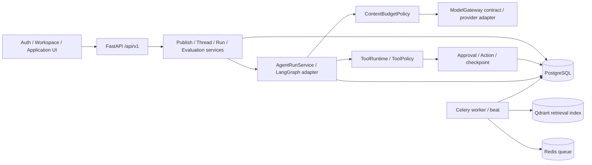

# Architecture

> **2026-10-05 当前状态**：[功能与证据口径](current-state.md)。T12/T28 已关闭，MCP/Auth UI、反馈、人工接管和专项前端脚本已存在；功能开发已收口，旧计划未完成项为 DEFERRED / FUTURE WORK。历史验收数字按各自日期/SHA 解读。

AgentHub uses a modular monolith plus worker: one repository, one API process, one worker
process and one web application. PostgreSQL is the business source of truth; Redis is used
for queue/cache concerns; Qdrant is the vector retrieval adapter; Langfuse is optional.
The M6-A production composition uses a provider-neutral redacted structured trace sink. It
does not export business content or credentials and remains fail-open; an external Langfuse or
OpenTelemetry exporter can be added behind the same contract later. `langfuse_enabled` does not
claim that an external Langfuse connection is active.

The dependency direction is:

```text
Transport/API -> Application -> Domain/Contract -> Infrastructure Adapter
```

This page is the boundary summary, not the full request-flow guide. For process topology,
the Run/approval/Thread/evaluation flows, and event persistence boundaries, see
[`docs/report/02-架构与数据流.md`](report/02-架构与数据流.md). For selected externally
observable route behavior, see [`docs/api-contracts.md`](api-contracts.md); the detailed
route and table inventory is in [`docs/report/09-数据模型与API.md`](report/09-数据模型与API.md).

M6-A provides read-only Run query/detail/timeline projections over the existing Agent Runtime,
Tool and Approval records. LangGraph and Qdrant remain behind adapter boundaries; raw checkpoint
payloads and provider SDK types do not cross the application contract.

## Current composition and state boundaries



| Component | Existing responsibility | Boundary |
| --- | --- | --- |
| Publication | Freeze prompt/model/tool/budget and knowledge binding policy into immutable AgentVersion | LATEST binding resolution is recorded for the Run/experiment; a version hash alone does not mean external knowledge never changes |
| Context preparation | Select/freeze knowledge and Memory inputs; label evidence and admit under token budgets | selected IDs are not automatically admitted IDs; memory role=system does not grant SYSTEM trust |
| Async extraction | Successful Thread run queues worker extraction from user_input; exact quote/parser/normalization/store | Best effort, not answer latency; shared/temporary/private semantic classification still depends on extractor prompt |
| Feedback | Reviewed correction imports a new DEV draft through existing DatasetService | Observation is not ground truth; published versions remain immutable |
| Handoff | OPEN→ASSIGNED→IN_PROGRESS→CLOSED with actor/version checks and retained source artifact | Operational closure does not approve tools or confirm an unknown side effect |
| Frontend | MCP manager, streaming multi-turn panes, feedback/handoff, T12 preview and T28 copy | Per-turn parameter overrides, new derived drafts and full Dashboard design remain deferred |

See [current state](current-state.md), [M-I2](reviews/AgentHub-面试增强M-I2完成报告-20261002.md),
[M-I5](reviews/AgentHub-面试增强M-I5验收报告-20261003.md) and [Memory quality](reviews/AgentHub-closure-memory-quality-20261005.md).
No new architecture service, memory vector database or external exporter was introduced by documentation closure.
