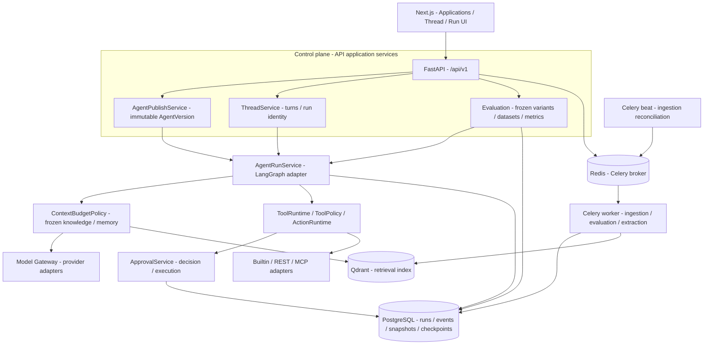
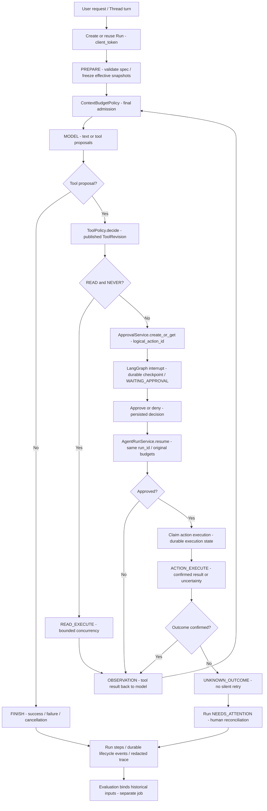

# AgentHub Architecture

2026-10-09，源码基线 `a12e8ab`。项目定位是 **Enterprise Agent Runtime & Control Plane**：围绕 Agent 执行提供治理、审批、持久化和可复现评测。这是设计范围，生产规模和企业成熟度尚未证明。业务功能保持冻结，见 [当前状态](current-state.md)。

## System Architecture

这是模块与进程职责图，模块箭头表示应用依赖或数据流，不代表各模块是独立微服务。图中的知识加载通过 Knowledge 服务/适配器访问索引，并由 PostgreSQL 校验快照成员；Memory 从 PostgreSQL 装载，不使用 Qdrant。API 与 worker 都可装配 Runtime，取决于流式交互或异步任务入口。

| 层/进程 | 实际职责与入口 | 边界 |
| --- | --- | --- |
| Web / API | [Thread routes](../apps/api/routes/threads.py)、[ThreadService.submit_turn](../packages/threads/service.py) | Thread 有多个 Turn，每个 Turn 关联自己的 Run；审批恢复复用该 Run |
| Control plane | [AgentPublishService.publish](../packages/agent_runtime/publish.py)、[Evaluation](../packages/evaluation/experiments.py) | 发布冻结 prompt、模型档案、工具修订、预算与知识绑定策略；LATEST 的有效知识快照在 Run/实验解析后另存 |
| Runtime | [AgentRunService](../packages/agent_runtime/runtime.py)、[compile_agent_graph](../packages/agent_runtime/adapters/langgraph/runtime.py) | LangGraph 提供图执行/interrupt/checkpoint；业务策略、身份、预算和终态由 AgentHub 定义 |
| Model / Context | [Model Gateway](../packages/model_gateway)、[ContextBudgetPolicy.admit_context](../packages/agent_runtime/context_budget.py) | 所有送入模型的上下文经过准入；选中 Memory 不等于最终准入 |
| Tool / Approval | [ToolPolicy.decide](../packages/tools/policy.py)、[ActionRuntime.execute](../packages/tools/actions.py)、[ApprovalService](../packages/approvals/service.py) | READ 与风险是两个维度；当前 auto 条件是 READ + NEVER，不能说“所有 READ 自动执行”或“单凭 LOW 就放行” |
| PostgreSQL | [Runtime models](../packages/agent_runtime/models.py)、[event_store](../packages/agent_runtime/event_store.py)、[checkpoint adapter](../packages/agent_runtime/adapters/langgraph/checkpoint.py) | 业务身份/状态/历史快照与 checkpoint 持久化；checkpoint schema 显式部署初始化 |
| Redis / Worker / Beat | [worker tasks](../apps/worker)、[Compose](../docker-compose.yml) | Redis 为队列基础设施，不是审批真相源；worker 处理入库、评测、记忆抽取，beat 触发入库对账 |
| Qdrant | [Knowledge](../packages/knowledge) | 向量/混合检索索引；历史修订与快照身份仍受 PostgreSQL 约束 |

依赖方向：`Transport/API → Application → Domain/Contracts → Adapters`。第三方 SDK/图状态隐藏在适配器后。当前 trace sink 是供应商无关、脱敏、失败不阻断业务的结构化观测；不宣称已连接外部 Langfuse 或 OpenTelemetry。

## Governed Agent Run Lifecycle

图省略了取消、预算拒绝和输入校验等提前退出分支；它们仍受 Runtime 的实际守卫控制。审批 DENIED 作为工具结果回到 observation，不应画成必然整次 Run FAILED。批准后先抢占执行，不能把批准状态当作动作成功。

### 核心边界

1. **身份**：[ApprovalService.create_or_get](../packages/approvals/service.py) 使用规范化参数、Run/版本/工具及提议序号生成逻辑动作身份，不依赖模型提供的 tool-call ID。不同逻辑动作仍可能造成重复业务操作；这不保证外部 exactly-once。
2. **恢复**：[AgentRunService.resume](../packages/agent_runtime/runtime.py) 装载同一 Run 和 checkpoint，重新校验 actor/版本/冻结输入，不重置计数预算。interrupt 前工作要可重入；不能先执行写入再等待批准。
3. **不确定写入**：[action_execute](../packages/agent_runtime/runtime.py) 与 [MCP runtime](../packages/mcp/runtime.py) 区分未派发、确认失败和结果不确定。已派发但结果不明进入 `UNKNOWN_OUTCOME / NEEDS_ATTENTION`，禁止静默重试；人工接管关闭不等于对账成功。
4. **事件/Trace**：[event_store.should_persist](../packages/agent_runtime/event_store.py) 选择持久生命周期事件；token delta 不等于每个 token 永久保存；异步 recorder 的有界队列满时会丢帧并告警，不能承诺完整事件永不丢失。脱敏 trace 不是 checkpoint，也不默认记录业务正文。
5. **复现**：版本规格和 hash 只是输入身份的一部分；Run 保存有效知识/Memory 快照，正式实验还绑定发布数据集内容/schema、pricing、build SHA、evaluator。重放不重新读取当前 LATEST。
6. **Memory**：workspace+agent 共享，默认关闭；异步用户输入抽取、精确引文、去重、停用/启用与 hash 回放存在。临时/个人/恶意语义拒写依赖 prompt，相关性与冲突处理不足；[11 场景证据](reviews/AgentHub-closure-memory-quality-20261005.md)不能解释成真实 LLM 业务收益。

## 展示与核查

- [5–8 分钟 Incident Demo](report/07-现场演示脚本.md)：已有 fixture 的安全回滚模拟。
- [逐函数学习](learning/README.md)、[数据流深读](report/02-架构与数据流.md)、[API](api-contracts.md)、[数据模型](data-model.md)。
- [历史验证索引](reviews/README.md)、[求职讲述](portfolio/README.md)。图与 Demo 为本轮静态核查；本轮未重跑业务链路。
