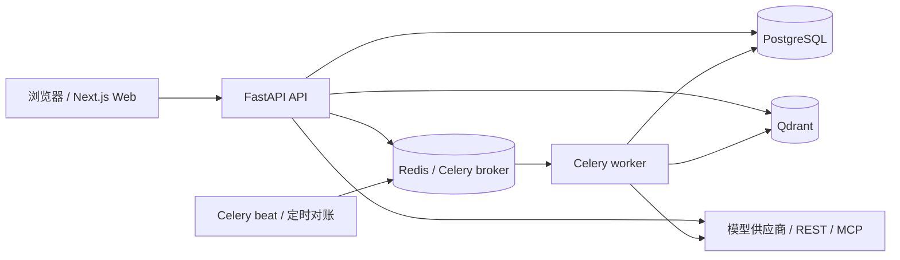
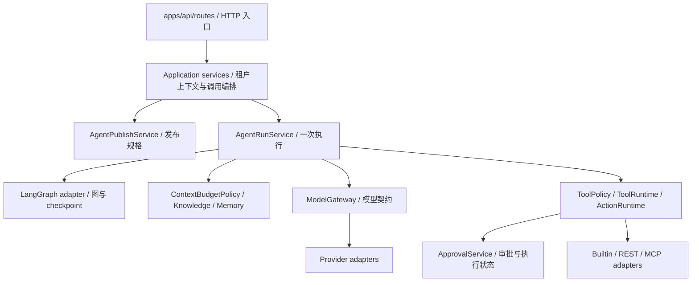

# 00 · 架构入门：先把 AgentHub 的骨架看懂

**学习位置：00，完整课程的架构起点。**

[学习首页](README.md) · [下一课：01 HTTP 与执行入口](01-codebase-navigation.md) 日期：2026-10-09；源码基线：`823ac05`。

本课整合现有架构、数据流、一次 Run 和面试资料，按理解顺序重新讲。首次学习只顺着这一个文件读，无须先打开其他报告。链接是核查入口，读到“打开代码”时再点。

建议分三段学习：§1–4 建立全景；§5–7 跟一次执行；§8–11 阅读代码并解释取舍。用自己的阅读节奏，不把建议顺序当作已完成的学习记录。本课不需要启动服务、模型密钥或付费调用。

## 读完应能做到什么

你应能在白板上画出主要进程与数据存储，解释一次用户请求为什么进入审批，以及为什么“批准”不是“执行成功”。能找到关键函数，并说明 LangGraph 提供什么、AgentHub 自己承担什么。

先记三个问题，读完再回答：

1. 用户的第二句话会继续同一个 Run 吗？审批批准呢？
2. Redis 停了、PostgreSQL 停了，影响是否一样？
3. 模型调用了回滚工具，谁有权决定真正执行？


---

## 1. 从一个具体问题理解项目

假设用户说：

> checkout-api 发布后错误率升高，帮我调查原因；如果确实需要回滚，提出操作并等待批准。

完成这件事需要的不只是模型回答。系统至少要做六件事：

| 需要解决的事 | AgentHub 的做法 | 少了它会怎样 |
| --- | --- | --- |
| 谁在操作哪个工作区？ | 鉴权、WorkspaceExecutionContext、工作区权限 | 同一个请求可能跨租户读取或操作 |
| 用哪一版模型配置、prompt 和工具？ | 发布不可变 AgentVersion | 更新草稿后，无法解释旧运行使用了什么 |
| 如何查证而不编造日志？ | READ 工具返回观测，模型再解释 | 生成的叙述可能被当成事实 |
| 回滚能否直接执行？ | 发布工具修订 + ToolPolicy + Approval | 模型一句建议变成真实写入 |
| 等待审批时服务重启怎么办？ | PostgreSQL checkpoint 与审批记录，同 Run 恢复 | 状态只在内存中时会丢失上下文/身份 |
| 回滚超时，究竟发生了没有？ | UNKNOWN_OUTCOME → NEEDS_ATTENTION，保留证据 | 静默重试可能再次执行外部写入 |

**项目定位：Agent Runtime & Control Plane。** Runtime 管一次执行，Control Plane 管执行所依赖的版本、权限、工具和配置。项目面向企业治理场景，但“Enterprise”不能当作已证明生产成熟度的标签。

贯穿本课的 Incident 是仓库已有模拟场景：固定指标、日志、部署和提交记录；回滚返回模拟结果，不连接真实部署系统。下面讨论的是源码路径，不是宣称本课已经跑出成功结果。

### 先分清三个常见词

| 词 | 这里的含义 | 具体例子 |
| --- | --- | --- |
| Application（应用） | 用户任务、prompt、工具组合和产物展示 | Incident 显示事故时间线，Research 显示文献卡片 |
| Runtime（运行时） | 执行一次 Run 的循环与守卫 | 模型调用、预算、工具审批、恢复和终态 |
| Control Plane（控制平面） | 配置/发布/访问管理及执行身份管理 | 发布版本、模型档案、工作区权限、工具修订 |

应用与 Runtime 是职责区别，不是两个必然独立部署的服务；Control Plane 也不是独立微服务名称。

## 2. 第一张图：机器上到底运行什么

先看**进程和存储**，不要把文件夹数量当成服务数量。



图是主要进程访问关系，不是每个请求都走完整图。检索经 Knowledge 适配器访问 Qdrant；模型/工具经各自适配器访问外部目标。Web 的同源代理是另一层 HTTP 转发，不是后端领域逻辑。

### 为什么叫 Modular Monolith + Worker

- **Modular（模块化）**：`packages/` 按业务职责分模块，代码可以分别阅读。
- **Monolith（单体）**：API 中这些模块通常以 Python 调用协作，不是每个模块有独立端口。
- **Worker**：耗时或异步任务由 Celery 进程处理；API 和 worker 能复用同一套服务/契约。
- **Beat**：定时发起入库、审批运行、评测运行的对账任务；它不是实际执行所有任务的 worker。

源码并不规定线上永远只有一个实例。这里解释的是现有进程职责，跨机器扩展与生产容量需要另有验证。

### 三种存储为什么都存在

| 存储 | 它存什么/负责什么 | 不要误解成 |
| --- | --- | --- |
| PostgreSQL | 用户/租户、版本、Run、审批、修订/快照、业务记录及持久事件；checkpoint 也使用 PostgreSQL 的框架 schema | 只存聊天记录；或用一张表替代全部图状态 |
| Redis | Celery broker，连接 API/定时任务与 worker | 审批决策、版本和 Run 的权威状态 |
| Qdrant | 知识检索索引，由文档解析/分块/嵌入流水线写入 | 历史文档修订的唯一存储；或当前 Memory 的存储 |

Memory 当前使用 PostgreSQL，不能因为它叫“记忆”就推断用了向量库。Qdrant 返回候选后，历史知识身份和可访问成员仍需由业务数据校验。

**暂停自测：**关掉 Redis 后，“已有审批记录消失”和“异步任务受影响”，哪个更符合这张图？答案是后者；是否还能继续某条请求，要再看该入口有没有依赖任务队列。不要推断全系统都正常。

## 3. 第二张图：代码如何分工

现在切换到**源码模块**。下面的箭头表示调用/依赖，不是新增网络连接。



这些模块不是一个 Python 类名的简单继承树。它们按职责协作；一个 `packages/` 包可以同时包含服务、契约、模型和适配器，不能把整个目录笼统叫“纯领域层”。

### 把目录变成你能记住的地图

| 目录/文件 | 第一遍只关心什么 | 暂时不需要读什么 |
| --- | --- | --- |
| `apps/web` | 用户操作如何变成 HTTP，流式结果怎样展示 | 所有 CSS、组件细节 |
| `apps/api/routes` | 路由参数、权限上下文、调用哪个服务 | 每个接口响应字段 |
| `apps/api/agent_runtime_dependencies.py` | 如何装配真正的 Runtime 依赖 | 所有 adapter 内部实现 |
| `packages/agent_runtime` | 发布、Run 服务、执行图、上下文预算 | 三千多行文件逐行背诵 |
| `packages/tools` / `packages/approvals` | 提议→治理→审批→执行的边界 | 各工具完整业务逻辑 |
| `packages/model_gateway` | 供应商无关输入/输出、能力/重试/fallback | 每种供应商 SDK 参数 |
| `packages/knowledge` / `packages/memory` | 为 Run 提供可追溯输入 | 第一遍学习嵌入/排序算法全部细节 |
| `packages/evaluation` | 如何冻结实验身份、衡量结果 | 所有 judge/指标实现 |
| `apps/worker` | 任务入口复用哪些服务，定时对账有哪些 | 每条 task 的所有异常分支 |

工程约束的方向是：`Transport/API → Application → Domain/Contracts → Adapters`。

**为什么有 Contracts？**例如模型请求中的 `ModelMessage`、工具中的 `ToolDefinition` 让 Runtime 操作稳定的数据结构；供应商 SDK 和 MCP 协议细节留在适配器。替换供应商时仍需适配/验证能力和行为，不是换个名字就零成本切换。

## 4. 控制平面与运行时：先配置，后执行

用一个 lab Agent 的生命周期理解这两个职责：

```text
编辑草稿（prompt / 模型档案 / 工具 / 预算 / 知识绑定）
    ↓ AgentPublishService.publish
不可变 AgentVersion（resolved_spec + canonical hash）
    ↓ 为用户请求创建 Run
AgentRunService 执行这个具体版本
    ↓
Run 的有效知识/Memory 快照、步骤、审批和结果
```

**草稿可变，发布版本不可变；Run 是一次执行记录，不是草稿。**

发布把运行规格解析成可核查身份，避免今天读旧 Run 时误用今天的工具或 prompt。`resolved_spec_hash` 是对版本化规范 JSON 的 SHA-256，不是对任意 JSON 文本排序碰巧算出的字符串。

但要补一个边界：知识绑定可能是 `LATEST` 策略。版本冻结这条策略，Run/实验在相应解析时冻结实际知识身份；不能声称发布一个版本就永远锁死所有未来 Run 的知识内容。Memory 的有效 ID/hash 也单独记录。

**打开代码 ①：**[AgentPublishService.publish](../../packages/agent_runtime/publish.py)。只找这几个词：`resolved_spec`、`canonical_json_hash`、`AgentVersion`。暂时不展开每项配置校验。

读完问自己：如果有人改了已发布规格，仅存着旧 hash 是否够用？执行路径还必须重新校验完整性，不能只相信数据库曾经发布过。

## 5. Thread、Turn、Run：对话和执行不是一个对象

| 对象 | 解决的问题 | 例子 |
| --- | --- | --- |
| Thread | 一段应用会话归属在哪个工作区/Agent | 一次 Incident 调查会话 |
| Turn | 用户提交的一轮输入及其提交身份 | “查一下原因”，带 client_token |
| Run | 这轮实际执行的版本、状态、预算和结果 | 调工具后等待审批的这一次执行 |
| Approval | 某个受控动作的决策和执行状态 | 是否批准回滚到旧版本 |
| Artifact | 应用可展示的结构化产物 | 事故时间线/文献卡片等 |

```text
Thread
 ├─ Turn 1 ── Run A ── Approval X ── 批准后仍是 Run A
 └─ Turn 2 ── Run B
```

新问题通常是新 Turn、新 Run；审批恢复当前 Run，预算不会因为批准而重置。重复提交相同 client_token 是提交幂等问题；它既不同于审批恢复，也不同于外部工具的逻辑动作身份。

ThreadTurn 和 Run 的写入不是一个跨所有过程的长事务。中间可能出现 Turn 已保存、Run 尚未关联的窗口，所以重复请求可能收到 `THREAD_TURN_IN_PROGRESS`（409），不能承诺任何时刻重试都立即拿到完整结果。

**暂停自测：**为什么要同时有 client_token、run_id、logical_action_id？它们分别标识提交、一次执行和受控动作，不能互相替代。

## 6. 把一句话沿代码走一遍

这里选当前 UI 的流式提交入口。同步 `submit_turn` 另有路径，第一遍不同时追两条。

| 顺序 | 发生什么 | 读哪个真实入口 |
| --- | --- | --- |
| 1 | Web 发 `POST /api/v1/workspaces/{workspace_id}/threads/{thread_id}/turns/stream` | [routes/threads.py 的 stream_turn](../../apps/api/routes/threads.py) |
| 2 | 解析所用版本，记录 Turn，重复 token 时检查原 Run | [ThreadService.resolve_agent_version / open_turn](../../packages/threads/service.py) |
| 3 | 先准备 Run，再关联 Turn，构造流 | [AgentRunService.prepare_stream / stream](../../packages/agent_runtime/runtime.py) |
| 4 | 运行图准备上下文、调用模型、处理工具与审批 | `_AgentRunGraph` 的 8 个节点（下一节） |
| 5 | 把事件作为 SSE 给 UI，记录 Run 步骤/结果与选定持久事件 | [events](../../packages/agent_runtime/events.py)、[event_store](../../packages/agent_runtime/event_store.py) |
| 6 | 所需审批决定后，恢复原 Run | [approvals route](../../apps/api/routes/approvals.py)→`AgentRunService.resume` |

模型生成不等于请求线程一直阻塞等待人审批。Run 进入 WAITING_APPROVAL 后持久化相关状态，批准请求再触发恢复。SSE 是传输方式，Run/Approval/checkpoint 才是业务与恢复状态。

### 哪些工作在 API，哪些在 worker？

当前既有 API 内装配/执行 Runtime 的路径，也有 `apps/worker/tasks/agent_runs.py` 的执行入口。具体是否排队由路由及服务配置决定。不能把“存在 Celery”说成每条聊天请求必定经过 Redis。

worker 还处理知识入库、评测、Memory 抽取及对账。任务队列传的是身份或工作请求，不是授权；worker 必须重新取得可信的工作区权限。发布版本、审批和执行状态仍在数据库，不由队列消息决定。

**打开代码 ②：**[get_production_agent_run_service](../../apps/api/agent_runtime_dependencies.py)。这是“组装机器”的位置。它把 ToolRuntime、ApprovalService、ActionRuntime、checkpoint、Memory 和 Artifact 依赖交给 AgentRunService，帮助你理解为什么 Runtime 不自己直接访问所有外部系统。

## 7. Runtime 的循环：模型提议，运行时治理

实际图构造位于 `packages/agent_runtime/runtime.py` 的 `_AgentRunGraph.invoke`。下面是**源码原样节选**，省略了 `compile_agent_graph` 调用的其他参数：

```python
nodes={
    "prepare": self.prepare,
    "model": self.model,
    "tool_proposal": self.tool_proposal,
    "policy": self.policy,
    "read_execute": self.read_execute,
    "action_execute": self.action_execute,
    "observation": self.observation,
    "finish": self.finish,
}
```

八个节点的作用依次理解：

| 节点 | 用白话解释 | 下一步由什么决定 |
| --- | --- | --- |
| prepare | 校验版本、冻结/装载有效输入、组装消息 | 完整性/准备是否失败 |
| model | 上下文预算准入后调用模型 | 最终答复、工具提议或模型错误 |
| tool_proposal | 把模型提议解析成结构化调用，并应用守卫 | 提议能否继续 |
| policy | 根据发布工具规则判断执行或等待审批 | 当前批准状态、action_calls 等 |
| read_execute | 有界并发执行自动放行的 READ | 工具结果进入 observation |
| action_execute | 对已批准动作抢占执行并记录结果 | 确认成功/失败或不确定结果 |
| observation | 将工具结果加入后续模型输入 | 继续推理或失败退出 |
| finish | 汇总终态和结果 | 返回执行结果 |

示意主线：`prepare → model → tool_proposal → policy → execute → observation → model`。模型直接给最终结果或某阶段失败，则走 finish；预算/取消等守卫分布在实际节点中，不是图上画几个节点就自动具备。

### 用最短的一段代码理解“治理”

[ToolPolicy.decide](../../packages/tools/policy.py)的真实函数：

```python
    def decide(definition: ToolDefinition) -> ToolPolicyDecision:
        if (
            definition.effect is ToolEffect.READ
            and definition.approval_policy is ToolApprovalPolicy.NEVER
        ):
            return ToolPolicyDecision.ALLOW_AUTO
        return ToolPolicyDecision.REQUIRE_APPROVAL
```

读法：自动放行要同时满足 READ 与 NEVER。其余进入审批。risk 和 effect 是独立维度，但这个函数没有直接用 risk 做第三个放行条件；不能凭注释或字段名讲成 LOW 就自动执行。

再看 [_AgentRunGraph.after_policy](../../packages/agent_runtime/runtime.py)的真实分支：

```python
    def after_policy(self, state: AgentRunState) -> str:
        if state.get("failure_code") or state.get("run_status"):
            return "finish"
        if state.get("action_calls"):
            return "action_execute"
        return "read_execute"
```

它只选择图的下一节点。等待审批是在 `policy` 节点中的 interrupt，不是这里返回一个“approval 网络服务”。遇到陌生代码时，先区分“路由下一节点”与“这个节点内部干了什么”。

### LangGraph 在哪里？AgentHub 自己又做了什么？

适配器中的真实代码很短：

```python
def approval_interrupt(payload: Mapping[str, Any]) -> Any:
    return interrupt(dict(payload))

def resume_command(payload: Mapping[str, Any]) -> Any:
    return Command(resume=dict(payload))
```

出处：[LangGraph runtime adapter](../../packages/agent_runtime/adapters/langgraph/runtime.py)。

- LangGraph 提供 StateGraph、interrupt、Command 与 checkpoint 支持。
- AgentHub 定义版本完整性、工作区权限、预算、工具策略、动作身份、审批执行和 UNKNOWN_OUTCOME 终态。
- checkpoint 保存执行图状态，不能证明外部系统有没有完成一次回滚。

**暂停自测：**“用了 LangGraph，所以审批和外部写入天然可靠”错在哪里？框架解决图状态恢复，业务并发/身份/外部副作用仍须由项目实现并验证。

## 8. 看懂四类持久化记录，才能理解恢复

| 记录 | 回答什么问题 | 不能替代什么 |
| --- | --- | --- |
| AgentRun / RunStep | 哪次执行、当前状态、预算、经过哪些步骤 | 不能凭步骤摘要恢复全部图内部状态 |
| Approval | 人如何决定、动作是否抢占/执行、结果是否确定 | APPROVED 不代表 execution SUCCEEDED |
| checkpoint | 挂起时的图状态与后续恢复位置 | 不代表外部副作用绝对只发生一次 |
| durable events / trace | UI 重连与观测，解释过程和耗时 | 不等于 checkpoint，也不保证完全无损业务日志 |

批准时，审批 route 先保存决定，再调用同一个 `AgentRunService.resume`。执行前还要争抢执行权。恢复是在数据库与 checkpoint 约束下继续原 Run，不是重新问一遍模型并清空预算。

外部写入发送后超时，可能已经完成操作但响应丢失。系统不能伪称“确定没发生”，因此记录 UNKNOWN_OUTCOME，让 Run 进入 NEEDS_ATTENTION。即使本地可以防止某个逻辑动作重复执行，也不能宣称所有外部写入 exactly-once。

事件方面，`message.delta` 不持久化；异步 recorder 的有界队列满时会丢帧并告警。重连可重放已持久化的过程/最终输出，不保证每个打字动画都重新出现。trace 默认脱敏，不能把数据库可查误讲成业务正文全部已记录。

## 9. 知识、记忆、评测怎样接到这条主线

第一遍只学习它们的位置和边界，算法与实现留到后续课。

| 模块 | 接入 Run 的位置 | 第一遍必须理解的点 |
| --- | --- | --- |
| Knowledge / RAG | 固定知识身份，`search_knowledge` 检索后进入工具结果/上下文 | 检索命中、进入预算、回答正确是三件事；历史引用需要修订和快照身份 |
| Memory | prepare 装载有效记忆，model 前最终预算准入；结束后可异步抽取 | 共享 workspace+agent、默认关闭、UNTRUSTED；选中不等于准入，精确引文不等于该共享 |
| Evaluation | 数据发布、变体/实验冻结，通过生产执行链生成结果并计算指标 | 正式实验冻结数据/schema、版本、知识、pricing、build 和 evaluator；不能用调过的 HOLDOUT 自证 |

Memory 已有冻结/停用/回放机制，但质量探针发现无关和矛盾事实仍可准入，临时/私人/恶意语义拒写依赖提示词。机制存在不等于“学得越多效果越好”。

已有模型实验使用合成任务，不能当成企业线上收益。11 场景 Memory 探针的 task correctness 是脚本消费者结果，不能说真实 LLM 成功率 100%。学架构时也要学会区分机制、验证范围和未证明结论。

## 10. 现在亲自打开六个文件（不启动服务）

按下面顺序各看一个位置，做完一行再进入下一行：

| 顺序 | 文件/函数 | 要留下的一句自己的解释 |
| --- | --- | --- |
| 1 | [apps/api/app.py：create_app](../../apps/api/app.py) | HTTP router 如何注册，为什么它不是 Agent Loop |
| 2 | [routes/threads.py：stream_turn](../../apps/api/routes/threads.py) | 如何从一轮提交得到具体版本、Turn 和 Run |
| 3 | [agent_runtime_dependencies.py：get_production_agent_run_service](../../apps/api/agent_runtime_dependencies.py) | 哪些真实依赖被组装进 Runtime |
| 4 | [runtime.py：_AgentRunGraph.invoke / after_policy](../../packages/agent_runtime/runtime.py) | 8 个节点怎样连，条件分支由谁决定 |
| 5 | [tools/policy.py：ToolPolicy.decide](../../packages/tools/policy.py) | 为什么 READ 本身不够自动执行 |
| 6 | [apps/worker/celery_app.py：create_celery_app](../../apps/worker/celery_app.py) | include 与 beat_schedule 对应哪些异步/定时工作 |

只读源码，不改 `.env`、数据库、运行时或已发布版本。此练习无需恢复环境；没有运行实验，也不能把“读过函数”记录成回归 PASS。

完成后不用看图，自己画一遍：浏览器、API、worker/beat、PostgreSQL、Redis、Qdrant；再在 API 旁写出 Runtime、Policy、Approval。分不清时回到 §2–3，不继续盲读目录。

## 11. 转成面试表达：先解释，再回答追问

### 90 秒讲述骨架

> AgentHub 是一个围绕工具治理、持久审批和可复现评测的 Agent Runtime 与控制平面。采用模块化单体加 worker，应用通过 FastAPI 复用同一运行时。PostgreSQL 保存业务和 checkpoint 状态，Redis 用于任务队列，Qdrant 用于知识检索索引。
>
> 控制平面发布不可变 AgentVersion；一次 Run 记录实际输入和预算。模型负责提议工具，运行时通过 ToolPolicy 决定执行或等待审批。批准后恢复原 Run；外部写入无法确认时标记 UNKNOWN_OUTCOME / NEEDS_ATTENTION，避免盲目重试。
>
> LangGraph 提供图执行和恢复基础，工作区权限、版本身份、预算与副作用边界由 AgentHub 定义。选用单体让当前事务、调试和验证更集中；真实生产规模、跨机故障与复杂 Memory 质量仍未全面证明。

这是解释顺序，不是个人贡献声明。只保留你能在代码中指出的内容。

### 六个追问，用自己的话回答

1. **为什么不用微服务？** 当前选择让业务状态协作、调用追踪和故障验证集中；拆分有独立扩展的价值，也增加一致性/运维成本。不能说微服务永远不适合。
2. **为什么要 worker？** 耗时/异步处理与交互分开，可重复/对账任务用队列执行；API 与 worker 仍复用服务。
3. **为什么 PostgreSQL 之外还有 Redis 和 Qdrant？** 数据真相、任务调度和检索索引职责不同。
4. **LangGraph 替你做了什么？** 说出 interrupt/checkpoint，再举一个框架没有替项目解决的副作用问题。
5. **应用有四个，Runtime 是四套吗？** 应用差异在任务模板、工具组合和产物投影，共用执行和治理机制。
6. **最容易说错的边界是什么？** 从 READ/NEVER、批准≠成功、同 Run 恢复、未知写入和 Memory 质量中选一个，指出真实函数。

### 本课通过标准

- 能在两分钟内画系统图，说明箭头是进程访问还是模块调用。
- 能沿流式入口找到 Run 图，区分 Thread/Turn/Run/Approval。
- 能解释三个状态：WAITING_APPROVAL、UNKNOWN_OUTCOME、NEEDS_ATTENTION。
- 能指出项目明确不能保证的一件事，而不是只说“所有测试通过”。

这四项是个人自测标准，不是已经替你完成的学习验收。遇到不会回答的项，标记问题并回看对应节。

## 精读增补：从一张架构图读出真实执行边界

### A. 先把四种“边界”分开

读架构时容易把目录、进程、服务和数据库画成同一层。这里按一次请求拆开：浏览器是客户端；API 是接收 HTTP 的进程；`packages/agent_runtime` 是被进程调用的模块；PostgreSQL 是独立存储服务。一个模块可以被 API 和 worker 同时使用，一个进程也会装配多个模块。所以看到十几个 packages，并不能推出项目有十几个微服务。

把“请求从哪里来”和“代码依赖谁”分别画出来。前者是浏览器→API→Runtime→Gateway/Tool adapter→外部服务；后者是 transport/API→application→domain/contracts→adapters 的工程约束，具体装配点可以知道具体 adapter。运行时会调用接口的实现，不意味着领域层应该反向 import FastAPI 或第三方 SDK。

再把“状态在哪”单独标注：业务状态与身份在 PostgreSQL，图恢复状态由 checkpoint 存储维护，Redis 主要承担队列/调度连接，Qdrant 保存检索索引，blob 路径保存原始文件。某层里能找到任务 ID，不表示它有足够的信息恢复审批后的外部动作。

### B. 贯穿教材的教学案例

以下符号都是**纸上教学身份，不能直接填入 API 的 UUID 字段**，也不是历史实验记录：

| 符号 | 本案例含义 | 生命周期 |
| --- | --- | --- |
| W | Incident 学习工作区 | 多次对话共享 |
| U | 发起调查的用户 | 是执行权限检查的主体 |
| A / V1 | 事故调查 Agent / 已发布版本 | A 可继续编辑；V1 冻结 |
| T / T1 | 一段会话 / 第一次提交 Turn | T 可含多轮，每轮独立关联执行 |
| R1 | 本轮 Run | 调查、等待、恢复仍是同一 R1 |
| P1 | 本轮回滚提议的 Approval | 决定和执行状态分开 |
| K1 | 本次有效知识快照 | 保留知识输入身份 |

用户问“checkout-api 发布后错误率升高，先调查，再给出处理建议”。首先系统验证 U 是否可在 W 运行 V1；随后创建 T1/R1；模型可能先提出指标、日志等 READ，再提出回滚 WRITE；治理把 WRITE 交给审批；人批准后恢复 R1；工具结果进入 observation；模型据此解释实际处理结果。每一步都要问三件事：谁触发、改了什么状态、失败后谁有证据。

不要把这条教学路径当成模型一定遵循的脚本。模型可能只调查而不提出回滚，也可能参数不合法；真正走过哪些步骤要从 RunStep、Approval、事件和结果确认。

### C. 为什么目前选择模块化单体

这个项目需要让版本、Run、审批、反馈等身份关联保持清晰。共享 PostgreSQL 和应用模块使事务及源码追踪容易理解；把长任务交给 worker，可以让入库、评测和恢复调度与 HTTP 连接分开。代价是模块隔离更多依靠契约和工程规则，部署和扩容也不是每个领域独立进行。

如果直接拆成多个服务，审批决定、动作抢占、Run 投影会跨网络，需要额外处理消息重复、部分提交和接口兼容。拆分不是天然提高可靠性。面试中先描述当前规模与任务需求，再讨论哪个模块因负载或组织需要值得拆出去；不要把未来方案说成当前实现。

### D. 阅读架构的操作顺序

1. 打开 [API 主入口](../../apps/api/main.py)，确认应用如何产生。
2. 打开 [应用装配](../../apps/api/app.py)，找 router 注册，了解哪些能力进入 HTTP。
3. 打开 [运行时依赖装配](../../apps/api/agent_runtime_dependencies.py)，找 `get_production_agent_run_service`。把每个注入对象写成“接口职责→当前实现”，不用先读 SDK。
4. 打开 [Runtime](../../packages/agent_runtime/runtime.py)，看 service 的入口与 graph 的节点，找业务状态写入点。
5. 回到调用的具体 adapter，核对网络/数据库行为。到这里才读 LangGraph、模型供应商、MCP 的适配细节。

这个顺序让你先知道“函数在整条链的哪一段”，再理解局部语法，避免把 adapter 的实现误当成系统全部。

### E. 练习、参考推理与掌握标准

**题 1：Redis 暂时不可用，已经保存的审批决定会消失吗？** 参考推理：决定属于 PostgreSQL 业务记录；Redis 不可用可能阻断任务派发或调度，不能据此推断决定被删除。能否及时继续执行还要看入口、恢复调度和 checkpoint，不能只回答“数据库没丢就没影响”。

**题 2：为什么只备份 Qdrant 不能恢复项目？** 它没有完整用户/权限、AgentVersion、Run、Approval、数据集与文件身份。索引是检索链的一部分，业务与原始内容仍需要对应备份和一致性策略。

**题 3：面试官让你删掉 LangGraph，哪些约束仍必须保留？** 同 Run 身份、稳定逻辑动作身份、审批/执行分离、上下文预算、未知副作用处理、租户边界都仍存在。框架提供图和 checkpoint 的实现便利，业务语义由项目自己负责。

**掌握标准：**不看图，能在纸上画出进程、模块、存储三个层次；给 R1 的每一步找到负责模块；指出一个框架提供的能力和一个框架无法保证的结果。然后进入第 01 课，沿真实 HTTP 入口追踪。


## 12. 学完这一课，下一步只去一个地方

接着读 [01 · HTTP 与执行入口](01-codebase-navigation.md)，先从鉴权/路由走到 Turn/Run；再顺读 [02 · Runtime 与模型上下文](02-one-run-end-to-end.md) 的执行循环。第一遍不要同时读全部面试题。

需要查证时再用：

- [架构参考](../architecture.md)：完整系统图/生命周期与边界。
- [原架构与数据流报告](../report/02-架构与数据流.md)：历史白板讲述，不作为最新行号来源。
- [HTTP 与执行入口](01-codebase-navigation.md)：查路由、装配与提交身份。
- [当前状态](../current-state.md)、[验收索引](../reviews/README.md)：区分已实现/历史已验证/未知。
- [Memory 质量证据](../reviews/AgentHub-closure-memory-quality-20261005.md)：核查质量而非机制宣传。

**本课到此结束。先把架构说清楚，再学执行细节。**
