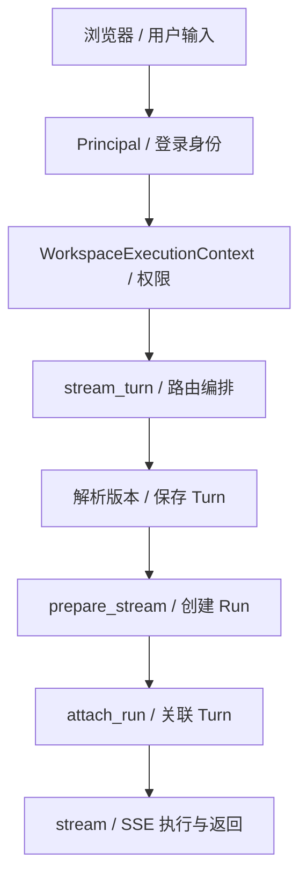

# 01 HTTP 与执行入口

[学习首页](README.md) · [上一课：00 架构](00-architecture-first.md) · [下一课：02 Runtime 与模型上下文](02-one-run-end-to-end.md)

源码核查基线：`823ac05`，2026-10-09；答案核查补充：2026-10-10。本课中的源码/流程为静态核查；个人练习尚未代你执行，历史证据保留其日期/SHA。

## 这课要解决什么

你已经知道系统有哪些模块，现在要回答：**一条 HTTP 请求怎样变成有权限、有版本、有身份的执行？** 第一遍只跟流式 Thread 请求，不同时追所有 API。读完能从 route 找到业务服务，并解释鉴权、提交幂等与依赖装配。

## 源码导读：鉴权、提交与执行的交接

先看下表，弄清代码的职责与交接，再按阅读重点进入源码。表中的入口不是全部都要第一遍逐行读完。

| 入口与职责 | 输入 → 产出 | 阅读重点 |
| --- | --- | --- |
| [get_current_principal](../../apps/api/auth_dependencies.py)：把请求认证结果变为可信主体，回答是谁。 | HTTP Request/认证材料→PrincipalContext；不合法时错误。 | 找认证来源和校验，再确认 user_id/request 身份从哪里来；不要从 body 或模型读取 actor。 |
| [get_workspace_context](../../apps/api/knowledge_dependencies.py) / [get_agent_run_workspace_context](../../apps/api/knowledge_dependencies.py)：检查工作区访问权；后者是本课 Thread 路由实际注入的版本。 | 普通依赖取 principal/session；运行依赖从 Request 装配短 session→WorkspaceExecutionContext。 | 两者都调用 TenantService；运行依赖在 SSE 前关闭权限查询的 session，不让长流一直占用连接。 |
| [stream_turn](../../apps/api/routes/threads.py)：协调版本、Turn、Run 和 StreamingResponse；把 HTTP 与业务执行连接起来。 | 路由 UUID、文本/client_token、可信 context 与服务→SSE response，或明确错误。 | 新 token 看准备/关联；重复 token 看旧 Run 附着和未关联 409；此函数不实现 Agent Loop。 |
| [resolve_agent_version](../../packages/threads/service.py) / [open_turn](../../packages/threads/service.py) / [attach_run](../../packages/threads/service.py) / [submit_turn](../../packages/threads/service.py)：前三者选版本、记录提交、保存关联；submit_turn 是同步执行编排。 | workspace context + thread/input/token→版本/Turn，关联写入或 SubmittedTurn。 | 分清每次 commit；同步重点看宽限窗口与 _turn_run，流式路径没有同样的 orphan 修复。 |
| [prepare_stream](../../packages/agent_runtime/runtime.py) / [stream](../../packages/agent_runtime/runtime.py)：准备阶段先创建 Run，stream 才推进执行并产生事件。 | context、发布 version、input/thread 或 prepared_run→Run / 异步事件流。 | Run 已存在≠模型已执行；辨认图启动、事件发布与取消/断线守卫。 |

## 1. 输入先落在哪一层

Incident 页面的一轮提交包含用户文本和 `client_token`，目标是：

```text
POST /api/v1/workspaces/{workspace_id}/threads/{thread_id}/turns/stream
```

三个身份不是模型自己提供的：workspace 来自路由并经过成员权限检查；用户来自鉴权；Thread 必须属于该工作区。不要把 body 中一个 `workspace_id` 字段当授权，也不能用前端“禁用按钮”替代后端检查。



这是流式新 Turn 的主线，重复 token 和异常分支另有处理。箭头不是跨表原子事务的保证。

## 2. 鉴权与工作区权限为何要分两步

先查 [auth_dependencies](../../apps/api/auth_dependencies.py) 的 `get_current_principal`，再用下面的普通工作区依赖理解“身份→权限上下文”。实际 Thread 路由注入同文件的 `get_agent_run_workspace_context`，它在独立短 session 内解析权限并在长流开始前关闭 session；不要把教学示例误读为所有路由都持有同一个请求级 session。

出处：[apps/api/knowledge_dependencies.py](../../apps/api/knowledge_dependencies.py)，`get_workspace_context`；源码函数（省略装饰器，学习注释见下）。

> **源码注释版：** `# 学习：` 是教材新增解释，原执行语句保留；导入、类或调用上下文可能省略。

```python
async def get_workspace_context(
    # 学习：路由定位的工作区身份，不是客户端已被授权的证明。
    workspace_id: UUID,
    # 学习：FastAPI 注入认证主体；不是从模型回答里解析用户身份。
    principal: PrincipalContext = principal_dependency,
    # 学习：注入数据库 session，用于查询成员/角色关系。
    session: AsyncSession = db_session_dependency,
) -> WorkspaceExecutionContext:
    return (
        # 学习：由租户服务验证关系与访问权；失败时抛错误，不生成可用权限上下文。
        await TenantService().get_workspace_access(
            session, principal=principal, workspace_id=workspace_id
        )
    # 学习：访问结果还含其他数据；这里提取 WorkspaceExecutionContext
    # 学习：供后续服务使用。
    ).context
```

`PrincipalContext` 回答“是谁”，`WorkspaceExecutionContext` 回答“在哪个工作区，能做什么”。`TenantService.get_workspace_access` 根据数据库的组织/工作区关系解析权限。组织成员不等于自动有某工作区全部权限。

**读法：** 在函数中依次圈出 `principal`、`workspace_id`、`get_workspace_access`。先不要展开所有角色常量；只要能说清权限不是模型文本/客户端参数赋予的。

Runtime 的执行入口还检查 `agent_run` 等权限。内容可读和身份/状态可见也可能是不同权限，因此看到 Run 列表不等于可以读 prompt、答案或知识分片。

## 3. Route、Service、Composition 三者区别

| 位置 | 第一遍读什么 | 为什么要分开 |
| --- | --- | --- |
| [apps/api/routes/threads.py](../../apps/api/routes/threads.py) `stream_turn` | 请求如何调用服务、构造 StreamingResponse | HTTP 解析/响应不用进入 Runtime |
| [packages/threads/service.py](../../packages/threads/service.py) `resolve_agent_version` / `open_turn` / `attach_run` | 工作区归属、版本解析、Turn 的提交身份 | 会话业务可以被不同 transport 复用 |
| [apps/api/agent_runtime_dependencies.py](../../apps/api/agent_runtime_dependencies.py) `get_production_agent_run_service` | Runtime 依赖怎样组装 | 测试或生产可以注入不同适配器，核心链不绑死 SDK |
| [packages/agent_runtime/runtime.py](../../packages/agent_runtime/runtime.py) `prepare_stream` / `stream` | 实际 Run 怎样创建、执行 | HTTP route 不自己实现模型循环 |

**Composition 是装配点。** 在 `get_production_agent_run_service` 找到 `ToolRuntime`、`ApprovalService`、`ActionRuntime`、`LangGraphCheckpointAdapter`、`memory_selector` 和 `artifact_recorder`。这些构造器解释了系统如何连起来，不要求本课读完每个实现。

## 4. 相同输入为何仍需要 client_token

文本相同不代表同一业务提交。用户可以合法重复问同一句话；网络超时也可能导致同一次提交被发送两遍。`client_token` 区分这两件事。

| 情况 | 预期处理 | 原因 |
| --- | --- | --- |
| 新 token | 新 Turn，再准备/关联 Run | 新业务提交 |
| 同 token，已有关联 Run | 复用/附着已有 Run | 避免一次提交创建重复执行 |
| 同 token，Turn 已存但 Run 未关联 | 流式 route 返回 409 in-progress，让客户端按同 token 重试 | 不能附着一个尚不存在的 Run |

同步 `ThreadService.submit_turn` 还包含孤儿 Turn 过期后的查找/修复路径，不能把同步和流式实现混成完全相同。详细比较时打开这个函数，先看 `_orphan_turn_expired` 和 `_turn_run`。

**数据库角度：** Turn 和 Run 先后保存/关联，不是持有事务跨过完整模型请求。长事务会占用连接和锁，也不能把网络调用变成数据库原子操作。项目用显式中间状态和重试语义处理窗口，而非宣称不存在窗口。

## 5. API 路径与 worker 路径如何复用

[apps/worker/tasks/agent_runs.py](../../apps/worker/tasks/agent_runs.py) 提供 `execute_agent_run` / `_execute_agent_run`。任务携带身份，worker 再取得可信工作区权限，装配同一 AgentRunService，执行已有 Run。

`apps/api/routes/threads.py` 的直接流式路径不应被画成每次必定进 Celery；其他入口可以准备 Run 后排队。阅读任何入口时问三个问题：创建记录在哪？真正执行在哪？谁给浏览器发送事件？

## 6. 只读练习：画一个提交窗口

不启动服务。顺序打开上述三个核心文件，画出 `open_turn → prepare_stream → attach_run → stream`，在每条箭头旁写：若进程在此退出，哪些记录已经存在？每个窗口的参考答案如下；这是源码推演，不是新故障实测。

再比较同步 `submit_turn`。记录两条路径各在哪里附着 Run、怎样处理重试。学习产物是你的调用链笔记，不是修改 Runtime。

**提交窗口参考答案：**

| 退出位置（该步已成功提交） | 已存在的记录 | 同 token 流式重发的行为 |
| --- | --- | --- |
| open_turn 后、prepare_stream 前 | Turn；还没有本次新 Run | 旧 Turn 无关联，返回 THREAD_TURN_IN_PROGRESS（409） |
| prepare_stream 后、attach_run 前 | Turn 和 Run；尚未建立 Turn 的 run 关联 | 仍因旧 Turn 未关联而返回 409；该入口没有同步路径的 orphan 修复分支 |
| attach_run 后、开始消费 stream 前 | Turn→Run 已关联 | 附着已有 Run；关联不证明执行已推进或事件已产生 |
| stream 正在推进或结束后 | 关联、已写步骤/持久事件，完成时有终态 | 附着原 Run 跟读/重放结构事件，不能保证完整 delta 重放 |

**同步路径对照：** `submit_turn` 调用 run_service.run 后才 attach_run，所以未关联不必然代表没执行。重发在启动宽限内返回 409；超过宽限后 `_turn_run` 在同 Thread 内按创建时间寻找候选 Run。仍 RUNNING/CANCEL_REQUESTED 则继续 409；已等待/终结则补关联并复用；没找到 Run 才重新执行记录的问题。这个恢复查询基于范围与时间，不是直接持久的 Turn→Run 外键证明，不能泛化为所有并发情形都完全确定。依据：[submit_turn / _turn_run](../../packages/threads/service.py)、[stream_turn](../../apps/api/routes/threads.py)。

## 7. 自测与面试追问

1. **为什么前端判断权限后 API 还要鉴权？** 客户端可被绕过且状态可能过期；后端认证主体、解析当前 workspace 权限并在 service 限定范围。否则一个伪造请求就能避开 UI。核查 get_workspace_context 和具体 service 的 `_require`。
2. **三种 ID 有何不同？** client_token 关联一次提交重发；run_id 标识整个执行，等待恢复不换 ID；logical_action_id 标识执行中的特定受控动作，用于审批/执行关联。一个 Run 可包含多个动作，所以不能用 run_id 替代全部动作 ID；provider call ID 也不能替代平台动作身份。
3. **为什么 Turn 存在却没关联 Run？** open_turn、准备/运行、attach_run 不是同一事务，进程可能在中间退出；同步路径甚至在执行返回后才关联。上面的窗口表给出各步已保存什么，不能只看一个空字段就重跑。
4. **Celery 意味着全部 Run 在 worker 吗？** 不意味。`stream_turn` 直接调用准备/流式 Runtime；入库、评测及部分恢复/异步入口使用 worker。执行位置由具体 route/queue 调用决定，框架存在不等于全链路自动派队列。

**通过标准：** 从 `stream_turn` 定位真实业务调用；解释工作区权限；画出 Turn/Run 的提交窗口。不能只背“FastAPI + Celery”。

已有核查入口：[租户隔离测试](../../tests/integration/test_interview_tenant_matrix.py)、[ThreadService](../../packages/threads/service.py)。文件存在不等于本轮执行这些测试。


## 精读增补：把 HTTP 请求追到一个可恢复的 Turn

### A. 阅读前需要理解的 Python 和数据库语法

`async def` 表示函数返回可等待的协程；`await` 在 I/O 等待时让出执行机会，不代表这一操作自动有事务保护。`async with session_factory() as session` 管理数据库 session 的生命周期；`await session.commit()` 才是提交当前事务。上下文退出不等于业务动作肯定成功。

`select(Model).where(...)` 构造查询，`session.scalar(...)` 执行并取一个标量对象；`update(...).where(...).returning(...)` 可把状态条件与更新合为一个数据库操作。`with_for_update()` 是行锁；唯一约束是数据库对并发写入的最终防线。这些机制解决的问题不同，后面的审批和任务租约会重复用到。

FastAPI 的 dependency 用来解析调用者和装配服务。读函数参数时，不只看请求 body：调用上下文、workspace、service 往往从依赖注入而来。客户端给出的 `workspace_id` 只是请求定位信息，不能自己证明成员资格。

### B. 用五个问题追踪路由

打开 [threads 路由](../../apps/api/routes/threads.py) 与 [ThreadService](../../packages/threads/service.py)，依次找：

| 要找什么 | 看代码中的什么 | 解释给别人听时应说什么 |
| --- | --- | --- |
| 请求身份 | principal / context 依赖 | 请求代表哪个主体 |
| 工作区权限 | `_require` / scoped load | 在哪个 workspace 允许什么操作 |
| 发布版本 | `resolve_agent_version` | 本轮跑哪份冻结规格 |
| 重复提交 | `open_turn` / `client_token` | 重发时关联已有 Turn，或识别尚未完成的提交 |
| 开始与跟读 | `prepare_stream` / `attach_run` / `attach_stream` | 创建新执行和跟读旧执行不是同一件事 |

建议在源码旁写“输入→校验→落库→返回”。遇到函数跳转就记录所交付的对象，不用马上通读整个被调用文件。

### C. `open_turn` 按操作拆解

真实函数在 [ThreadService.open_turn](../../packages/threads/service.py)。按以下顺序逐项核对，而不是只背“有幂等键”：

1. 要求 AGENT_RUN 权限，取得当前工作区身份。权限不够时不会因 token 相同而绕过检查。
2. 校验输入文本，规范化 token 并限制长度。格式合法和业务允许是两类检查。
3. 按工作区加载 Thread，避免拿别的租户的 thread_id 直接写入。
4. 如果 token 已存在，返回既有提交需要复用的信号，路由再找 Turn/Run。
5. 查询当前 Thread 的最大序号，计算下一序号，构造 ThreadTurn 并提交。
6. 捕获 `IntegrityError`、rollback 并返回空结果。数据库约束会拦截前置检查之后发生的竞争；调用方仍需区分已存在与尚未完成。

这里有重要的并发细节：两个请求都可能在第 4 步看不到旧 Turn。前置查询只能减少常见重复，不能代替唯一约束。不同 token 也可能竞争同一个下一序号，因此不能把所有 IntegrityError 都解释成“同 token 已完美去重”。定位竞态要同时查看 route 如何处理返回值和 models 的约束。

### D. 一个重发请求的时间线

下面是**教学推演，不是新执行日志**。设 token 为 `submit-1`，第一次请求已经创建 T1 并关联 R1，但客户端还没有收到响应就断线。

| 时间 | 客户端/服务器操作 | 应读出的语义 |
| --- | --- | --- |
| t0 | 第一次提交 token=submit-1 | 新 Turn 的提交身份 |
| t1 | T1 保存，随后关联 R1 | Turn 和 Run 是不同持久对象 |
| t2 | 客户端没收到完整响应 | 不能推断服务端没开始 |
| t3 | 用同 token 重发 | 查询已有提交，避免把网络重发当新问题 |
| t4 | 已有关联 Run | stream 分支可附着旧 R1 |

再把断线点提前到 T1 保存但 Run 尚未关联：stream 分支发现旧 Turn 没有 agent_run_id，会给出 `THREAD_TURN_IN_PROGRESS`，而不是立即承诺新开一个 Run。同步提交和流式提交的恢复逻辑要分别读，不把某入口的处理扩展到所有入口。

因此 token 的前端生命周期也属于正确性：对同一次网络重试保留 token；开始新的语义提交应产生新的 token；取消分支不能让下一次问题误附着旧执行。

### E. 为什么数据库 session 不应包住慢模型调用

一条数据库查询通常很短，模型/远端工具可能等待数秒甚至超时。如果在等待期间保持事务或行锁，其他请求会被锁竞争阻塞，连接池也更容易耗尽。读依赖装配和 Gateway 时观察“先读取必要配置并关闭 session，再访问远端”的边界。它降低资源占用，但也意味着不能假装数据库和外部调用是同一个原子事务；第 05 课专门处理这个后果。

### F. 练习与参考答案

#### Q01-01 · HTTP 200 能证明什么？

**答案：** 先看该接口的响应契约。返回 Run 身份、打开事件流、完成最终执行是不同阶段。流式响应已经开始后，业务错误可能出现在事件中，不能只看 HTTP 状态码。

**解读：** HTTP 状态描述传输/接口接受情况。流式响应开始后，服务器可能用事件报告失败；返回 Run ID 的接口也可能尚未完成执行。因此要把接口契约、最终 Run 状态、错误事件及动作结果一起看。

**核查依据：** [对应源码/证据](../../apps/api/routes/threads.py)，重点看 `stream_turn`。

**常见误解：** 只看到 200 就认定模型、工具和审批都成功。

#### Q01-02 · 隐藏“发布”按钮能否完成权限控制？

**答案：** 不能。前端用于解释可用操作；后端必须按实际 principal、workspace 和 permission 检查。攻击者可直接调用 API，UI 也可能缓存旧角色。

**解读：** 客户端可以绕过页面直接发 HTTP，前端还可能缓存过期角色。服务端读取当前上下文并在具体操作中要求对应权限、限定 workspace，才能保证请求不能靠隐藏按钮绕过。

**核查依据：** [对应源码/证据](../../packages/threads/service.py)，重点看 `_require / resolve_agent_version`。

**常见误解：** 把界面可见性当作授权边界。

#### Q01-03 · 两人同时提交同一个 token，如何证明不重复？

**答案：** 找前置查询、唯一约束、IntegrityError 分支和后续关联/附着处理，列出崩溃点；不能只指出一行 token 查询就宣称所有竞争都已覆盖。

**解读：** 相同 token 的前置查询减少重复，唯一约束处理查询后竞争，IntegrityError 分支回滚后由路由寻找已有 Turn。若 Run 尚未关联，流式入口返回 409；若已关联则附着已有 Run。这证明各层处理意图，全部崩溃/竞争覆盖还必须查相应测试。

**核查依据：** [对应源码/证据](../../packages/threads/service.py)，重点看 `open_turn / token_turn；配合 threads route`。

**常见误解：** 说“一次 SELECT 就保证了并发幂等”，或把任何唯一冲突都当同 token。

**掌握标准：** 能从路由画出“鉴权→工作区→版本→Turn→Run→流”的调用链；解释 await、事务与唯一约束的区别；预测重发发生在 Run 关联前后各会怎样。

---

[学习首页](README.md) · [上一课：00 架构](00-architecture-first.md) · [下一课：02 Runtime 与模型上下文](02-one-run-end-to-end.md)
