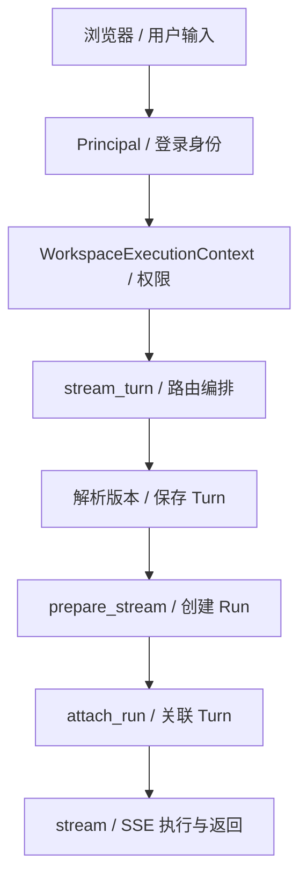

# 01 HTTP 与执行入口

[学习首页](README.md) · [上一课：00 架构](00-architecture-first.md) · [下一课：02 Runtime 与模型上下文](02-one-run-end-to-end.md)

源码核查基线：`67264b3`，2026-10-09。本课中的源码/流程为静态核查；个人练习尚未代你执行，历史证据保留其日期/SHA。

## 这课要解决什么

你已经知道系统有哪些模块，现在要回答：**一条 HTTP 请求怎样变成有权限、有版本、有身份的执行？** 第一遍只跟流式 Thread 请求，不同时追所有 API。读完能从 route 找到业务服务，并解释鉴权、提交幂等与依赖装配。

## 1. 输入先落在哪一层

Incident 页面的一轮提交包含用户文本和 `client_token`，目标是：

```text
POST /api/v1/workspaces/{workspace_id}/threads/{thread_id}/turns/stream
```

三个身份不是模型自己提供的：workspace 来自路由并经过成员权限检查；用户来自鉴权；Thread 必须属于该工作区。不要把 body 中一个 `workspace_id` 字段当授权，也不能用前端“禁用按钮”替代后端检查。



这是流式新 Turn 的主线，重复 token 和异常分支另有处理。箭头不是跨表原子事务的保证。

## 2. 鉴权与工作区权限为何要分两步

先查 [auth_dependencies](../../apps/api/auth_dependencies.py) 的 `get_current_principal`，再查下面的真实依赖：

出处：[apps/api/knowledge_dependencies.py](../../apps/api/knowledge_dependencies.py)，`get_workspace_context`；原样函数（省略装饰器）。

```python
async def get_workspace_context(
    workspace_id: UUID,
    principal: PrincipalContext = principal_dependency,
    session: AsyncSession = db_session_dependency,
) -> WorkspaceExecutionContext:
    return (
        await TenantService().get_workspace_access(
            session, principal=principal, workspace_id=workspace_id
        )
    ).context
```

`PrincipalContext` 回答“是谁”，`WorkspaceExecutionContext` 回答“在哪个工作区，能做什么”。`TenantService.get_workspace_access` 根据数据库的组织/工作区关系解析权限。组织成员不等于自动有某工作区全部权限。

**读法：**在函数中依次圈出 `principal`、`workspace_id`、`get_workspace_access`。先不要展开所有角色常量；只要能说清权限不是模型文本/客户端参数赋予的。

Runtime 的执行入口还检查 `agent_run` 等权限。内容可读和身份/状态可见也可能是不同权限，因此看到 Run 列表不等于可以读 prompt、答案或知识分片。

## 3. Route、Service、Composition 三者区别

| 位置 | 第一遍读什么 | 为什么要分开 |
| --- | --- | --- |
| [apps/api/routes/threads.py](../../apps/api/routes/threads.py) `stream_turn` | 请求如何调用服务、构造 StreamingResponse | HTTP 解析/响应不用进入 Runtime |
| [packages/threads/service.py](../../packages/threads/service.py) `resolve_agent_version` / `open_turn` / `attach_run` | 工作区归属、版本解析、Turn 的提交身份 | 会话业务可以被不同 transport 复用 |
| [apps/api/agent_runtime_dependencies.py](../../apps/api/agent_runtime_dependencies.py) `get_production_agent_run_service` | Runtime 依赖怎样组装 | 测试或生产可以注入不同适配器，核心链不绑死 SDK |
| [packages/agent_runtime/runtime.py](../../packages/agent_runtime/runtime.py) `prepare_stream` / `stream` | 实际 Run 怎样创建、执行 | HTTP route 不自己实现模型循环 |

**Composition 是装配点。**在 `get_production_agent_run_service` 找到 `ToolRuntime`、`ApprovalService`、`ActionRuntime`、`LangGraphCheckpointAdapter`、`memory_selector` 和 `artifact_recorder`。这些构造器解释了系统如何连起来，不要求本课读完每个实现。

## 4. 相同输入为何仍需要 client_token

文本相同不代表同一业务提交。用户可以合法重复问同一句话；网络超时也可能导致同一次提交被发送两遍。`client_token` 区分这两件事。

| 情况 | 预期处理 | 原因 |
| --- | --- | --- |
| 新 token | 新 Turn，再准备/关联 Run | 新业务提交 |
| 同 token，已有关联 Run | 复用/附着已有 Run | 避免一次提交创建重复执行 |
| 同 token，Turn 已存但 Run 未关联 | 流式 route 返回 409 in-progress，让客户端按同 token 重试 | 不能附着一个尚不存在的 Run |

同步 `ThreadService.submit_turn` 还包含孤儿 Turn 过期后的查找/修复路径，不能把同步和流式实现混成完全相同。详细比较时打开这个函数，先看 `_orphan_turn_expired` 和 `_turn_run`。

**数据库角度：**Turn 和 Run 先后保存/关联，不是持有事务跨过完整模型请求。长事务会占用连接和锁，也不能把网络调用变成数据库原子操作。项目用显式中间状态和重试语义处理窗口，而非宣称不存在窗口。

## 5. API 路径与 worker 路径如何复用

[apps/worker/tasks/agent_runs.py](../../apps/worker/tasks/agent_runs.py) 提供 `execute_agent_run` / `_execute_agent_run`。任务携带身份，worker 再取得可信工作区权限，装配同一 AgentRunService，执行已有 Run。

`apps/api/routes/threads.py` 的直接流式路径不应被画成每次必定进 Celery；其他入口可以准备 Run 后排队。阅读任何入口时问三个问题：创建记录在哪？真正执行在哪？谁给浏览器发送事件？

## 6. 只读练习：画一个提交窗口

不启动服务。顺序打开上述三个核心文件，画出 `open_turn → prepare_stream → attach_run → stream`，在每条箭头旁写：若进程在此退出，哪些记录已经存在？本课只需要列问题，不假造测试结果。

再比较同步 `submit_turn`。记录两条路径各在哪里附着 Run、怎样处理重试。学习产物是你的调用链笔记，不是修改 Runtime。

## 7. 自测与面试追问

1. 前端已有权限判断，为什么 API 还要鉴权？提示方向：客户端不可信，后端是权威。
2. `client_token`、`run_id`、`logical_action_id` 有何不同？分别是提交、执行和动作身份；第 4 课展开第三个。
3. 为什么 Turn 可能存在但 Run 没关联？提示方向：分段持久化与启动/执行窗口。
4. 使用 Celery 是否意味着全部 Run 都在 worker？提示方向：打开具体 route 验证，不用框架名字推断。

**通过标准：**从 `stream_turn` 定位真实业务调用；解释工作区权限；画出 Turn/Run 的提交窗口。不能只背“FastAPI + Celery”。

已有核查入口：[租户隔离测试](../../tests/integration/test_interview_tenant_matrix.py)、[ThreadService](../../packages/threads/service.py)。文件存在不等于本轮执行这些测试。

---

[学习首页](README.md) · [上一课：00 架构](00-architecture-first.md) · [下一课：02 Runtime 与模型上下文](02-one-run-end-to-end.md)
