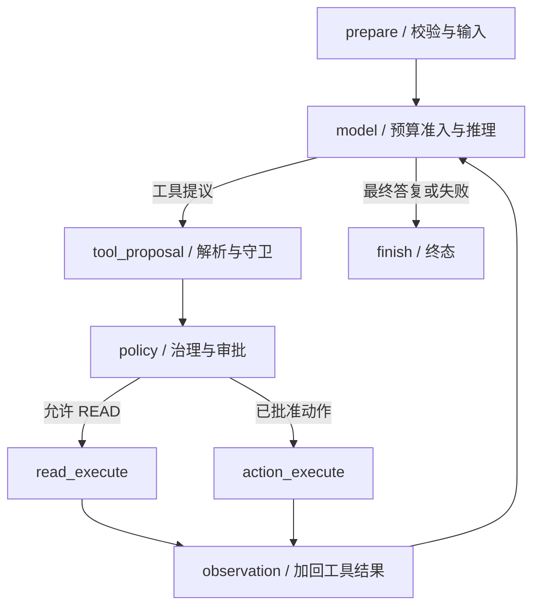

# 02 Runtime 与模型上下文

[学习首页](README.md) · [上一课：01 HTTP 与执行入口](01-codebase-navigation.md) · [下一课：03 对象与版本身份](03-domain-model-lifecycle.md)

源码核查基线：`67264b3`，2026-10-09。本课中的源码/流程为静态核查；个人练习尚未代你执行，历史证据保留其日期/SHA。

## 这课要解决什么

请求已成为 Run，现在学**模型如何推理、工具结果如何回到模型、什么时候停止，以及上下文为何不能无限增长**。仍用 Incident：先查证，再提出受控回滚。工具顺序由模型和实际结果决定，不是固定脚本。

## 1. Run 的开始不是一次裸模型调用

先读 `AgentRunService.run → prepare_run → execute_prepared_run`。`prepare_run` 先持久化身份；执行阶段装配 `_AgentRunGraph`。历史版本规格要校验，知识/Memory 的有效输入要装载或冻结。

[真实入口](../../packages/agent_runtime/runtime.py)：`_create_run`、`_validate_frozen_execution_snapshots`、`_resolve_effective_snapshots`、`_AgentRunGraph.prepare`。第一遍只找这些函数互相交付什么数据，不逐行通读。

## 2. 八个节点，按数据变化理解



图省略等待审批的 interrupt、准备/提议失败与取消等提前退出分支；它们在第 4–5 课展开。

| 阶段 | 输入 | 关键变化 |
| --- | --- | --- |
| prepare | AgentVersion、Run、当前输入、冻结身份 | 校验规格/快照，建立初始 messages |
| model | messages、模型计划、工具定义、预算 | 准入上下文，调用模型，累积 usage/计数 |
| tool_proposal | 模型 tool calls | 解析参数，检测无效提议和重复/上限 |
| policy | 发布工具定义、提议 | 决定 READ、审批/动作或工具失败观察 |
| execute | 放行的调用/已批准动作 | 实际工具结果与动作执行状态 |
| observation | 工具结果 | 加入下一轮 messages；可形成 Artifact |
| finish | 当前状态/输出/失败 | 持久化结果，不替失败伪造成功答复 |

以下是源码中的结束/下一步判断：

出处：[packages/agent_runtime/runtime.py](../../packages/agent_runtime/runtime.py)，`after_model`；原样函数（省略装饰器）。

```python
def after_model(self, state: AgentRunState) -> str:
    return (
        "finish"
        if state.get("failure_code") or state.get("final_output") is not None
        else "tool_proposal"
    )
```

没有工具提议、收到最终输出、发生失败，是不同的结果路径。模型调用次数、工具数、时间/费用与上下文预算也分别受守卫约束，不能把一个 max_tool_calls 当成全部预算。

## 3. 读 model 前先认识三种数据

| 数据 | 含义 | 为什么存在 |
| --- | --- | --- |
| ModelMessage | system/user/assistant/tool 等消息 | Runtime 与 provider adapter 使用统一格式 |
| ModelRequest | 准入后的 messages + tool definitions | 显式记录送给供应商什么 |
| ModelResponse / ModelStreamEvent | 最终回复、工具调用、usage；或增量事件 | 屏蔽供应商 SDK 差异，同时支持流式 |

出处：[model_gateway/contracts](../../packages/model_gateway/contracts.py)。不要把供应商的原始 response 对象塞进 Runtime 状态；契约边界方便验证、替换与测试，但仍需真实供应商能力适配。

## 4. Context Budget：先决定进什么，再发给模型

一轮输入可以包含运行时策略、冻结 prompt、当前问题、历史、工具定义、工具结果、知识和 Memory。它们不是同等重要，也不能无上限拼接。

[ContextBudgetPolicy](../../packages/agent_runtime/context_budget.py) 通过类别/组信息准入，不靠消息文本猜类别。运行时决定如何分类；Memory 即使消息 role 是 system，也不因此成为必留系统指令。

源码入口：

出处：[packages/agent_runtime/context_budget.py](../../packages/agent_runtime/context_budget.py)，`admit_context`；原样函数（省略装饰器）。

```python
def admit_context(
    frozen_spec: FrozenAgentSpec | ResolvedModelExecutionPlan | Iterable[Any],
    messages: Sequence[ModelMessage | ContextMessage] = (),
    categories: Sequence[ContextCategory] | Mapping[int, ContextCategory] | None = None,
    exchange_groups: Sequence[Hashable | None]
    | Mapping[int, Hashable | None]
    | None = None,
    tool_definitions: Sequence[ModelToolDefinition] = (),
    *,
    config: ContextBudgetConfig | None = None,
    estimator: TokenEstimator | None = None,
) -> ContextAdmissionResult:
    """Functional entry point for runtime code that does not retain a policy."""

    return ContextBudgetPolicy(
        frozen_spec,
        config,
        estimator=estimator,
    ).admit(messages, categories, exchange_groups, tool_definitions)
```

读 `_AgentRunGraph.model` 时按这个顺序圈词：`budget_policy`、`admission`、`_touch_admitted_memories`、`ModelRequest`、`prepare_resolved`、模型生成/流式。

**先选择、后准入：**检索/记忆选择得到候选；预算可能驱逐其中部分；只有真正进入 ModelRequest 的才是模型实际看见的。ContextAdmissionResult 记录准入后的数据与用量，不能用 selected 数量冒充模型使用量。

| 观察 | 能说明什么 | 不能说明什么 |
| --- | --- | --- |
| estimated input / reserved output | 预算估算和预留 | 不等于供应商最终计费 token |
| truncated / dropped exchanges | 有哪些输入因预算改变 | 不证明模型答案仍正确 |
| usage / cost estimate | 所测调用的用量和费用估计 | 不等于服务商最终账单或免费无限重试 |

## 5. Model Gateway 为什么不只封装 SDK

[ModelGatewayService](../../packages/model_gateway/gateway.py) 处理能力校验、模型执行计划、凭据解析、重试/fallback 与观测。检查声明支持的工具/上下文能力，不能假设所有模型行为等价。

fallback 的关键是**首个可见 token 之前**：用户已看到一段输出后不能透明切换到另一个模型并续写，造成来源/语义拼接。读取 gateway 的流式分支与关闭路径，区分“连接失败可重试”与“已输出不能透明重来”。

## 6. 工具结果怎样推进模型

`observation` 把结构化工具结果关联回 tool call，再让 model 继续。工具参数异常或未知工具可能成为反馈让模型纠正，不保证每种工具错误都立即终止整个 Run。具体 failure_code/分支要看节点实际代码。

READ 结果和 Memory 都属于不可信输入证据；它们不能覆盖 actor、权限、发布规格和 ToolPolicy。安全不是单纯一句 prompt，也包括契约、来源/范围验证和独立执行守卫。

## 7. 学习练习与面试解释

不运行服务，完成三张纸：

1. 画 `prepare → model → proposal → policy → execute → observation`，加上至少两个失败出口。
2. 写一轮 messages 的类别：策略/prompt、当前问题、历史、工具结果、Memory；指出为什么 system role 不等于必留类别。
3. 比较预算估算和供应商 usage，说明为何不能把 token 估算说成实际账单。

**自测：**为什么 observation 后还要调用模型？因为模型需根据实际结果修正推理。为什么不能无限重试工具？预算/重复守卫与副作用边界共同限制。

已有证据：[上下文预算测试](../../tests/unit/test_m4d_context_budget.py)、[流式预算集成](../../tests/integration/test_m4d_streaming_budget.py)、[失败与流式修复](../reviews/AgentHub-上下文失败与流式修复记录-20261002.md)。本课未重跑。

**通过标准：**找到 `_AgentRunGraph.model` 的最终 ModelRequest，讲出循环停止条件、输入分类和 fallback 边界。下一课学习这些输入身份为何能固定。

---

[学习首页](README.md) · [上一课：01 HTTP 与执行入口](01-codebase-navigation.md) · [下一课：03 对象与版本身份](03-domain-model-lifecycle.md)
