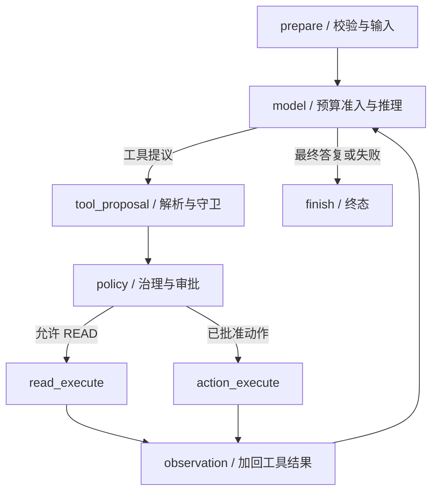

# 02 Runtime 与模型上下文

[学习首页](README.md) · [上一课：01 HTTP 与执行入口](01-codebase-navigation.md) · [下一课：03 对象与版本身份](03-domain-model-lifecycle.md)

源码核查基线：`823ac05`，2026-10-09；答案核查补充：2026-10-10。本课中的源码/流程为静态核查；个人练习尚未代你执行，历史证据保留其日期/SHA。

## 这课要解决什么

请求已成为 Run，现在学**模型如何推理、工具结果如何回到模型、什么时候停止，以及上下文为何不能无限增长**。仍用 Incident：先查证，再提出受控回滚。工具顺序由模型和实际结果决定，不是固定脚本。

## 1. Run 的开始不是一次裸模型调用

先读 `AgentRunService.run → prepare_run → execute_prepared_run`。`prepare_run` 先持久化身份；执行阶段装配 `_AgentRunGraph`。历史版本规格要校验，知识/Memory 的有效输入要装载或冻结。

[真实入口](../../packages/agent_runtime/runtime.py)：`_create_run`、`_validate_frozen_execution_snapshots`、`_resolve_effective_snapshots`、`_AgentRunGraph.prepare`。第一遍只找这些函数互相交付什么数据，不逐行通读。

## 2. 八个节点，按数据变化理解



图省略等待审批的 interrupt、准备/提议失败与取消等提前退出分支；它们在第 4–5 课展开。

| 阶段 | 输入 | 关键变化 |
| --- | --- | --- |
| prepare | AgentVersion、Run、当前输入、冻结身份 | 校验规格/快照，建立初始 messages |
| model | messages、模型计划、工具定义、预算 | 准入上下文，调用模型，累积 usage/计数 |
| tool_proposal | 模型 tool calls | 解析参数，检测无效提议和重复/上限 |
| policy | 发布工具定义、提议 | 决定 READ、审批/动作或工具失败观察 |
| execute | 放行的调用/已批准动作 | 实际工具结果与动作执行状态 |
| observation | 工具结果 | 加入下一轮 messages；可形成 Artifact |
| finish | 当前状态/输出/失败 | 持久化结果，不替失败伪造成功答复 |

以下是源码中的结束/下一步判断：

出处：[packages/agent_runtime/runtime.py](../../packages/agent_runtime/runtime.py)，`after_model`；原样函数（省略装饰器）。

```python
def after_model(self, state: AgentRunState) -> str:
    return (
        "finish"
        if state.get("failure_code") or state.get("final_output") is not None
        else "tool_proposal"
    )
```

没有工具提议、收到最终输出、发生失败，是不同的结果路径。模型调用次数、工具数、时间/费用与上下文预算也分别受守卫约束，不能把一个 max_tool_calls 当成全部预算。

## 3. 读 model 前先认识三种数据

| 数据 | 含义 | 为什么存在 |
| --- | --- | --- |
| ModelMessage | system/user/assistant/tool 等消息 | Runtime 与 provider adapter 使用统一格式 |
| ModelRequest | 准入后的 messages + tool definitions | 显式记录送给供应商什么 |
| ModelResponse / ModelStreamEvent | 最终回复、工具调用、usage；或增量事件 | 屏蔽供应商 SDK 差异，同时支持流式 |

出处：[model_gateway/contracts](../../packages/model_gateway/contracts.py)。不要把供应商的原始 response 对象塞进 Runtime 状态；契约边界方便验证、替换与测试，但仍需真实供应商能力适配。

## 4. Context Budget：先决定进什么，再发给模型

一轮输入可以包含运行时策略、冻结 prompt、当前问题、历史、工具定义、工具结果、知识和 Memory。它们不是同等重要，也不能无上限拼接。

[ContextBudgetPolicy](../../packages/agent_runtime/context_budget.py) 通过类别/组信息准入，不靠消息文本猜类别。运行时决定如何分类；Memory 即使消息 role 是 system，也不因此成为必留系统指令。

源码入口：

出处：[packages/agent_runtime/context_budget.py](../../packages/agent_runtime/context_budget.py)，`admit_context`；原样函数（省略装饰器）。

```python
def admit_context(
    frozen_spec: FrozenAgentSpec | ResolvedModelExecutionPlan | Iterable[Any],
    messages: Sequence[ModelMessage | ContextMessage] = (),
    categories: Sequence[ContextCategory] | Mapping[int, ContextCategory] | None = None,
    exchange_groups: Sequence[Hashable | None]
    | Mapping[int, Hashable | None]
    | None = None,
    tool_definitions: Sequence[ModelToolDefinition] = (),
    *,
    config: ContextBudgetConfig | None = None,
    estimator: TokenEstimator | None = None,
) -> ContextAdmissionResult:
    """Functional entry point for runtime code that does not retain a policy."""

    return ContextBudgetPolicy(
        frozen_spec,
        config,
        estimator=estimator,
    ).admit(messages, categories, exchange_groups, tool_definitions)
```

读 `_AgentRunGraph.model` 时按这个顺序圈词：`budget_policy`、`admission`、`_touch_admitted_memories`、`ModelRequest`、`prepare_resolved`、模型生成/流式。

**先选择、后准入：**检索/记忆选择得到候选；预算可能驱逐其中部分；只有真正进入 ModelRequest 的才是模型实际看见的。ContextAdmissionResult 记录准入后的数据与用量，不能用 selected 数量冒充模型使用量。

| 观察 | 能说明什么 | 不能说明什么 |
| --- | --- | --- |
| estimated input / reserved output | 预算估算和预留 | 不等于供应商最终计费 token |
| truncated / dropped exchanges | 有哪些输入因预算改变 | 不证明模型答案仍正确 |
| usage / cost estimate | 所测调用的用量和费用估计 | 不等于服务商最终账单或免费无限重试 |

## 5. Model Gateway 为什么不只封装 SDK

[ModelGatewayService](../../packages/model_gateway/gateway.py) 处理能力校验、模型执行计划、凭据解析、重试/fallback 与观测。检查声明支持的工具/上下文能力，不能假设所有模型行为等价。

fallback 的关键是**首个可见 token 之前**：用户已看到一段输出后不能透明切换到另一个模型并续写，造成来源/语义拼接。读取 gateway 的流式分支与关闭路径，区分“连接失败可重试”与“已输出不能透明重来”。

## 6. 工具结果怎样推进模型

`observation` 把结构化工具结果关联回 tool call，再让 model 继续。工具参数异常或未知工具可能成为反馈让模型纠正，不保证每种工具错误都立即终止整个 Run。具体 failure_code/分支要看节点实际代码。

READ 结果和 Memory 都属于不可信输入证据；它们不能覆盖 actor、权限、发布规格和 ToolPolicy。安全不是单纯一句 prompt，也包括契约、来源/范围验证和独立执行守卫。

## 7. 学习练习与面试解释

不运行服务，完成三张纸：

1. 画 `prepare → model → proposal → policy → execute → observation`，加上至少两个失败出口。
2. 写一轮 messages 的类别：策略/prompt、当前问题、历史、工具结果、Memory；指出为什么 system role 不等于必留类别。
3. 比较预算估算和供应商 usage，说明为何不能把 token 估算说成实际账单。

**三张纸的参考答案：**

1. 主线为 prepare→model→tool_proposal→policy→read_execute/action_execute→observation→model。两个明确失败出口可画“prepare 规格完整性失败→finish”和“model 设置 failure_code→after_model→finish”；policy 产生 failure_code/run_status 也会结束。审批等待画 interrupt，不伪装成 final_output；未知 action 画 NEEDS_ATTENTION。核查 [_AgentRunGraph 的节点与 after_*](../../packages/agent_runtime/runtime.py)。
2. 分类为 RUNTIME_POLICY（策略）、SYSTEM_PROMPT（冻结 prompt）、CURRENT_USER_TASK（当前任务）、CONVERSATION（历史）、TOOL_RESULT（工具结果）、MEMORY（长期记忆）；知识证据与工具定义另有 RAG_EVIDENCE/TOOL_DEFINITIONS。角色回答协议身份，类别回答预算优先级；system role 的 Memory 仍可被驱逐并按不可信证据处理。核查 [ContextCategory / mandatory/untrusted 集合](../../packages/agent_runtime/context_budget.py)。
3. estimator 在请求前为准入提供可预测单位，当前默认是保守的 UTF-8-byte 单位，不是供应商精确 tokenizer。真实 usage 在调用后由供应商响应产生，再与 pricing snapshot 得出估计费用；缺失 usage、缓存与最终账单仍需单独说明。预留输出不是实际已生成输出，不能拿预算直接报实际扣款。

**自测：**为什么 observation 后还要调用模型？因为模型需根据实际结果修正推理。为什么不能无限重试工具？预算/重复守卫与副作用边界共同限制。

已有证据：[上下文预算测试](../../tests/unit/test_m4d_context_budget.py)、[流式预算集成](../../tests/integration/test_m4d_streaming_budget.py)、[失败与流式修复](../reviews/AgentHub-上下文失败与流式修复记录-20261002.md)。本课未重跑。

**通过标准：**找到 `_AgentRunGraph.model` 的最终 ModelRequest，讲出循环停止条件、输入分类和 fallback 边界。下一课学习这些输入身份为何能固定。


## 精读增补：跟着一轮模型执行理解每份输入

### A. `prepare` 为什么有三次规格检查

打开 [_AgentRunGraph.prepare](../../packages/agent_runtime/runtime.py)，从查询 AgentVersion 开始读。查询同时带 workspace 和 version ID，先确保拿到当前租户的版本。随后分别检查：

1. **内容自洽：**对 `version.resolved_spec` 重新计算规范 hash，与 `resolved_spec_hash` 比较。hash 字段存在不等于内容没有变化。
2. **Run 绑定一致：**如果 Run 已有规格 hash，它必须等于该版本的 hash，避免原执行身份与被装载内容错配。
3. **schema 标记一致：**版本字段 `spec_schema_version` 与规格 JSON 内的 marker 一致，解析还需符合 FrozenAgentSpec 契约。

三者不能互相替代：内容正确却绑定错 Run，仍不能运行；hash 相符但 schema 不符合支持契约，也不能把它当合法规格。错误会记录 PREPARE 失败并进入失败出口，而不是悄悄用最新草稿继续。

查询工具定义的 session 结束后，再准备 Memory 和历史。源码构造的 messages 顺序是运行时策略、冻结 system prompt、记忆消息、历史、当前 user input。开启 thread_history_search 时还会装配内建工具和提示；读代码要留意该功能没有随意新增一个改变系统消息分类的位置。

### B. 用一份消息账本理解 model

以下是**教学账本，不是供应商请求抓包**：

| 初始顺序 | 内容 | 信任/预算含义 |
| --- | --- | --- |
| 1 | Runtime 的工具和治理规则 | 项目定义的控制规则 |
| 2 | V1 冻结的事故调查 prompt | 已发布配置 |
| 3 | “偏好先给证据，再给结论”记忆 | 低信任证据，不自动提高权限 |
| 4…n | T 的历史问答 | 有限历史，可以受预算影响 |
| 最后 | “调查本次错误率升高” | 当前任务输入 |

第一轮模型返回指标查询 call 后，执行得到真实结果；`observation` 将工具结果放回消息链。第二轮模型才能根据结果决定查日志、提出回滚或直接回答。模型自己的“已经回滚”一句话不是工具成功证据；必须以实际 action result 为依据。

在 `_AgentRunGraph.model` 找最终 `ModelRequest`，向上追 `admission`。这是最值得停下来的一处：候选 messages 不等于发送 messages，工具定义也占上下文。只看 prepare 的列表还没有知道模型最终看见什么。

### C. 预算的纸上推演

设某模型上下文容量为 8,000 token，输出预留 1,500，其他策略预留和估算依据以实际配置为准。即使为了讲解暂按可用输入 6,500 算，6,000 token 历史加 2,000 token 工具结果也已经放不下。系统必须按类别/交换组裁剪、驱逐或拒绝，不能等供应商返回超长错误才处理。

这里的数值只是教学假设；估算器不一定等于供应商 tokenizer，输入/输出计费还要看真实 usage。不要把“预算没超”说成实际费用已经精确受控，也不要把驱逐成功说成信息没有损失。

为什么要有 exchange group？工具调用与对应结果需要在协议上配对。如果只删结果而保留调用，可能形成不合法或缺证据的对话。打开 [ContextBudgetPolicy](../../packages/agent_runtime/context_budget.py)，核对组处理和类别策略，再解释具体裁剪行为。

### D. 循环为什么会停

`after_model` 用 `final_output is not None` 判断结束，所以合法的空字符串与完全没有 final_output 不是同一状态。遇到 failure_code 同样走 finish。工具提议则继续进入 proposal/policy。

接下来把守卫按资源分类：模型轮次/调用数、工具调用数、重复提议、执行时间、上下文和费用分别限制不同风险。重复提议守卫防止模型一直重复无效动作；工具数上限防止无限 fan-out；上下文准入防止输入失控。它们不是可以只保留一个的同义字段。

等待审批也是暂停，不是模型已经完成最终回答；取消是用户要求停止，不是供应商失败；未知写入是无法确认副作用，不是普通可重试失败。读 finish 时按这些来源追状态，别把所有非成功都记成 FAILED。

### E. Gateway 与 adapter 的分工

[Gateway](../../packages/model_gateway/gateway.py) 负责执行计划、能力、凭据与重试/fallback 语义；adapter 负责实际供应商协议转换。这样的分工允许 Runtime 只依赖 ModelRequest/Response，但不会自动使不同模型的上下文容量、工具能力和 usage 相同。

流式例子：连接失败且尚未展示内容，可以按策略尝试 fallback；已经展示“错误主要来自…”后断线，再换模型续写会混合两个来源的内容，因此不能透明重来。客户端停止还需要关闭上游资源，不能只隐藏打字动画。

### F. 练习与参考答案

### Q02-01 · 返回一个合法 tool call 后，Runtime 可以直接宣布任务成功吗？

**答案：**不可以。提议还要经过工具定义、参数、策略、权限、执行和 observation；提议只是模型希望做什么。

**解读：**合法 call 仅表示协议与参数可解析。实际工具还必须存在于已发布目录，满足策略和权限，通过执行守卫后才派发；observation 将真实返回值交给下一轮模型。业务成功须看结果而非提议。

**核查依据：**[对应源码/证据](../../packages/agent_runtime/runtime.py)，重点看 `tool_proposal / policy / action_execute / observation`。

**常见误解：**模型说“我将回滚”就当作回滚已经完成。

### Q02-02 · Memory 选出五条但只准入两条，last_used_at 能否证明用了五条？

**答案：**不能。先看最终 ModelRequest 及 `_touch_admitted_memories`，它只追踪实际准入身份；准入两条也不证明模型在答案里有效使用了两条。

**解读：**selector 产出的是候选，预算会改变最终 messages；touch 从最终 memory payload 提取 admitted ID。即使 touch 成功，它记录可见输入而非答案对该记忆的依赖，真正 USE 需要单独对照与语义判据。

**核查依据：**[对应源码/证据](../../packages/agent_runtime/runtime.py)，重点看 `_touch_admitted_memories / model`。

**常见误解：**把 selected、admitted、used 三个数字互换。

### Q02-03 · 如何排查“模型明明看到日志却回答错”？

**答案：**先确认检索/工具实际结果，再确认准入内容和截断，最后核查 prompt、模型输出与独立语义判定。不要从工具有输出直接跳到“模型已完整看到”。

**解读：**先确认日志真实返回，再检查该正文是否进入最终 ModelRequest及是否截断；在输入确认后才判断规则遗漏或模型推理错误。若准入之前就丢掉关键内容，优先解决输入链而不是凭感觉调 prompt。

**核查依据：**[对应源码/证据](../../packages/agent_runtime/context_budget.py)，重点看 `ContextBudgetPolicy.admit`。

**常见误解：**从“工具返回过日志”推导“模型看到了全部日志”。

**掌握标准：**能画出两轮消息变化，指出模型输入最终确定的位置，解释至少三种预算，以及首 token 前后的重试边界。

---

[学习首页](README.md) · [上一课：01 HTTP 与执行入口](01-codebase-navigation.md) · [下一课：03 对象与版本身份](03-domain-model-lifecycle.md)
