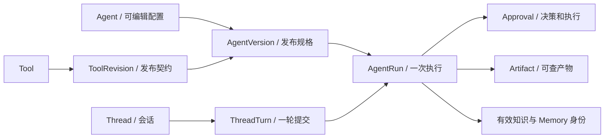

# 03 对象与版本身份

[学习首页](README.md) · [上一课：02 Runtime 与模型上下文](02-one-run-end-to-end.md) · [下一课：04 工具治理与审批](04-tools-approval.md)

源码核查基线：`823ac05`，2026-10-09。本课中的源码/流程为静态核查；个人练习尚未代你执行，历史证据保留其日期/SHA。

## 这课要解决什么

学对象的**关系、生命周期和身份**，而不是背数据库字段。Incident 先编辑 Agent，发布版本，再运行；知识、工具、反馈和实验也各有可变与不可变阶段。

## 1. 先画关系，再看表



箭头是业务关联，不是生命周期全由父对象级联删除。历史记录需保留，不能“删旧数据减轻负担”破坏运行/实验可解释性。

## 2. 可变与不可变，各保护什么

| 对象 | 主要变化 | 必须保护的东西 |
| --- | --- | --- |
| Agent 草稿 | prompt、模型、工具/知识绑定、预算 | 发布前可编辑，发布后不能回写旧版本 |
| AgentVersion | 发布后规格不变 | resolved_spec / schema / hash / 工具修订身份 |
| Tool 与 ToolRevision | Tool 有逻辑身份；修订承载执行契约 | Agent 使用的修订不能被今天的新配置偷换 |
| DocumentRevision | 入库状态与生命周期有管理过程 | 被历史版本/实验引用的修订留存 |
| KnowledgeSnapshot | 物化成员身份 | 固定 document/revision 成员，不能改成今天所有文档 |
| AgentRun | 状态、计数、输出会变化 | 所用版本、实际快照身份及原始执行归属 |
| Approval | PENDING 到决定，执行状态另变化 | 冻结参数、逻辑动作 ID、决定者、执行结果 |
| Thread/Turn | 会话元信息、多轮关联 | 提交 token 和 Run 的关系 |
| Artifact | 按类型约束保存/操作 | 来源 Run/工具证据，不能把所有产物都叫不可变或都叫可编辑 |
| WorkspaceMemory | 停用/启用等运营状态可变 | 原始内容身份与历史快照回放 |
| DatasetVersion / Experiment | 数据草稿可改；发布数据和冻结实验不可改 | 内容/schema/变体/知识/价格/build/evaluator 身份 |

**不可变不是“表没有 UPDATE 语句”。**要看应用服务校验、数据库约束/触发器和 Runtime hash 复核各保护什么。[models](../../packages/agent_runtime/models.py)、[migrations](../../migrations)与 [publish](../../packages/agent_runtime/publish.py)共同核查；不能把仅服务层保护说成数据库绝对禁止修改。

## 3. 为什么规范 JSON 才能作为身份

真实实现：

出处：[packages/core/canonical/json_hash.py](../../packages/core/canonical/json_hash.py)，`canonical_json`；原样函数（省略装饰器）。

```python
def canonical_json(value: Any) -> str:
    """Serialize JSON-compatible values with the M0 canonicalization contract."""
    return json.dumps(
        value,
        ensure_ascii=False,
        sort_keys=True,
        separators=(",", ":"),
        allow_nan=False,
    )
```

出处：[packages/core/canonical/json_hash.py](../../packages/core/canonical/json_hash.py)，`canonical_json_hash`；原样函数（省略装饰器）。

```python
def canonical_json_hash(value: Any) -> str:
    return hashlib.sha256(canonical_json(value).encode("utf-8")).hexdigest()
```

键顺序、空白和编码不应该改变同一结构的身份；NaN 等非标准值被拒绝。但 canonicalization 只解决编码稳定性，规格/schema 的语义仍需版本化。

只读小练习：在纸上写 `{"b": 2, "a": 1}` 与 `{"a": 1, "b": 2}`，预测哈希关系；再修改 a 的值，解释什么才叫规格真的变化。不运行数据库，也不直接改已发布 spec。

## 4. 三层冻结，不要混为一个 hash

| 层 | 冻结什么 | 示例 |
| --- | --- | --- |
| 发布版本 | 执行规格和知识绑定策略 | 工具修订、模型档案、预算、LATEST 策略 |
| 单次 Run | 当时实际使用的有效输入身份 | 解析出的知识快照、Memory ID/hash |
| 正式 Experiment | 实验和变体全部可比较身份 | 已发布数据/schema、spec、知识、pricing、build SHA、evaluator |

因此同一个版本采用 LATEST 时，不同 Run 的知识输入可能不同；实验要求一次冻结并保留。今天读取历史实验不应再次解析 LATEST。

Memory 停用也不意味着旧 Run 的记忆快照消失。回放回答“当时看到什么”，新选择回答“现在可以看到什么”。历史回放完整性仍需范围/hash 验证。

## 5. 版本 derive 的界限

当前 `AgentPublishService.derive_draft_values` 可提供派生编辑值，但真正新建派生草稿与持久关系 UI 属延期范围。不要从函数名推断已实现完整 lineage 产品能力。

## 6. 有身份的状态机

Run 的 WAITING_APPROVAL 是执行等待，人决定后恢复；Approval 的 APPROVED 是人决定，execution_status 才描述动作结果；Handoff CLOSED 是运营处理完成，不确认未知副作用。不把三个“完成”混成一个状态。

**练习：**给 Incident 写一条纸上记录：AgentVersion V1、Run R1、Approval A1；编辑草稿发布 V2 后，审批 R1 应执行哪一版？答题要包含冻结 ToolRevision 和参数，不能只说“还是旧 prompt”。

## 7. 按顺序打开代码

1. [AgentPublishService.publish](../../packages/agent_runtime/publish.py)：从草稿到 resolved_spec。
2. [AgentVersion / AgentRun](../../packages/agent_runtime/models.py)：看版本身份和执行状态的区别。
3. [KnowledgeSnapshotService](../../packages/knowledge/snapshots.py)：成员身份与 canonical hash。
4. [Thread/Turn models](../../packages/threads/models.py)：提交唯一性和 Run 关联。
5. [Approval contracts](../../packages/approvals/contracts.py)：两套状态枚举，不需要先背每个字段。

**面试追问：**为什么 AgentVersion 不能只保存“agent_id + 当前配置指针”？为何 Run 本身可变却还能支持历史解释？从身份不变、状态推进的区别回答。

已有证据：[知识快照](../../tests/integration/test_m3f_snapshot.py)、[发布/冻结流式](../../tests/unit/test_m4d_frozen_stream.py)、[实验身份](../../tests/integration/test_m7b_experiments.py)。本课未执行这些测试。

**通过标准：**解释草稿/版本/Run 三层关系，画出知识和实验的冻结时点。下一课让版本中的工具契约真正参与治理。


## 精读增补：沿身份链理解“不可变”与“可复现”

### A. 把草稿和已发布规格想成两份东西

Agent A 是持续编辑的产品对象；AgentVersion V1 是发布时的完整 resolved runtime snapshot。编辑 A 的 prompt 或工具绑定，不应直接让既有 V1 的运行内容变化。新发布产生 V2，新的 Run 可以选 V2，历史 R1 仍绑定 V1。

发布不只是给草稿加一个状态：它要解析并保存运行所需的模型计划、工具修订、知识绑定和其他配置，让 Runtime 不再依赖“今天草稿长什么样”。这也是为什么读取已发布工具应看 PublishedToolCatalog，而不是任意查询当前最新工具。

同时要区分**冻结配置**和**当时有效输入**。配置可以声明 LATEST 知识；执行或正式实验还需解析具体知识 snapshot。Memory 也有自己的有效内容身份。V1 的 hash 不替代所有实际输入的 hash。

### B. Canonical JSON 的手工理解

考虑两个教学 JSON：

```json
{"b":2,"a":1}
```

```json
{"a":1,"b":2}
```

它们字段语义相同，但原始字节不同。若直接对随意输出的 JSON 文本做 SHA-256，序列化顺序和空格会造成无意义变化。项目通过版本化的规范 JSON 产生身份。数组顺序如果在契约里有意义，则不能擅自排序成“相同”；规范化不是忽略所有差别。

学习时找到 [canonical 模块](../../packages/core/canonical/json_hash.py) 的实现，确认具体序列化选项和上层输入 schema。不要凭记忆另写一个 json.dumps 算法，就声称与项目 hash 一致。运行时重新计算 hash 用于完整性校验，hash 本身并不验证政策内容正确或没有越权。

### C. R1 的身份账本

下表仍是教学符号，应在真正实验中换成实际身份和完整 hash：

| 身份 | 冻结/解析时点 | 为什么需要 |
| --- | --- | --- |
| build SHA | 实验构造/冻结记录 | 同一配置在不同代码中可能行为不同 |
| AgentVersion V1 + spec hash | 发布后，被 Run/variant 绑定 | 确定模型计划、prompt 和工具配置 |
| 工具 revision | 版本解析 | 同名工具的参数/治理可能升级 |
| K1 + content hash | LATEST 解析或 PINNED 绑定 | 新文档不能悄悄进入历史实验 |
| Memory IDs + 内容身份 | 有效输入冻结 | 记忆停用或内容变化需要被识别 |
| DatasetVersion + schema/content hash | 数据集发布与实验冻结 | 输入/答案/分组不应被静默修改 |
| pricing/evaluator versions | 正式实验冻结 | 费用和评分算法有自己的版本 |

身份链解决的是“这次到底使用了什么”。它不是供应商模型完全确定性的保证：相同请求可能仍有输出波动，远端部署也可能改变。这就是评测需要重复次数和原始输出，而不是只存一组 hash。

### D. LATEST 具体怎么理解

假设冻结时知识库的有效快照为 K1，实验变体记录 K1。之后新增修订生成 K2。读取历史实验时仍应加载 K1，不能再次把 LATEST 解析为 K2，否则“同一个实验”的输入已经改变。

打开 [运行时快照校验](../../packages/agent_runtime/runtime.py) 的 `_validate_frozen_execution_snapshots`：它比较覆盖项数量与绑定数量，解析知识库/快照/hash，检查 workspace、binding mode、数据库 snapshot 和 content hash；PINNED 还与原规格固定身份比较。错配会失败，不是悄悄修正为当前最新。

这也解释了为什么历史文档修订要保留：只留 K1 的 hash 却删掉其成员内容，无法再次装载证据。hash 能发现变化，不能从摘要反推出原文。

### E. 三个“不可变”不能混讲

业务发布契约规定不可改，服务拒绝更新、数据库约束或触发器保护、运行时读取校验，是不同层次的保护。针对某对象要去查实际 service、models 和 [migrations](../../migrations) 中的约束，不能看到“immutable”注释就断言所有对象都有数据库 trigger。

历史 Run 的状态仍会从等待走向终态；Approval 的 execution_status 仍会更新；这不与 AgentVersion 规格不可变冲突。身份/配置不可变和执行状态可变属于不同对象及字段。

### F. 练习与参考答案

**题 1：改了 A 的 prompt，旧 R1 恢复用什么？** 原 V1 和原执行身份；如果恢复改用新 prompt，就已不再是原执行语义。

**题 2：两次 spec hash 相同，为什么不能证明实验可比？** 还需要代码、数据集、知识、Memory、pricing、evaluator 等身份；同一输入仍可能有模型波动。

**题 3：固定快照里引用的文档是否可以删除？** 历史绑定内容需要保留；逻辑删除、新修订和历史成员保留要按实际服务契约区分。

**掌握标准：**画出 A→V1→R1 及 K1/DatasetVersion 的关联；说清冻结发生在哪里、读取时验证什么，以及可复现输入与确定输出的区别。

---

[学习首页](README.md) · [上一课：02 Runtime 与模型上下文](02-one-run-end-to-end.md) · [下一课：04 工具治理与审批](04-tools-approval.md)
