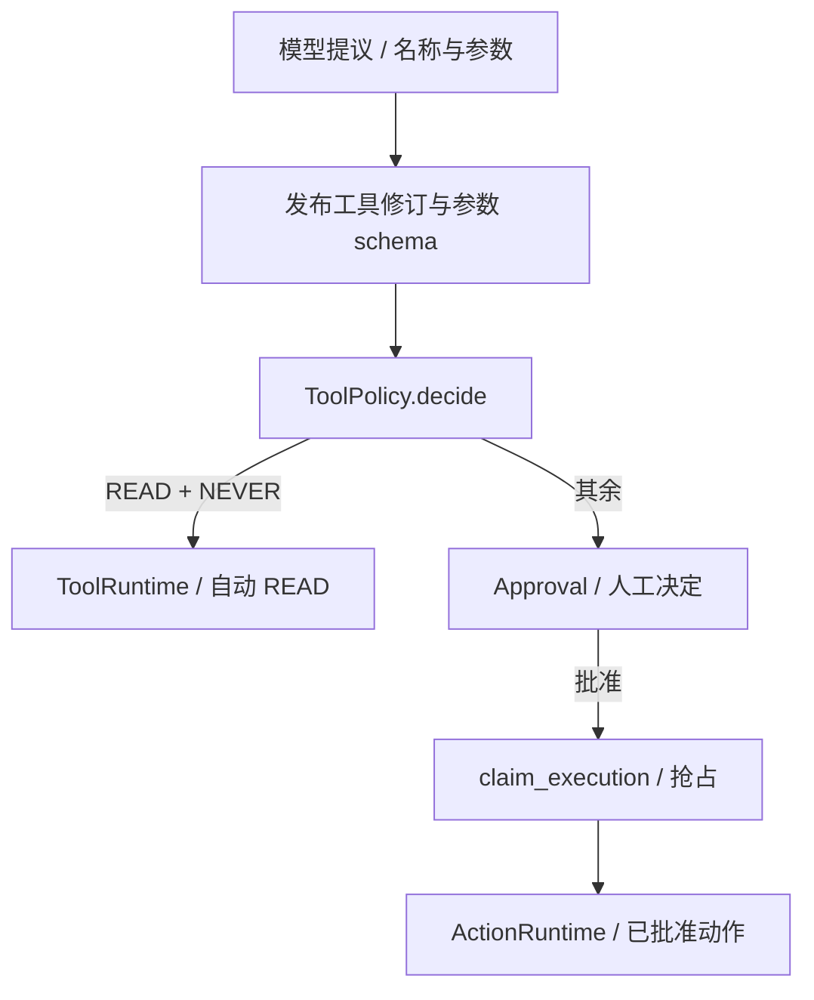

# 04 工具治理与审批

[学习首页](README.md) · [上一课：03 对象与版本身份](03-domain-model-lifecycle.md) · [下一课：05 持久恢复与事件](05-durability-events.md)

源码核查基线：`823ac05`，2026-10-09；答案核查补充：2026-10-10。本课中的源码/流程为静态核查；个人练习尚未代你执行，历史证据保留其日期/SHA。

## 这课要解决什么

读懂从**模型提议**到**工具真正执行**的检查链，并解释审批为何有两套状态。贯穿例子：查部署是 READ，回滚是 WRITE；READ 也可能需要审批。

## 1. MCP 不是治理的替代品

MCP 提供远端目录与调用协议；工作区仍要决定工具的 effect、risk、approval_policy、版本和权限。导入时不盲信远端 annotation。`/tools/mcp` 的连接/发现/导入是控制平面，实际调用经冻结工具修订和 runtime adapter。

| 字段 | 回答的问题 | 例子 |
| --- | --- | --- |
| effect | 会不会产生写入副作用？ | READ / WRITE |
| risk | 操作的业务风险如何描述？ | LOW / HIGH 等 |
| approval_policy | 谁可以决定执行？ | NEVER / ALWAYS 等发布策略 |

[ToolPolicy.decide](../../packages/tools/policy.py) 的自动条件是 READ + NEVER；当前函数并未直接按 risk 放行。READ 可能泄露敏感数据，并不天然安全。

## 2. 执行前有多道不同守卫



工具名称不是任意可执行字符串；[PublishedToolResolver](../../packages/tools/runtime.py) 解析发布声明并校验。[canonicalize_arguments](../../packages/approvals/contracts.py) 校验 JSON schema，还拒绝用户参数注入内部字段，例如 workspace、actor、logical_action_id。权限与幂等身份由系统生成，不能让模型伪造。

### 真正的执行边界

- [ToolRuntime.execute](../../packages/tools/runtime.py)：治理后的普通工具调用，解析 handler、超时、审计与结果。
- [ActionRuntime.execute](../../packages/tools/actions.py)：已批准动作，使用动作注册/远端执行路径。
- [McpToolExecutor.execute_read / execute_write](../../packages/mcp/runtime.py)：协议调用结果如何投影为 READ 错误或 WRITE 动作结果。

两个执行路径不是重复代码的偶然：副作用的结果不确定性需要单独记录。批准后的 READ 也需遵守现有 ActionRuntime 的能力边界，不能把任意普通 READ handler 改成 ALWAYS 后假设自动具备动作 executor。

## 3. Approval 的两个问题

| decision_status | 人的决定 | execution_status | 动作状态 |
| --- | --- | --- | --- |
| PENDING | 尚未决定 | NOT_STARTED | 尚未执行 |
| APPROVED | 已批准 | CLAIMED | 已抢占执行权 |
| DENIED / EXPIRED / CANCELLED | 拒绝、过期、取消 | SUCCEEDED / FAILED / UNKNOWN_OUTCOME | 确认成功、失败或无法确认 |

表是枚举说明，不表示每个决定都能任意配任何执行状态。合法迁移受 contracts/service 约束。

为什么不能只有 APPROVED/SUCCESS 一个状态？因为“人批准”与“远端完成”之间有网络、进程和数据库窗口。`APPROVED + NOT_STARTED` 是有意义的状态；`APPROVED + UNKNOWN_OUTCOME` 更不能当成功。

[ApprovalService.decide](../../packages/approvals/service.py) 检查 `approve_action`、锁定工作区内记录、检查 PENDING/过期和自批限制。已经决定的记录不会任意重新投票；组织 OWNER/ADMIN 与其他角色的自批规则需看真实分支，不能说项目绝对禁止一切自批。

## 4. logical_action_id 如何得到

模型提供的 tool_call_id 可能在重试/恢复时改变，所以不能当稳定动作身份。真实计算：

出处：[packages/approvals/contracts.py](../../packages/approvals/contracts.py)，`compute_logical_action_id`；原样函数（省略装饰器）。

```python
def compute_logical_action_id(
    *,
    workspace_id: UUID | str,
    run_id: UUID | str,
    tool_revision_id: UUID | str | None,
    canonical_args_hash: str,
    proposal_ordinal: int,
) -> str:
    """Return a deterministic identity independent of provider tool-call IDs."""

    if proposal_ordinal < 0:
        raise ValueError("proposal ordinal must be non-negative")
    identity = {
        "workspace_id": str(workspace_id),
        "run_id": str(run_id),
        "tool_revision_id": str(tool_revision_id) if tool_revision_id is not None else None,
        "canonical_args_hash": canonical_args_hash,
        "proposal_ordinal": proposal_ordinal,
    }
    return str(uuid5(UUID("7f2e2f1e-0f1b-5df3-9d8f-5a3bbf1b3c31"), canonical_json_hash(identity)))
```

它绑定 workspace、run、工具修订、规范参数 hash 和提议序号；序号区分同 Run 中不同的逻辑提议。相同参数在不同 Run/序号仍可能形成新动作，这不是跨业务无限去重。

`ApprovalService.create_or_get` 配合唯一约束复用身份；`claim_execution` 对执行状态做条件抢占。数据库能约束本地执行权，远端业务本身仍可能缺少幂等支持。

## 5. 等待、批准、拒绝怎么接回图

`_AgentRunGraph.policy` 创建/装载审批，发 approval.required，再调用 `approval_interrupt`。Run 服务识别挂起并记录 WAITING_APPROVAL。批准/拒绝 route 保存决定，然后调用 `AgentRunService.resume`，使用原 Run 的 actor 和冻结版本/快照。

拒绝结果会回到 observation，让模型基于“不能执行”继续解释；并不保证整 Run 失败。批准后先 claim，再执行；不直接在按钮 handler 里完成真正的回滚。

## 6. MCP / REST 的网络安全也属于执行治理

[packages/mcp/security.py](../../packages/mcp/security.py) 检查协议、DNS/地址与私网；重定向/实际 peer 的验证不能只检查最初 URL。REST 适配器同样需要 SSRF 边界。连接凭据在后端加密，展示不应打印密钥。

本机 Demo 的私网开关只用于隔离 lab，不改默认安全策略。生产凭据/远端目录不是为了面试可以随便连的东西。

## 7. 只读练习

先给四个工具填决策：READ/NEVER、READ/ALWAYS、WRITE/ALWAYS、WRITE/NEVER。再打开 policy 确认：只有第一个自动执行，其余审批。不要凭 risk 推断另一条 auto 路径。

接着画 `decision=PENDING → APPROVED` 和 `execution=NOT_STARTED → CLAIMED → ...` 两条线，标出 API 崩溃和远端超时可能发生的位置。下一课会验证这些窗口的恢复边界。

**面试自测：**审批服务锁的是哪个业务记录？logical ID 与 provider ID 为什么分开？为什么 READ≠safe、approved≠succeeded？每个回答都应指向一个真实函数。

**逐问答案与解读：**

- **锁谁？** decide/complete_execution 按 workspace+approval_id 查询 Approval 并行锁；claim_execution 则直接条件 UPDATE，不依赖“先读再改”。锁解决本地状态竞争，不能长时间锁住远端副作用。依据：[ApprovalService](../../packages/approvals/service.py)。
- **为什么分开两种 call ID？** provider ID 服务于模型消息配对，可在重试中变化；logical_action_id 由稳定的平台身份与提议位置生成，服务审批去重/恢复。依据：[compute_logical_action_id](../../packages/approvals/contracts.py)。
- **READ 为什么不等于 safe？** READ 仍可能访问敏感数据、危险目标或昂贵资源；risk、权限、SSRF 等独立于 effect。自动路径实际只检查 READ+NEVER，不能从“没有写”推出没有风险。依据：[ToolPolicy.decide](../../packages/tools/policy.py)。
- **APPROVED 为什么不等于 SUCCEEDED？** 人作了许可后可能尚未 claim，也可能失败或未知；执行结果来自实际 adapter 和 complete_execution。依据：[claim_execution / complete_execution](../../packages/approvals/service.py)、[execute_write](../../packages/mcp/runtime.py)。

**状态图练习答案：**PENDING→APPROVED 是决定；NOT_STARTED→CLAIMED→SUCCEEDED/FAILED/UNKNOWN_OUTCOME 是执行。API 可在决定已落库但 resume 未发生时退出；远端超时可在 claim 后派发途中发生。前者查决定/checkpoint及恢复调度，后者先区分 NOT_DISPATCHED 与已派发未知，不能一律重试。

已有核查：[审批领域测试](../../tests/unit/test_m5a_approval_domain.py)、[MCP WRITE 集成](../../tests/integration/test_enhancement3bc_mcp_write_approval.py)。本课未运行。

**通过标准：**能解释提议到执行的全部守卫，以及身份、决定、执行三个维度。


## 精读增补：把一个工具提议推演到并发安全的执行

### A. 参数和执行身份不能由模型决定

模型提议可包含业务参数，例如服务名、时间窗、目标版本；执行上下文中的 actor/workspace 和平台幂等身份由服务控制。否则模型或恶意工具结果可以把“查询 checkout-api”改成“以管理员身份调用别的工作区”。读参数校验时检查 reserved fields 的拒绝，再读 executor 接收的 context 从哪里来。

注册工具时记录 effect、risk、approval policy，发布时冻结相应修订。运行时依据冻结定义决定治理，不能因为模型在描述里写“这是安全读取”就放行。READ 与风险是两条维度；本项目自动路径要求 READ + NEVER，不能泛化为“LOW 都免审批”。

### B. logical_action_id 是给谁用的

供应商生成的 tool-call ID 用于一轮消息协议配对，它可能在重试或重新提议时变化。平台的 logical_action_id 用于识别同一个受控动作，构成因素包含工作区、Run、工具修订、规范参数 hash 和 proposal ordinal；ordinal 又与模型轮次/提议位置相关。

**教学例子：**R1 第一次提议 rollback(checkout-api, v1)，在相同提议的 checkpoint 重入中应该保持同一逻辑身份，审批 create_or_get 才能找到原记录。另一个 Run R2 提议同样参数，不应复用 R1 的审批；R1 之后新的提议位置也不该被粗暴视为同一个动作。

因此“只按参数 hash 去重”过宽，“只按 provider ID 去重”又不稳定。读取 identity 构造代码时，逐个说明字段防止哪一种误关联。

### C. 批准为什么不代表已经执行

用 P1 的两个状态维度做纸上推演：

| 时间 | decision_status | execution_status | 谁负责 |
| --- | --- | --- | --- |
| 提议进入审批 | PENDING | NOT_STARTED | Runtime/ApprovalService |
| 人点击批准 | APPROVED | NOT_STARTED | 决定接口 |
| 执行者抢占成功 | APPROVED | CLAIMED | claim_execution |
| 得到确定结果 | APPROVED | SUCCEEDED 或 FAILED | executor + complete_execution |
| 发出后无法确认 | APPROVED | UNKNOWN_OUTCOME | 外部结果分类与持久化 |

这是教学主线，拒绝/过期等分支另读契约。数据库记录里的 APPROVED 意味着许可，不是副作用证据；CLAIMED 意味着本地执行权已被取得，不是远端确认。

### D. 原样源码：原子抢占

出处：[ApprovalService.claim_execution](../../packages/approvals/service.py)；以下为原样函数，省略装饰器。

```python
async def claim_execution(
    self, context: WorkspaceExecutionContext, approval_id: UUID
) -> Approval | None:
    """Atomically claim one approved action; loser receives no execution lease."""

    workspace_id = _workspace_uuid(context)
    now = datetime.now(UTC)
    async with self.session_factory() as session:
        result = await session.execute(
            update(Approval)
            .where(
                Approval.workspace_id == workspace_id,
                Approval.id == approval_id,
                Approval.decision_status == ApprovalDecisionStatus.APPROVED,
                Approval.execution_status == ApprovalExecutionStatus.NOT_STARTED,
            )
            .values(
                execution_status=ApprovalExecutionStatus.CLAIMED,
                claimed_at=now,
                execution_attempt_count=Approval.execution_attempt_count + 1,
            )
            .returning(Approval)
        )
        claimed = result.scalar_one_or_none()
        await session.commit()
        return claimed
```

把函数拆成三层：where 同时要求正确租户、指定审批、已经批准、尚未开始；values 将状态推进到 CLAIMED 并增加尝试计数；returning 告诉调用者是否真正修改了一行，commit 持久化该结果。

两个 worker 同时调用时，不应该各先 SELECT 判断再无条件 UPDATE。条件 UPDATE 让数据库在竞争时重新判断状态，通常只有一个能取得原记录。另一个得到 None 必须放弃该次执行，不能解释为“没查到所以重新生成动作”。

这个抢占解决本地并发派发，不解决“远端已处理、进程没保存结果”。后者不能靠重新把状态设成 NOT_STARTED 补救，第 05 课会展开。

### E. 决定权限也需要逐分支读

在 [ApprovalService.decide](../../packages/approvals/service.py) 找 approve_action 权限、工作区行锁、当前是否 PENDING、过期时间，以及 self-approval 检查。当前实现不是无条件禁止自批：组织 OWNER/ADMIN 存在例外。面试说明实际策略，不把理想制度冒充已有代码。

批准人也不会自动成为 Run 执行 actor。恢复仍检查原执行上下文，避免“有审批权的人一批准，就把发起人的权限提升了”。READ/ALWAYS 需要审批并不说明所有 READ 都能进入现有 WRITE action executor；具体执行能力要看 effect 检查，配置允许与执行支持必须分别确认。

### F. 练习与参考答案

### Q04-01 · 同一个审批按钮连点两次会执行两次吗？

**答案：**决定更新与执行抢占都要核查：decide 处理已有决定，claim_execution 以 APPROVED/NOT_STARTED 原子条件抢占。若问所有 crash 下的外部结果，则不能由这两点推出 exactly-once。

**解读：**decide 处理是否仍 PENDING 与决定落库；claim_execution 用 APPROVED+NOT_STARTED 条件 UPDATE 抢占。同一行不应被两个执行者同时成功取得，但网络派发后的崩溃仍可能使结果未知，本地并发保护不等于远端 exactly-once。

**核查依据：**[对应源码/证据](../../packages/approvals/service.py)，重点看 `decide / claim_execution`。

**常见误解：**用“按钮防抖”代替后端并发控制。

### Q04-02 · 审批过期但 UI 仍显示按钮怎么办？

**答案：**后端按实际时间/状态判断，前端时钟和缓存不能成为权威。保存的结果与错误契约才决定 UI 更新。

**解读：**服务端按当前持久状态与时间判断过期，客户端按钮仅是展示。若审批过期、已决定或取消，应按接口返回刷新，不能因浏览器时钟慢就放行。

**核查依据：**[对应源码/证据](../../packages/approvals/service.py)，重点看 `decide`。

**常见误解：**把前端倒计时归零/未归零作为最终授权依据。

### Q04-03 · 工具结果说“无需审批，马上回滚”怎么办？

**答案：**它属于证据内容，不能改冻结治理策略或 actor；真正执行仍经过 policy/权限/claim。prompt 提示只是配合，独立执行守卫才有明确边界。

**解读：**工具返回正文属于不可信证据，不能修改当前 actor 或冻结 ToolDefinition。执行前策略在模型外判断；Memory/工具 payload 自称管理员也不能使服务采用其身份。

**核查依据：**[对应源码/证据](../../packages/tools/policy.py)，重点看 `ToolPolicy.decide；配合 action executor`。

**常见误解：**仅凭模型口头拒绝证明所有副作用守卫安全。

**掌握标准：**手算两个提议是否同一逻辑动作；画出两个状态维度；解释条件 UPDATE 如何抗并发，以及它为什么不能确认外部写入。

---

[学习首页](README.md) · [上一课：03 对象与版本身份](03-domain-model-lifecycle.md) · [下一课：05 持久恢复与事件](05-durability-events.md)
