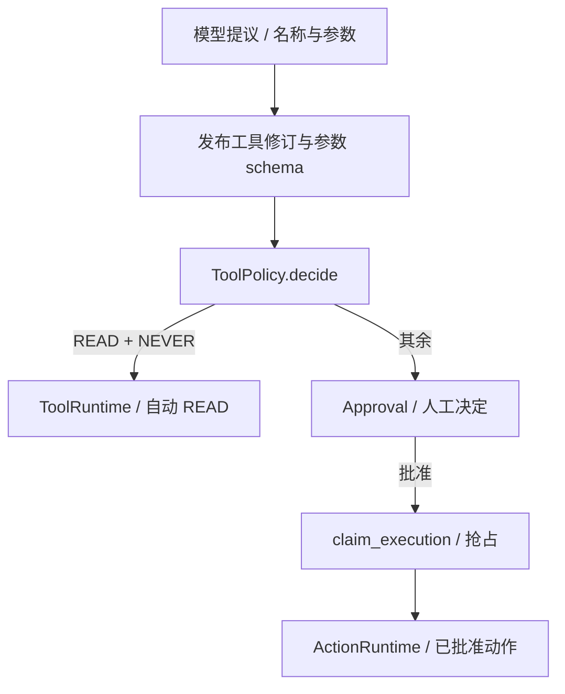

# 04 工具治理与审批

[学习首页](README.md) · [上一课：03 对象与版本身份](03-domain-model-lifecycle.md) · [下一课：05 持久恢复与事件](05-durability-events.md)

源码核查基线：`67264b3`，2026-10-09。本课中的源码/流程为静态核查；个人练习尚未代你执行，历史证据保留其日期/SHA。

## 这课要解决什么

读懂从**模型提议**到**工具真正执行**的检查链，并解释审批为何有两套状态。贯穿例子：查部署是 READ，回滚是 WRITE；READ 也可能需要审批。

## 1. MCP 不是治理的替代品

MCP 提供远端目录与调用协议；工作区仍要决定工具的 effect、risk、approval_policy、版本和权限。导入时不盲信远端 annotation。`/tools/mcp` 的连接/发现/导入是控制平面，实际调用经冻结工具修订和 runtime adapter。

| 字段 | 回答的问题 | 例子 |
| --- | --- | --- |
| effect | 会不会产生写入副作用？ | READ / WRITE |
| risk | 操作的业务风险如何描述？ | LOW / HIGH 等 |
| approval_policy | 谁可以决定执行？ | NEVER / ALWAYS 等发布策略 |

[ToolPolicy.decide](../../packages/tools/policy.py) 的自动条件是 READ + NEVER；当前函数并未直接按 risk 放行。READ 可能泄露敏感数据，并不天然安全。

## 2. 执行前有多道不同守卫



工具名称不是任意可执行字符串；[PublishedToolResolver](../../packages/tools/runtime.py) 解析发布声明并校验。[canonicalize_arguments](../../packages/approvals/contracts.py) 校验 JSON schema，还拒绝用户参数注入内部字段，例如 workspace、actor、logical_action_id。权限与幂等身份由系统生成，不能让模型伪造。

### 真正的执行边界

- [ToolRuntime.execute](../../packages/tools/runtime.py)：治理后的普通工具调用，解析 handler、超时、审计与结果。
- [ActionRuntime.execute](../../packages/tools/actions.py)：已批准动作，使用动作注册/远端执行路径。
- [McpToolExecutor.execute_read / execute_write](../../packages/mcp/runtime.py)：协议调用结果如何投影为 READ 错误或 WRITE 动作结果。

两个执行路径不是重复代码的偶然：副作用的结果不确定性需要单独记录。批准后的 READ 也需遵守现有 ActionRuntime 的能力边界，不能把任意普通 READ handler 改成 ALWAYS 后假设自动具备动作 executor。

## 3. Approval 的两个问题

| decision_status | 人的决定 | execution_status | 动作状态 |
| --- | --- | --- | --- |
| PENDING | 尚未决定 | NOT_STARTED | 尚未执行 |
| APPROVED | 已批准 | CLAIMED | 已抢占执行权 |
| DENIED / EXPIRED / CANCELLED | 拒绝、过期、取消 | SUCCEEDED / FAILED / UNKNOWN_OUTCOME | 确认成功、失败或无法确认 |

表是枚举说明，不表示每个决定都能任意配任何执行状态。合法迁移受 contracts/service 约束。

为什么不能只有 APPROVED/SUCCESS 一个状态？因为“人批准”与“远端完成”之间有网络、进程和数据库窗口。`APPROVED + NOT_STARTED` 是有意义的状态；`APPROVED + UNKNOWN_OUTCOME` 更不能当成功。

[ApprovalService.decide](../../packages/approvals/service.py) 检查 `approve_action`、锁定工作区内记录、检查 PENDING/过期和自批限制。已经决定的记录不会任意重新投票；组织 OWNER/ADMIN 与其他角色的自批规则需看真实分支，不能说项目绝对禁止一切自批。

## 4. logical_action_id 如何得到

模型提供的 tool_call_id 可能在重试/恢复时改变，所以不能当稳定动作身份。真实计算：

出处：[packages/approvals/contracts.py](../../packages/approvals/contracts.py)，`compute_logical_action_id`；原样函数（省略装饰器）。

```python
def compute_logical_action_id(
    *,
    workspace_id: UUID | str,
    run_id: UUID | str,
    tool_revision_id: UUID | str | None,
    canonical_args_hash: str,
    proposal_ordinal: int,
) -> str:
    """Return a deterministic identity independent of provider tool-call IDs."""

    if proposal_ordinal < 0:
        raise ValueError("proposal ordinal must be non-negative")
    identity = {
        "workspace_id": str(workspace_id),
        "run_id": str(run_id),
        "tool_revision_id": str(tool_revision_id) if tool_revision_id is not None else None,
        "canonical_args_hash": canonical_args_hash,
        "proposal_ordinal": proposal_ordinal,
    }
    return str(uuid5(UUID("7f2e2f1e-0f1b-5df3-9d8f-5a3bbf1b3c31"), canonical_json_hash(identity)))
```

它绑定 workspace、run、工具修订、规范参数 hash 和提议序号；序号区分同 Run 中不同的逻辑提议。相同参数在不同 Run/序号仍可能形成新动作，这不是跨业务无限去重。

`ApprovalService.create_or_get` 配合唯一约束复用身份；`claim_execution` 对执行状态做条件抢占。数据库能约束本地执行权，远端业务本身仍可能缺少幂等支持。

## 5. 等待、批准、拒绝怎么接回图

`_AgentRunGraph.policy` 创建/装载审批，发 approval.required，再调用 `approval_interrupt`。Run 服务识别挂起并记录 WAITING_APPROVAL。批准/拒绝 route 保存决定，然后调用 `AgentRunService.resume`，使用原 Run 的 actor 和冻结版本/快照。

拒绝结果会回到 observation，让模型基于“不能执行”继续解释；并不保证整 Run 失败。批准后先 claim，再执行；不直接在按钮 handler 里完成真正的回滚。

## 6. MCP / REST 的网络安全也属于执行治理

[packages/mcp/security.py](../../packages/mcp/security.py) 检查协议、DNS/地址与私网；重定向/实际 peer 的验证不能只检查最初 URL。REST 适配器同样需要 SSRF 边界。连接凭据在后端加密，展示不应打印密钥。

本机 Demo 的私网开关只用于隔离 lab，不改默认安全策略。生产凭据/远端目录不是为了面试可以随便连的东西。

## 7. 只读练习

先给四个工具填决策：READ/NEVER、READ/ALWAYS、WRITE/ALWAYS、WRITE/NEVER。再打开 policy 确认：只有第一个自动执行，其余审批。不要凭 risk 推断另一条 auto 路径。

接着画 `decision=PENDING → APPROVED` 和 `execution=NOT_STARTED → CLAIMED → ...` 两条线，标出 API 崩溃和远端超时可能发生的位置。下一课会验证这些窗口的恢复边界。

**面试自测：**审批服务锁的是哪个业务记录？logical ID 与 provider ID 为什么分开？为什么 READ≠safe、approved≠succeeded？每个回答都应指向一个真实函数。

已有核查：[审批领域测试](../../tests/unit/test_m5a_approval_domain.py)、[MCP WRITE 集成](../../tests/integration/test_enhancement3bc_mcp_write_approval.py)。本课未运行。

**通过标准：**能解释提议到执行的全部守卫，以及身份、决定、执行三个维度。

---

[学习首页](README.md) · [上一课：03 对象与版本身份](03-domain-model-lifecycle.md) · [下一课：05 持久恢复与事件](05-durability-events.md)
