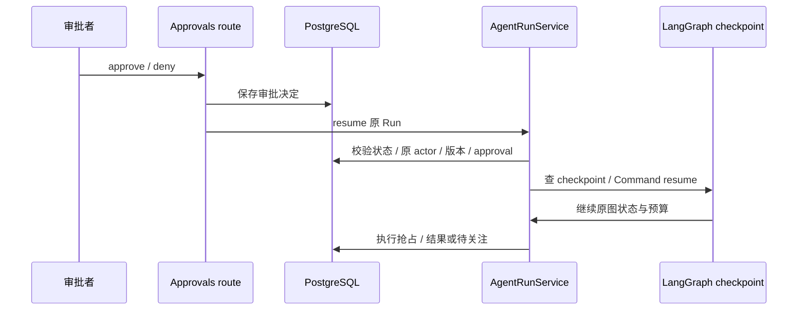

# 05 持久恢复与事件

[学习首页](README.md) · [上一课：04 工具治理与审批](04-tools-approval.md) · [下一课：06 知识与 RAG](06-knowledge-rag.md)

源码核查基线：`67264b3`，2026-10-09。本课中的源码/流程为静态核查；个人练习尚未代你执行，历史证据保留其日期/SHA。

## 这课要解决什么

解释等待审批后如何恢复，为什么 checkpoint 不等于外部 exactly-once，以及 SSE、持久事件、RunStep 和 trace 各解决什么。不是只背“用了 LangGraph”。

## 1. 恢复需要稳定的图身份

真实 checkpoint 标识：

出处：[packages/agent_runtime/adapters/langgraph/checkpoint.py](../../packages/agent_runtime/adapters/langgraph/checkpoint.py)，`checkpoint_thread_id`；原样函数（省略装饰器）。

```python
def checkpoint_thread_id(workspace_id: UUID | str, run_id: UUID | str) -> str:
    """Stable tenant-safe identity used by every graph invocation for a Run."""

    return f"agenthub:{workspace_id}:{run_id}"
```

这里的 LangGraph `thread_id` 是 workspace+Run 派生身份，**不是业务 Thread 的 UUID**。一段聊天多个 Run 各有自己的图状态；审批恢复仍使用原 Run 的 checkpoint 身份。

`checkpoint_config` 把它交给框架。schema 由 [bootstrap_langgraph_checkpoint](../../scripts/bootstrap_langgraph_checkpoint.py) 显式初始化；API 不自动建 checkpoint 表。

## 2. 恢复不是新跑一遍



图是成功恢复的步骤；checkpoint 缺失、身份不匹配、权限撤销或执行不确定会走其他分支，不保证批准一定恢复成功。

按顺序读 [AgentRunService.resume](../../packages/agent_runtime/runtime.py)：Run 是否存在/等待 → 原运行上下文 → approval 归属版本 → checkpoint 是否存在 → graph resume。原 actor 决定执行权限，不是审批者获得权限后替原 actor 改写执行身份。

预算和 usage 也随原执行历史保留；不因人工批准清零。缺 checkpoint 时会记录 NEEDS_ATTENTION，并给出 `APPROVAL_CHECKPOINT_MISSING` 对应分支。

## 3. 哪些窗口能重入，哪些不能盲试

| 窗口 | 需要问的问题 | 项目边界 |
| --- | --- | --- |
| 创建审批/interrupt 前后 | 重入是否生成同一 logical_action_id？ | 纯/idempotent/re-entrant 操作，create_or_get 复用 |
| 保存决定后，resume 前 | 决定是否已落库？图是否还等待？ | 对账/恢复依赖持久状态，不只靠 API 内存 |
| claim 后，发出写入前 | 是否能确认远端没接收？ | 未必能仅凭本地 CLAIMED 区分，不能随意重试 |
| 发出写入后，结果保存前 | 远端可能成功了吗？ | 无法确认则 UNKNOWN_OUTCOME / NEEDS_ATTENTION |

本地动作可在特定事务/幂等身份中确认结果；远端动作另受协议和服务约束，不能用本地工单去重测试推出所有 MCP 写入 exactly-once。

## 4. 从代码学三类结果

[McpToolExecutor.execute_write](../../packages/mcp/runtime.py) 是非常值得逐行读的短函数：

出处：[packages/mcp/runtime.py](../../packages/mcp/runtime.py)，`execute_write`；原样函数（省略装饰器）。

```python
async def execute_write(
    self,
    context: WorkspaceExecutionContext,
    definition: ToolDefinition,
    arguments: Mapping[str, Any],
) -> ActionExecutionResult:
    """Dispatch an approved WRITE tool once and classify the answer.

    AgentHub intentionally dispatches the call a single time and never
    retries an uncertain outcome. That is a statement about what this side
    does, not a promise about the remote: no exactly-once guarantee is
    claimed or available here.
    """

    outcome = await self._call(context, definition, arguments)
    if outcome.status is McpCallStatus.OK:
        return ActionExecutionResult.succeeded(outcome.data or {})
    if outcome.status is McpCallStatus.TOOL_ERROR:
        # The server said the tool failed. That is a definite answer about a
        # completed round trip, so it is a failure, not a mystery.
        return ActionExecutionResult.failed(
            outcome.failure_code or "MCP_TOOL_CALL_FAILED",
            "The remote MCP tool reported a failure.",
        )
    if outcome.dispatch is DispatchState.NOT_DISPATCHED:
        return ActionExecutionResult.failed(
            outcome.failure_code or "MCP_TOOL_CALL_FAILED",
            "The remote MCP tool was not called.",
        )
    return ActionExecutionResult.unknown_outcome(
        outcome.failure_code or "MCP_TOOL_CALL_FAILED"
    )
```

读法：OK 是确认成功；TOOL_ERROR 是远端明确返回失败；NOT_DISPATCHED 是未发请求；其他无法确认的已派发情况归未知。不要把所有超时都写成“失败，可重试”。

[_AgentRunGraph.action_execute](../../packages/agent_runtime/runtime.py) 将未知动作投影为 Run NEEDS_ATTENTION。人工接管关闭只是运营处理，不是自动副作用对账。

## 5. SSE 与持久化：四份记录不能混用

| 机制 | 用途 | 局限 |
| --- | --- | --- |
| Run / RunStep | 状态、步骤、预算、结果查询 | 不是全部 graph payload |
| checkpoint | 图中断与恢复 | 不证明远端结果 |
| AgentRunEvent / SSE | 事件序号、重连/跟读、UI 展示 | message.delta 不持久化；队列满可丢帧 |
| trace sink | 脱敏的时延/阶段观测 | 失败不阻断业务，不默认记录正文，不等于外部 Langfuse 已接通 |

[真实事件筛选](../../packages/agent_runtime/event_store.py)：

出处：[packages/agent_runtime/event_store.py](../../packages/agent_runtime/event_store.py)，`should_persist`；原样函数（省略装饰器）。

```python
def should_persist(event: AgentEvent) -> bool:
    return event.type not in NON_PERSISTED_EVENT_TYPES
```

这里的 NON_PERSISTED_EVENT_TYPES 包含 message.delta。读本文件开头与有界队列写入分支，理解为什么不能承诺全部帧不丢失。

`AgentRunService.attach_stream` 根据原 Run 与游标跟读。API 内直接流式还受订阅者/宽限/取消守卫；worker detached 路径又不同。断线不等于必然取消，也不等于永远后台继续，必须说清入口和配置。

## 6. 实验先做预测

纸上画两个故障点：WAITING 时 API 重启、远端接受写入但不返回。写出预期状态与证据，再在第 10 课的隔离实验中验证。此处没有新实测记录。

**面试追问：**为什么队列重投不能让已经 CLAIMED 的未知动作自动再发？为什么审批恢复不能新建 Run？为什么 SSE 重放不一定包含完整打字动画？

已有证据：[checkpoint 集成](../../tests/integration/test_m5a_checkpoint_runtime.py)、[审批预算恢复](../../tests/integration/test_approval_usage_resume.py)、[durable stream 单测](../../tests/unit/test_durable_run_stream.py)、[故障报告](../reviews/AgentHub-面试增强M-I3-M-I4验收报告-20261003.md)。历史 OS 退出三窗口安全终态 3/3，业务恢复仅 1/3，不能都叫自动恢复成功。

**通过标准：**区分数据库状态/图状态/外部结果/事件；说明一个已验证窗口与一个未知限制。

---

[学习首页](README.md) · [上一课：04 工具治理与审批](04-tools-approval.md) · [下一课：06 知识与 RAG](06-knowledge-rag.md)
