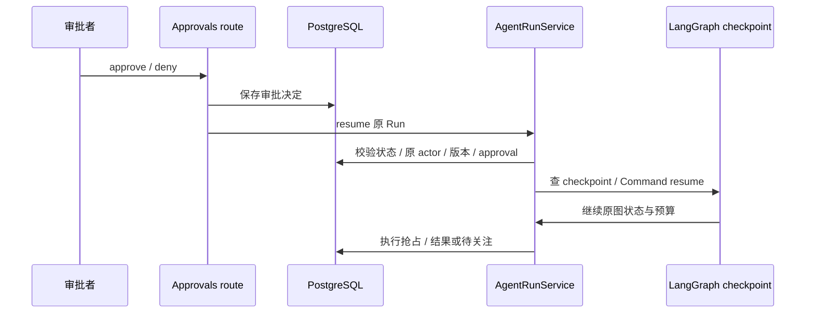

# 05 持久恢复与事件

[学习首页](README.md) · [上一课：04 工具治理与审批](04-tools-approval.md) · [下一课：06 知识与 RAG](06-knowledge-rag.md)

源码核查基线：`823ac05`，2026-10-09；答案核查补充：2026-10-10。本课中的源码/流程为静态核查；个人练习尚未代你执行，历史证据保留其日期/SHA。

## 这课要解决什么

解释等待审批后如何恢复，为什么 checkpoint 不等于外部 exactly-once，以及 SSE、持久事件、RunStep 和 trace 各解决什么。不是只背“用了 LangGraph”。

## 源码导读：恢复条件与外部结果分类

先看下表，弄清代码的职责与交接，再按阅读重点进入源码。表中的入口不是全部都要第一遍逐行读完。

| 入口与职责 | 输入 → 产出 | 阅读重点 |
| --- | --- | --- |
| [AgentRunService.resume](../../packages/agent_runtime/runtime.py)<br><br>以原 Run 继续图执行，不重新开始一次问题。 | request context、run_id、approval_id→AgentRunResult 或明确恢复错误。 | 原 Run 状态→原 actor 当前权限→审批归属→checkpoint→Command resume→结果。 |
| [checkpoint_thread_id](../../packages/agent_runtime/adapters/langgraph/checkpoint.py)<br>[config_for_run](../../packages/agent_runtime/adapters/langgraph/checkpoint.py)<br>[has_checkpoint](../../packages/agent_runtime/adapters/langgraph/checkpoint.py)<br><br>生成同 Run 图身份、交给框架配置，并探测恢复状态是否存在。 | workspace+Run→标识/config；探测→bool。 | 业务 Thread 与 checkpoint thread_id 不同；配置存在也不证明远端写入结果。 |
| [McpToolExecutor.execute_write](../../packages/mcp/runtime.py)<br><br>派发一次批准的 WRITE，将远端/派发证据转换成三类动作结果。 | context、ToolDefinition、arguments→ActionExecutionResult。 | 依次看 OK、TOOL_ERROR、NOT_DISPATCHED、未知兜底；不要先统一加 retry。 |
| [should_persist](../../packages/agent_runtime/event_store.py)<br><br>判断事件是否进入持久重放记录，本身不执行 INSERT。 | AgentEvent→bool。 | 读 NON_PERSISTED_EVENT_TYPES，再读实际写入与队列边界；序号是游标不是行数。 |

## 1. 恢复需要稳定的图身份

真实 checkpoint 标识：

出处：[packages/agent_runtime/adapters/langgraph/checkpoint.py](../../packages/agent_runtime/adapters/langgraph/checkpoint.py)，`checkpoint_thread_id`；源码函数（省略装饰器，学习注释见下）。

> **源码注释版：** `# 学习：` 是教材新增解释，原执行语句保留；导入、类或调用上下文可能省略。

```python
def checkpoint_thread_id(workspace_id: UUID | str, run_id: UUID | str) -> str:
    """Stable tenant-safe identity used by every graph invocation for a Run."""

    # 学习：用 workspace+Run 定位图状态；不是业务会话 Thread 的 ID。
    return f"agenthub:{workspace_id}:{run_id}"
```

这里的 LangGraph `thread_id` 是 workspace+Run 派生身份，**不是业务 Thread 的 UUID**。一段聊天多个 Run 各有自己的图状态；审批恢复仍使用原 Run 的 checkpoint 身份。

`checkpoint_config` 把它交给框架。schema 由 [bootstrap_langgraph_checkpoint](../../scripts/bootstrap_langgraph_checkpoint.py) 显式初始化；API 不自动建 checkpoint 表。

## 2. 恢复不是新跑一遍



图是成功恢复的步骤；checkpoint 缺失、身份不匹配、权限撤销或执行不确定会走其他分支，不保证批准一定恢复成功。

按顺序读 [AgentRunService.resume](../../packages/agent_runtime/runtime.py)：Run 是否存在/等待 → 原运行上下文 → approval 归属版本 → checkpoint 是否存在 → graph resume。原 actor 决定执行权限，不是审批者获得权限后替原 actor 改写执行身份。

预算和 usage 也随原执行历史保留；不因人工批准清零。缺 checkpoint 时会记录 NEEDS_ATTENTION，并给出 `APPROVAL_CHECKPOINT_MISSING` 对应分支。

## 3. 哪些窗口能重入，哪些不能盲试

| 窗口 | 需要问的问题 | 项目边界 |
| --- | --- | --- |
| 创建审批/interrupt 前后 | 重入是否生成同一 logical_action_id？ | 纯/idempotent/re-entrant 操作，create_or_get 复用 |
| 保存决定后，resume 前 | 决定是否已落库？图是否还等待？ | 对账/恢复依赖持久状态，不只靠 API 内存 |
| claim 后，发出写入前 | 是否能确认远端没接收？ | 未必能仅凭本地 CLAIMED 区分，不能随意重试 |
| 发出写入后，结果保存前 | 远端可能成功了吗？ | 无法确认则 UNKNOWN_OUTCOME / NEEDS_ATTENTION |

本地动作可在特定事务/幂等身份中确认结果；远端动作另受协议和服务约束，不能用本地工单去重测试推出所有 MCP 写入 exactly-once。

## 4. 从代码学三类结果

[McpToolExecutor.execute_write](../../packages/mcp/runtime.py) 是非常值得逐行读的短函数：

出处：[packages/mcp/runtime.py](../../packages/mcp/runtime.py)，`execute_write`；源码函数（省略装饰器，学习注释见下）。

> **源码注释版：** `# 学习：` 是教材新增解释，原执行语句保留；导入、类或调用上下文可能省略。

<details>
<summary>展开 execute_write 的带注释代码</summary>

```python
async def execute_write(
    self,
    context: WorkspaceExecutionContext,
    definition: ToolDefinition,
    arguments: Mapping[str, Any],
) -> ActionExecutionResult:
    """Dispatch an approved WRITE tool once and classify the answer.

    AgentHub intentionally dispatches the call a single time and never
    retries an uncertain outcome. That is a statement about what this side
    does, not a promise about the remote: no exactly-once guarantee is
    claimed or available here.
    """

    # 学习：本次调用一次并得到状态/派发证据；这里没有不确定写入重试循环。
    outcome = await self._call(context, definition, arguments)
    # 学习：收到远端确定成功结果，返回成功分类。
    if outcome.status is McpCallStatus.OK:
        return ActionExecutionResult.succeeded(outcome.data or {})
    # 学习：远端明确报告工具失败，与“请求没回音”不同。
    if outcome.status is McpCallStatus.TOOL_ERROR:
        # The server said the tool failed. That is a definite answer about a
        # completed round trip, so it is a failure, not a mystery.
        return ActionExecutionResult.failed(
            outcome.failure_code or "MCP_TOOL_CALL_FAILED",
            "The remote MCP tool reported a failure.",
        )
    # 学习：有证据表明未派发，属于确定未执行，不需要猜远端状态。
    if outcome.dispatch is DispatchState.NOT_DISPATCHED:
        return ActionExecutionResult.failed(
            outcome.failure_code or "MCP_TOOL_CALL_FAILED",
            "The remote MCP tool was not called.",
        )
    # 学习：其余情况无法确认副作用；保存未知，不能擅自按 FAILED 重试。
    return ActionExecutionResult.unknown_outcome(
        outcome.failure_code or "MCP_TOOL_CALL_FAILED"
    )
```

</details>

读法：OK 是确认成功；TOOL_ERROR 是远端明确返回失败；NOT_DISPATCHED 是未发请求；其他无法确认的已派发情况归未知。不要把所有超时都写成“失败，可重试”。

[_AgentRunGraph.action_execute](../../packages/agent_runtime/runtime.py) 将未知动作投影为 Run NEEDS_ATTENTION。人工接管关闭只是运营处理，不是自动副作用对账。

## 5. SSE 与持久化：四份记录不能混用

| 机制 | 用途 | 局限 |
| --- | --- | --- |
| Run / RunStep | 状态、步骤、预算、结果查询 | 不是全部 graph payload |
| checkpoint | 图中断与恢复 | 不证明远端结果 |
| AgentRunEvent / SSE | 事件序号、重连/跟读、UI 展示 | message.delta 不持久化；队列满可丢帧 |
| trace sink | 脱敏的时延/阶段观测 | 失败不阻断业务，不默认记录正文，不等于外部 Langfuse 已接通 |

[真实事件筛选](../../packages/agent_runtime/event_store.py)：

出处：[packages/agent_runtime/event_store.py](../../packages/agent_runtime/event_store.py)，`should_persist`；源码函数（省略装饰器，学习注释见下）。

> **源码注释版：** `# 学习：` 是教材新增解释，原执行语句保留；导入、类或调用上下文可能省略。

```python
def should_persist(event: AgentEvent) -> bool:
    # 学习：按事件类型过滤；message.delta 不持久化，所以重放游标允许有缺口。
    return event.type not in NON_PERSISTED_EVENT_TYPES
```

这里的 NON_PERSISTED_EVENT_TYPES 包含 message.delta。读本文件开头与有界队列写入分支，理解为什么不能承诺全部帧不丢失。

`AgentRunService.attach_stream` 根据原 Run 与游标跟读。API 内直接流式还受订阅者/宽限/取消守卫；worker detached 路径又不同。断线不等于必然取消，也不等于永远后台继续，必须说清入口和配置。

## 6. 实验先做预测

纸上画两个故障点：WAITING 时 API 重启、远端接受写入但不返回。写出预期状态与证据，再在第 10 课的隔离实验中验证。此处没有新实测记录。

**面试追问：** 为什么队列重投不能让已经 CLAIMED 的未知动作自动再发？为什么审批恢复不能新建 Run？为什么 SSE 重放不一定包含完整打字动画？

**逐问答案：** CLAIMED 只证明本地抢占，远端可能已经完成；队列重复投递不提供远端结果证据，因此不能自动重新派发未知 WRITE。审批恢复必须延续原动作/checkpoint/actor/预算，新建 Run 会改变执行与去重身份，属于重跑。SSE 的 message.delta 不落库，重放结构事件和最终输出而非完整 token 动画，sequence 也可以有缺口。分别核查 [claim_execution](../../packages/approvals/service.py)、[resume](../../packages/agent_runtime/runtime.py)、[should_persist](../../packages/agent_runtime/event_store.py)。

**两个预测题的答案：** WAITING 重启后，若原数据、checkpoint、当前原 actor 权限和配置有效，应恢复同一 Run；缺 checkpoint 则 NEEDS_ATTENTION / APPROVAL_CHECKPOINT_MISSING，不伪造继续成功。远端接受写入但不回答时，若无法确认结果，执行 UNKNOWN_OUTCOME、Run NEEDS_ATTENTION；需保留远端调查线索，不能靠再次调用“试出”结果。这是条件性预期，实际实验还需记录观察。

已有证据：[checkpoint 集成](../../tests/integration/test_m5a_checkpoint_runtime.py)、[审批预算恢复](../../tests/integration/test_approval_usage_resume.py)、[durable stream 单测](../../tests/unit/test_durable_run_stream.py)、[故障报告](../reviews/AgentHub-面试增强M-I3-M-I4验收报告-20261003.md)。历史 OS 退出三窗口安全终态 3/3，业务恢复仅 1/3，不能都叫自动恢复成功。

**通过标准：** 区分数据库状态/图状态/外部结果/事件；说明一个已验证窗口与一个未知限制。


## 精读增补：按崩溃时间点推理，而不是背“支持恢复”

### A. 恢复时必须同时对齐四份事实

第一份是 Run 的业务身份与状态；第二份是 Approval 的决定与执行状态；第三份是 graph checkpoint；第四份是远端实际副作用。前两份在业务数据库，第三份由 checkpoint adapter 管理，第四份可能无法直接从本地得知。

比如业务库写了 WAITING_APPROVAL，却没有可用 checkpoint，就不能仅凭批准状态继续原图。反过来 checkpoint 存在，也不能跳过审批归属和原 actor 校验。恢复不是单独调用框架 resume 就结束，它先要证明恢复的是正确的 Run 和正确的许可。

### B. 从三个窗口看“不知道”是合法结果

| 故障点 | 本地能够证明什么 | 安全处理推理 |
| --- | --- | --- |
| 尚未派发且明确 NOT_DISPATCHED | 远端没收到本次请求 | 可按具体策略作为确定失败处理 |
| 派发中断/超时，无法证明对方没接收 | 对方可能执行，也可能没执行 | UNKNOWN_OUTCOME，不盲目重发 |
| 远端回了成功但本地结果提交失败 | 远端可能已完成，本地缺持久证据 | 需要对账/人工核查，不能当普通重试 |

注意“claim 后崩溃”本身不足以判定远端未接收。claim 是本地权利标记，没有覆盖所有网络时间点。把副作用与 PostgreSQL 放在一个事务里也不能把远端 MCP 服务器纳入同一数据库事务。

假设回滚命令已经被执行，只是响应丢失。自动重发可能再次改变部署或触发外部计费，所以宁可将 Run 标为 NEEDS_ATTENTION。这个状态保存不确定性并交给运营处理；不是把错误隐藏起来，也不是声称最终业务成功。

### C. same-run resume 具体保留什么

读 [AgentRunService.resume](../../packages/agent_runtime/runtime.py)，按原 Run 状态、原 actor、AgentVersion/审批归属、checkpoint、恢复调用逐段记录。再核对恢复后的 counters、usage 和剩余预算，避免把一次批准当成新的无限预算。

这里有两个 Thread：业务 Thread 组织多轮对话，checkpoint_thread_id 用 workspace+Run 派生。若把业务 Thread ID 当 checkpoint ID，同一对话多次 Run 会互相覆盖恢复身份。源码的小函数虽短，但承载的是租户隔离与原执行识别。

审批恢复和“新 Run 重跑同一问题”可在 UI 上看起来相近，却有不同语义：重跑产生新身份、新预算及可能的新输入；恢复延续原执行。面试时要先问入口是在继续还是重新开始。

### D. 事件游标不等于记录数量

教学事件序列：1 run.started、2 context.budget、3/4/5 message.delta、6 run.completed。由于 delta 不持久化，重连可能查询到 1、2、6。这里没有三条业务结构事件丢失；序号存在缺口是预期设计，游标表示位置而不是“已经存了多少行”。

接收端应按真实事件 sequence 跟读，不能用 `已有行数 + 1` 推算下一位置。持久结构事件和最终输出用于重建结果，delta 用于打字动画。实时队列有容量限制，慢消费者可能丢帧；最终查询与持久事件承担不同补偿职责。

同时区分客户端断线、主动取消与 worker detached：其订阅者/宽限逻辑不同。不要在所有入口承诺“断线必取消”或者“永远继续”，先定位具体启动路径和配置。

### E. 排障顺序

1. 查 R1 状态和 failure_code，确认等待、失败、取消还是 NEEDS_ATTENTION。
2. 查对应 P1 的 decision_status/execution_status，区分未批准和批准后未执行。
3. 检查原 checkpoint 身份及存在性，不能临时建新图假装恢复。
4. 查 RunStep 的 sequence_number 与 safe_metadata，再查持久事件 sequence；日志作为补充，不用未脱敏正文作唯一证据。
5. 若结果未知，查远端可核查的凭证或进入接管；没有证据就保持未知，不直接 SQL 改为成功。

### F. 练习与参考答案

#### Q05-01 · 给未知动作增加三次网络重试能提高稳健性吗？

**答案：** 对 READ 和明确未派发失败可能有可重试空间；对已派发但未知 WRITE 会扩大重复副作用风险，不能共用一套盲重试逻辑。

**解读：** 同一个超时可能发生在派发前或派发后。前者可确认没有副作用，后者可能已经完成；不区分 dispatch 就统一重试，会把不确定性变成重复写入风险。

**核查依据：** [对应源码/证据](../../packages/mcp/runtime.py)，重点看 `execute_write`。

**常见误解：** 把请求没有返回等同于远端没有处理。

#### Q05-02 · trace sink 写失败要终止 Run 吗？

**答案：** 当前 trace 是观测路径，失败不阻断业务；这不等于业务状态/checkpoint 持久化失败也可忽略。按记录职责区分。

**解读：** trace 是观测的辅助路径，项目采取失败不阻断业务；Run/Approval/checkpoint 是正确性和恢复依赖，丢失它们的结果不能用相同策略忽略。区分信息用途后再决定失败处理。

**核查依据：** [对应源码/证据](../../packages/agent_runtime/runtime.py)，重点看 `trace 与 Run/恢复持久化调用`。

**常见误解：** 把“观测 fail-open”推广成“所有数据库错误都可继续”。

#### Q05-03 · 历史 crash 测试安全终态 3/3，业务恢复 1/3，怎么讲？

**答案：** “三个所测窗口都没有错误自动重写，只有一个自动恢复业务完成”。安全落到待关注也可能符合验收，不能把它算业务恢复成功。

**解读：** 安全终态统计的是没有危险的盲目续写或错误副作用，业务恢复统计的是任务自动完成。NEEDS_ATTENTION 可以是安全落点，却不是业务成功；两个指标回答不同问题。

**核查依据：** [对应源码/证据](../reviews/AgentHub-面试增强M-I3-M-I4验收报告-20261003.md)，重点看 `所记录的故障窗口与结果`。

**常见误解：** 把两项分母相同当作两项含义相同。

**掌握标准：** 在纸上任意放一个 crash 点，说明最后可证明的事实、下一步能做什么、不能做什么，并找到对应实际分支。

---

[学习首页](README.md) · [上一课：04 工具治理与审批](04-tools-approval.md) · [下一课：06 知识与 RAG](06-knowledge-rag.md)
