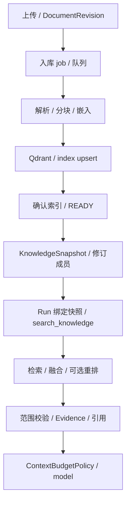

# 06 知识与 RAG

[学习首页](README.md) · [上一课：05 持久恢复与事件](05-durability-events.md) · [下一课：07 Memory](07-memory.md)

源码核查基线：`823ac05`，2026-10-09。本课中的源码/流程为静态核查；个人练习尚未代你执行，历史证据保留其日期/SHA。

## 这课要解决什么

把 RAG 学成 Run 的一条证据链：文档如何进索引，检索为何限定快照，结果怎样进入模型预算，引用能证明到什么程度。

## 1. 写入链与读取链分开

这是理解阶段图，实际 job 的阶段状态/事务以 worker 与 ingestion 实现为准；创建快照不等于复制所有原始文件进一个大文本。

## 2. 入库如何抵抗重复任务

入口：[KnowledgeService.upload_document](../../packages/knowledge/services.py)→[knowledge worker](../../apps/worker/tasks/knowledge.py)→[ingestion](../../packages/knowledge/ingestion.py)。

读取租约/lease_token、attempt_count、next_attempt_at 与 job claim。Celery 可重复投递；任务必须可重复且可对账，不能仅凭 acks_late 说入库只执行一次。索引点 ID 与修订/chunk 身份帮助重复写保持一致。

beat 的入库对账能发现中间状态，重新推进到可确认的 READY。历史索引后进程退出实验是特定窗口证据，不证明所有网络分区自动修复。

首次加载 BGE/重排模型会影响时延，Compose 配了预热与缓存；“工具没及时返回”不能一律解释为无知识结果。

## 3. KnowledgeSnapshot 到底冻结什么

`KnowledgeSnapshotService.create_current_snapshot` 把当前满足条件的修订集合物化；`resolve_snapshot` 装载明确身份或解析 LATEST。hash 包含 schema、知识库身份及 document/revision 成员。

你应分清 document（逻辑文档）、revision（具体内容修订）、chunk（修订分片）、snapshot（成员集合）。新上传一版不会自动改写旧 snapshot。旧实验使用的修订需留存。

[T12 preview_chunks](../../packages/knowledge/snapshots.py) 只读取冻结成员，默认 limit 10、最大 20，文本有截断标志；它是检查证据的入口，不是绕过内容权限的全文导出。

## 4. Dense / Hybrid / Rerank 分别解决什么

| 阶段 | 直观解释 | 代码观察点 |
| --- | --- | --- |
| Dense | 用语义向量找相似分片 | dense_embedder / dense_search |
| Sparse | 用稀疏特征提供另一种召回 | sparse_encoder / sparse_search |
| Fusion | 融合候选排序，如 RRF | fuse_reciprocal_rank |
| Rerank | 对候选再计算匹配分数 | reranker / candidate 与 final top-k |

打开 [HybridKnowledgeRetriever.retrieve_with_trace](../../packages/knowledge/retrieval.py)。先看 `_snapshot_scope`，再看检索阶段，最后看 `_load_chunks` 和 evidence 构造。候选来自索引不等于都可跨租户/快照使用。

[_snapshot_scope](../../packages/knowledge/retrieval.py) 把快照成员转换为检索范围；后续从数据库取真实 chunk 并验证身份。LangGraph 不负责替你做这些知识范围校验。

## 5. 检索到 → 准入 → 回答 → 引用，是四个问题

| 问题 | 该看什么 |
| --- | --- |
| 有关 chunk 是否找到了？ | recall / ranking / retrieval trace |
| 是否真的送到模型？ | ContextAdmissionResult / tool-result budget |
| 答案是否符合政策？ | 独立语义评估与 reference/evidence |
| 引用是否支持这个命题？ | revision/chunk 身份与 claim-to-source 核查 |

引用 ID 存在，只能先证明它来自某证据身份，不能自动证明回答中全部话都被支持。答案额外引入相邻政策也可能“有真实引用但负担/语义不佳”。

## 6. 用真实实验学习，不拿小样本夸结论

[正式 RAG 对照](../reviews/AgentHub-面试增强M-I3-M-I4验收报告-20261003.md)：8 个短政策、24 DEV 问题、两策略各三次，共 144 次真实检索生成。最终目标召回两组均 72/72；Dense MRR 0.9722、Hybrid 0.9931，Hybrid 时延更高。

这说明所测小语料上排序略有变化、最终目标召回未提高；不能宣称 Hybrid 在所有业务更好。抽检只覆盖一部分回答，引用存在不等于全批次零幻觉。

数据源和 runner 在 [benchmarks/evaluation](../../benchmarks/evaluation)，原始结果在 [evidence](../reviews/evidence/mi3-mi4-20261002)。复现前核对数据/schema/code/model/pricing 身份，不先换默认策略。

## 7. 学习步骤和自测

依次打开 `upload_document`、`ingestion`、`create_current_snapshot`、`retrieve_with_trace`、[search_knowledge builtin](../../packages/tools/builtins/search_knowledge.py)。画出 document→revision→chunk→snapshot→evidence。

纸上预测：只上传新文档、不更新固定 snapshot，旧 Run 能否看见它？答案要包含 snapshot 成员、LATEST 策略和实际解析时点，不能简单说“知识库有就能用”。

**面试追问：**Qdrant 的结果为何还查数据库？快照 hash 与文件 bytes hash 是否同一件事？检索 recall=1 能否说明任务成功率=1？

已有核查：[snapshot 测试](../../tests/integration/test_m3f_snapshot.py)、[检索策略单测](../../tests/unit/test_knowledge_m7e_strategy.py)。本课未运行。

**通过标准：**画完整写入/读取链，解释范围隔离、冻结与引用边界，而不只说“embedding+vector DB”。

## 精读增补：从一条政策到模型能够引用的证据

### A. 一份知识不是只经历一次向量写入

教学政策：“普通退款需在签收后七天内申请”。上传生成逻辑 Document 与具体 DocumentRevision；解析后产生 Chunk；嵌入后写入检索索引；确认状态后修订才能进入合适的 snapshot。Document 代表文档身份，Revision 代表这一次内容，Chunk 代表内容片段，Snapshot 代表本次可检索的修订集合。

如果后来政策改为五天，应形成新修订与新的成员身份，而不是把旧 chunk 原地改写后仍挂旧 snapshot。否则历史 Run 的引用和实验会随今日政策变化，无法解释当时为何回答七天。

读 [ingestion](../../packages/knowledge/ingestion.py) 时用一张四列表：阶段、数据库状态、索引副作用、崩溃后的对账依据。索引已写而数据库尚未 READY 是跨存储窗口；Celery 重投只是一种触发，不自动证明两边已经一致。

### B. 租约与重复入库各负责一层

claim/lease 防止多个活跃 worker 同时无约束推进同一 job；稳定 revision/chunk/point 身份让重复 upsert 可识别；对账发现中间态并决定继续或失败。attempt_count 限制尝试、next_attempt_at 控制重试时点，人工 retry 又需遵循对应状态和计数语义。

一个 job 有租约并不说明绝对不会重复：worker 超时或崩溃后可能由另一实例接手。旧实例迟到回写时必须结合当前租约身份判断是否还有权推进。理解这里后再学评测 lease generation，会发现两者处理的是相近的失效执行者问题。

### C. 用三条候选手算 RRF

打开 [fuse_reciprocal_rank](../../packages/knowledge/retrieval.py)。下面都是**教学排名**：Dense 返回 A 第 1、B 第 2；Sparse 返回 B 第 1、C 第 2；取 k=60。

| chunk | Dense 贡献 | Sparse 贡献 | 融合分数 |
| --- | --- | --- | --- |
| A | 1/(60+1) | 0 | 约 0.016393 |
| B | 1/(60+2) | 1/(60+1) | 约 0.032523 |
| C | 0 | 1/(60+2) | 约 0.016129 |

因此融合顺序 B→A→C。RRF 用排名贡献，没有把 Dense 的原始相似度与 Sparse 的原始分数直接相加，因为两类分数的尺度未必一致。源码还处理重复候选、无效 ID/非有限分数，再按融合分、最佳来源名次与 chunk ID 排序，保证同分时有明确次序。

候选 top-k 与最终 top-k 又不同：前者给重排提供池子，后者决定返回证据量。扩大池子可能提高目标进入重排的机会，也会提高延迟；没有实测不能只凭“候选更多”判断更好。

### D. 从索引命中到 Evidence

在 `retrieve_with_trace` 中先找 `_snapshot_scope`，确认过滤绑定的是本次 workspace/知识库/snapshot 成员。再看 Dense/Sparse/Fusion/Rerank，最后核对 `_load_chunks` 装载的数据库对象。索引可能有历史条目或中间态，因此索引命中不是最终授权与来源真实性的唯一依据。

真实 chunk 装成带 revision/chunk 等身份的 Evidence，通过 search_knowledge 结果进入模型；上下文预算可能截断或驱逐。最终答案引用必须回到这份身份，而不是凭模型输出一个看似合法的编号。

四层排障问题分别是：有没有召回目标；目标是否排名足够前；正文是否完整准入；答案的命题是否真的被正文支持。前三层成功仍可能有推理错误，第四层要独立语义核查。

### E. MRR 的小例子

三个教学 query 的第一个相关结果分别在 1、2、4 名，MRR=(1+1/2+1/4)/3≈0.5833。若某 query 没命中，通常该项 reciprocal rank 为 0，具体 top-k 与相关性标签必须按实际 evaluator 定义。Recall 关注相关目标是否被找到，MRR 关注首个相关项靠前程度，两者不互相替代。

历史短政策实验两组目标召回都满，但 MRR 有小差异，说明排序表现可以变化而召回不变；Hybrid 更慢，所以不能脱离延迟和答案质量直接宣布默认应该换策略。

### F. 练习与参考答案

**题 1：回答引用了真实 chunk，却仍错了，可能为什么？** chunk 不支持具体命题、规则条件遗漏、相邻政策混入、准入截断或模型推理错误；真实来源 ID 只是第一层证据。

**题 2：新文档 READY 后，固定 K1 会自动看到吗？** 不会因为 READY 就进入已冻结成员；要看绑定/解析的新 snapshot，LATEST 也有明确解析时点。

**题 3：索引不可用是否等于知识原文丢了？** 原文、关系数据、索引属于不同存储。检索链可能失效，但不能据此推断 blob 和数据库成员已消失。

**掌握标准：**手算 RRF/MRR；画上传和检索两条链；在源码指出 scope、候选融合、真实 chunk 与预算四个位置。

---

[学习首页](README.md) · [上一课：05 持久恢复与事件](05-durability-events.md) · [下一课：07 Memory](07-memory.md)
