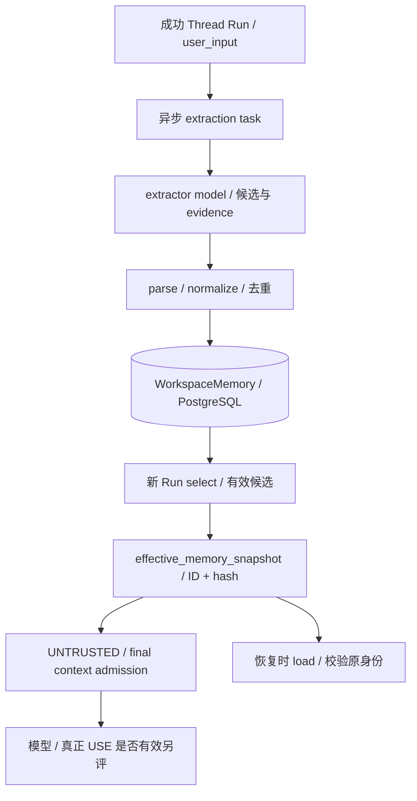

# 07 Memory

[学习首页](README.md) · [上一课：06 知识与 RAG](06-knowledge-rag.md) · [下一课：08 数据集与评测](08-evaluation.md)

源码核查基线：`67264b3`，2026-10-09。本课中的源码/流程为静态核查；个人练习尚未代你执行，历史证据保留其日期/SHA。

## 这课要解决什么

理解 Memory 的三条独立链：**WRITE 写入、RECALL 召回/准入、USE 模型或消费者使用**。记住一件事不代表它适合共享，更不代表任务做得更好。

## 1. Memory 在哪里，范围是什么

当前长期记忆存 PostgreSQL，以 workspace+agent 共享，默认关闭。不是每用户个人 profile，也不是 Qdrant 的知识检索副本。开关来自已发布规格，worker 会重新校验，不能凭队列消息强行让没开启的 Agent 抽取。

新 Run 和历史恢复有不同需求：新 Run 选当前可用记忆，旧 Run 校验并装载当时的 ID/hash。历史停用不应抹掉旧输入证据。

## 2. 两条流水线



图不表示提取在当前回答返回前完成；Memory writer 是异步 best effort，失败不应该伪称该任务已经学会。

## 3. WRITE：硬闸门与提示词要求的区别

按顺序读 [worker memories](../../apps/worker/tasks/memories.py) 的 `_extract_run_memories`、[extraction](../../packages/memory/extraction.py) 的 `extraction_request / parse_candidates`、[store](../../packages/memory/store.py) 的 `normalize_candidate / record`。

| 检查 | 主要实现位置 | 能保证到哪里 |
| --- | --- | --- |
| 成功 Thread Run、开关与权限 | worker / frozen spec / TenantService | 不能任意从过期队列启动写入 |
| 候选结构与精确引文 | parse_candidates | evidence 必须真的出现在 user_input |
| 长度/类型/空白规范化 | normalize_candidate | 不接受部分格式无效候选 |
| 同范围去重、来源与冲突处理 | record / 数据库约束 | 保留可核查来源，避免部分重复插入 |
| 共享/持久/非私人/非恶意语义 | extractor prompt | 尚无完备硬语义拒写保证 |

真实 parser 中的 evidence 判断，原样语句节选：

```python
if (
    not isinstance(user_input, str)
    or not isinstance(evidence, str)
    or not evidence
    or len(evidence) > MAX_EVIDENCE_LENGTH
    or evidence not in user_input
):
    # One malformed candidate must not discard valid siblings.
    continue
```

出处：[parse_candidates](../../packages/memory/extraction.py)。这证明引文存在，不证明“这是长期共享事实”。用户说“今晚临时帮我”也可能有真实引文。因此不能把 grounded 误讲成 legitimate。

## 4. RECALL：候选、冻结、准入不能混数

`SqlAlchemyMemoryStore.select` 按工作区、agent、ACTIVE 与 expires_at 有效性过滤，再结合查询词匹配、salience、创建时间排序取 limit。

当前有 expires_at **读取过滤**，不等于已实现自动 TTL 分配、定时清理、衰减或容量淘汰。低相关条目仍可能靠后备排序进入 top-k；没有自动矛盾事实合并/语义 supersede。

`_freeze_memory_snapshot` 保存身份，`SqlAlchemyMemoryStore.load` 在回放时校验缺失/重复 ID 和 hash。新 hash 快照的严格校验与历史 ID-only 兼容路径要分开解释，不说所有历史快照格式完全一样。

`ContextBudgetPolicy` 最终准入后，`_touch_admitted_memories` 才更新实际准入条目。被 selected 但预算驱逐的记忆不能冒充 used；Memory 作为独立可驱逐类别，强制 UNTRUSTED。

## 5. USE：机制和质量分开验证

[11 场景质量探针](../../benchmarks/evaluation/memory_quality) 使用确定性强制候选/脚本消费者，新增付费调用为 0：

| 指标 | 结果 | 应怎样解释 |
| --- | --- | --- |
| Write precision | 6/9 | 按强制落库候选条目计，不是真实 extractor 准确率 |
| Write recall | 5/5 | 按应写场景计 |
| Required recall | 2/2 | 最终准入，不只 selector 命中 |
| Forbidden/irrelevant recall | 5/8 | 错误召回；5 个已有禁止条目场景全部准入 |
| Task correctness | 10/10 | 脚本后置条件；冲突场景 null 排除，不是 LLM 成功率 |

冲突两 ACTIVE 共存；临时/私人/恶意候选带真实引文也可写入和准入。恶意文本仍 UNTRUSTED，不能更改发布 spec、actor 与 ToolPolicy；新探针没有实际退款动作。

历史跨 Thread ON/OFF 等机制/模型证据保留，但新真实复杂 USE 未测。`NO_DEMONSTRATED_BENEFIT` 是这轮新业务质量的结论，不抹掉历史机制证据，也不包装成整个系统完全无用。

## 6. 管理为什么停用而非删除

[MemoryAdminService.invalidate / reactivate](../../packages/memory/service.py) 管当前选择状态；原内容/来源保持可解释。新的 Run 排除停用条目，历史冻结回放仍要核查当时身份。reactivate 对不符合状态的对象有冲突语义，不是无条件幂等成功。

## 7. 只读练习与自测

从 result.json 挑 MQ04、MQ07、MQ09，各写四列：写入多少、选择多少、准入多少、实际 USE 测了什么。然后找对应 parser/select/admission 代码，判断失败发生在哪一层。

**面试追问：**为什么快照不代表内容正确？为什么 system role 不能授予记忆系统指令权限？为什么 expires_at 字段存在仍不能说 TTL 运营完成？

已有核查：[Memory hash 回放](../../tests/unit/test_b2_memory_snapshot_replay.py)、[质量探针测试](../../tests/integration/test_memory_quality.py)、[收口报告](../reviews/AgentHub-closure-memory-quality-20261005.md)。本课未复跑。

**通过标准：**能分别说 WRITE/RECALL/USE 的证据与未知；默认不开记忆、冻结身份和真实质量问题都讲得清楚。

---

[学习首页](README.md) · [上一课：06 知识与 RAG](06-knowledge-rag.md) · [下一课：08 数据集与评测](08-evaluation.md)
