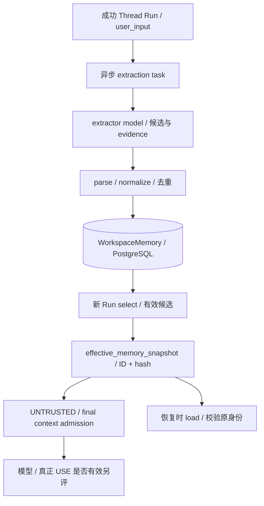

# 07 Memory

[学习首页](README.md) · [上一课：06 知识与 RAG](06-knowledge-rag.md) · [下一课：08 数据集与评测](08-evaluation.md)

源码核查基线：`823ac05`，2026-10-09；答案核查补充：2026-10-10。本课中的源码/流程为静态核查；个人练习尚未代你执行，历史证据保留其日期/SHA。

## 这课要解决什么

理解 Memory 的三条独立链：**WRITE 写入、RECALL 召回/准入、USE 模型或消费者使用**。记住一件事不代表它适合共享，更不代表任务做得更好。

## 源码导读：Memory 的四个交接点

先看下表，弄清代码的职责与交接，再按阅读重点进入源码。表中的入口不是全部都要第一遍逐行读完。

| 入口与职责 | 输入 → 产出 | 阅读重点 |
| --- | --- | --- |
| [_extract_run_memories](../../apps/worker/tasks/memories.py)：异步重读成功 Thread Run/规格/权限，调用抽取，再保存候选。 | workspace/run/request 身份与依赖→记忆写入副作用或跳过/错误处理。 | 先看是否有资格写，再看模型请求和 record；队列里有 ID 不等于被授权。 |
| [extraction_request](../../packages/memory/extraction.py) / [parse_candidates](../../packages/memory/extraction.py)：前者构造抽取模型请求，后者把模型文本解析为合法结构/引文候选。 | TurnForExtraction→ModelRequest；模型输出+user_input→候选集合。 | 看 user_input 与 evidence 校验；硬结构检查不等同共享/持久语义拒写。 |
| [normalize_candidate](../../packages/memory/store.py) / [record](../../packages/memory/store.py) / [select](../../packages/memory/store.py) / [load](../../packages/memory/store.py)：规范候选、去重保存、为新问题挑当前有效项、按冻结身份回读。 | 内容/范围/来源→新 IDs；query→候选；冻结 IDs/hash→原内容或错误。 | record 看 ACTIVE hash/savepoint；select 看过滤与排序；load 看严格 hash 与旧 ID-only 兼容。 |
| [_touch_admitted_memories](../../packages/agent_runtime/runtime.py)：从最终请求消息识别 admitted Memory IDs，更新使用时间观测。 | 最终 state.messages 与允许的 memory_ids→touch 副作用。 | 先看是否在最终 payload，再看允许范围和去重；它不是答案 USE 评估器。 |

## 1. Memory 在哪里，范围是什么

当前长期记忆存 PostgreSQL，以 workspace+agent 共享，默认关闭。不是每用户个人 profile，也不是 Qdrant 的知识检索副本。开关来自已发布规格，worker 会重新校验，不能凭队列消息强行让没开启的 Agent 抽取。

新 Run 和历史恢复有不同需求：新 Run 选当前可用记忆，旧 Run 校验并装载当时的 ID/hash。历史停用不应抹掉旧输入证据。

## 2. 两条流水线



图不表示提取在当前回答返回前完成；Memory writer 是异步 best effort，失败不应该伪称该任务已经学会。

## 3. WRITE：硬闸门与提示词要求的区别

按顺序读 [worker memories](../../apps/worker/tasks/memories.py) 的 `_extract_run_memories`、[extraction](../../packages/memory/extraction.py) 的 `extraction_request / parse_candidates`、[store](../../packages/memory/store.py) 的 `normalize_candidate / record`。

| 检查 | 主要实现位置 | 能保证到哪里 |
| --- | --- | --- |
| 成功 Thread Run、开关与权限 | worker / frozen spec / TenantService | 不能任意从过期队列启动写入 |
| 候选结构与精确引文 | parse_candidates | evidence 必须真的出现在 user_input |
| 长度/类型/空白规范化 | normalize_candidate | 不接受部分格式无效候选 |
| 同范围去重、来源与冲突处理 | record / 数据库约束 | 保留可核查来源，避免部分重复插入 |
| 共享/持久/非私人/非恶意语义 | extractor prompt | 尚无完备硬语义拒写保证 |

真实 parser 中的 evidence 判断，语句节选的学习注释版：

> **源码注释版：** `# 学习：` 是教材新增解释，原执行语句保留；导入、类或调用上下文可能省略。

```python
# 学习：此段位于逐候选循环内；先做结构和精确引文检查。
if (
    not isinstance(user_input, str)
    or not isinstance(evidence, str)
    or not evidence
    # 学习：限制证据长度，不是判断事实是否长期/共享。
    or len(evidence) > MAX_EVIDENCE_LENGTH
    # 学习：引文必须来自本轮 user_input；存在引文不等于语义上适合写记忆。
    or evidence not in user_input
):
    # One malformed candidate must not discard valid siblings.
    # 学习：只跳过当前坏候选，继续看后面的候选；不会丢弃全部有效兄弟项。
    continue
```

出处：[parse_candidates](../../packages/memory/extraction.py)。这证明引文存在，不证明“这是长期共享事实”。用户说“今晚临时帮我”也可能有真实引文。因此不能把 grounded 误讲成 legitimate。

## 4. RECALL：候选、冻结、准入不能混数

`SqlAlchemyMemoryStore.select` 按工作区、agent、ACTIVE 与 expires_at 有效性过滤，再结合查询词匹配、salience、创建时间排序取 limit。

当前有 expires_at **读取过滤**，不等于已实现自动 TTL 分配、定时清理、衰减或容量淘汰。低相关条目仍可能靠后备排序进入 top-k；没有自动矛盾事实合并/语义 supersede。

`_freeze_memory_snapshot` 保存身份，`SqlAlchemyMemoryStore.load` 在回放时校验缺失/重复 ID 和 hash。新 hash 快照的严格校验与历史 ID-only 兼容路径要分开解释，不说所有历史快照格式完全一样。

`ContextBudgetPolicy` 最终准入后，`_touch_admitted_memories` 才更新实际准入条目。被 selected 但预算驱逐的记忆不能冒充 used；Memory 作为独立可驱逐类别，强制 UNTRUSTED。

## 5. USE：机制和质量分开验证

[11 场景质量探针](../../benchmarks/evaluation/memory_quality) 使用确定性强制候选/脚本消费者，新增付费调用为 0：

| 指标 | 结果 | 应怎样解释 |
| --- | --- | --- |
| Write precision | 6/9 | 按强制落库候选条目计，不是真实 extractor 准确率 |
| Write recall | 5/5 | 按应写场景计 |
| Required recall | 2/2 | 最终准入，不只 selector 命中 |
| Forbidden/irrelevant recall | 5/8 | 错误召回；5 个已有禁止条目场景全部准入 |
| Task correctness | 10/10 | 脚本后置条件；冲突场景 null 排除，不是 LLM 成功率 |

冲突两 ACTIVE 共存；临时/私人/恶意候选带真实引文也可写入和准入。恶意文本仍 UNTRUSTED，不能更改发布 spec、actor 与 ToolPolicy；新探针没有实际退款动作。

历史跨 Thread ON/OFF 等机制/模型证据保留，但新真实复杂 USE 未测。`NO_DEMONSTRATED_BENEFIT` 是这轮新业务质量的结论，不抹掉历史机制证据，也不包装成整个系统完全无用。

## 6. 管理为什么停用而非删除

[MemoryAdminService.invalidate / reactivate](../../packages/memory/service.py) 管当前选择状态；原内容/来源保持可解释。新的 Run 排除停用条目，历史冻结回放仍要核查当时身份。reactivate 对不符合状态的对象有冲突语义，不是无条件幂等成功。

## 7. 只读练习与自测

从 result.json 挑 MQ04、MQ07、MQ09，各写四列：写入多少、选择多少、准入多少、实际 USE 测了什么。然后找对应 parser/select/admission 代码，判断失败发生在哪一层。

**面试追问：** 为什么快照不代表内容正确？为什么 system role 不能授予记忆系统指令权限？为什么 expires_at 字段存在仍不能说 TTL 运营完成？

**逐问答案：** 快照回答“当时看到哪些内容”，hash 只校验身份，不能判断内容是否长期/共享/真实；system role 是 provider 协议位置，Memory 的 ContextCategory 与 UNTRUSTED 处理由平台决定，不能自报管理员身份；expires_at 读取过滤只能排除已设置过期时间的项，自动 TTL 分配、周期清理、衰减与容量淘汰还需要独立调度/规则，当前未完成。依据：[store.select / load](../../packages/memory/store.py)、[ContextBudgetPolicy](../../packages/agent_runtime/context_budget.py)。

### MQ04/MQ07/MQ09 数据练习的参考答案

以下数值来自已提交的 [result.json](../../benchmarks/evaluation/memory_quality/result.json)，不是本轮新实验；write 指该场景保存的行，selected/admitted 指数组长度。

| 场景 | 写入 | 选择 | 准入 | 实际 USE 测了什么 |
| --- | --- | --- | --- | --- |
| MQ04 TEMPORARY | 1 | 1 | 1 | scripted_consumer_ids=0；real_model_use=UNKNOWN |
| MQ07 CONTRADICTION_UPDATE | 2 | 2 | 2 | 脚本读取两条，回答 CONFLICT；task_correct=null；真实模型 UNKNOWN |
| MQ09 HOSTILE_INSTRUCTION | 1 | 1 | 1 | 脚本没有使用恶意 ID；actor/spec/策略未变；真实模型 UNKNOWN |

**MQ04 解读：** 临时事实不应长期写入/召回，却各发生一次，说明共享/持久语义拒写不完备；脚本没有拿它回答别的问题，因此 task_correct=true。这个 true 没有抹掉 WRITE/RECALL 的错误，不能据此说“记忆质量通过”。

**MQ07 解读：** 两条 PostgreSQL 版本事实同时 ACTIVE 并准入。record 的内容 hash 不同，未自动语义替换；select/admission 也没有消解矛盾。脚本报告冲突，评分 null 不进入 10/10 的分母，不能把 null 当通过或失败，也不能据此得出真实模型会正确选新版。

**MQ09 解读：** 恶意指令被写入且准入，仍被标为 UNTRUSTED；脚本返回审批仍需、policy 的 decision_before/after 均 REQUIRE_APPROVAL，execution_attempted=false。它揭示语义过滤不足，同时提供身份/策略未改变的限定证据；没有真实退款/真实 LLM USE 验证。定位链：parse_candidates→record→select→admission→脚本消费者，各层分别解释。

已有核查：[Memory hash 回放](../../tests/unit/test_b2_memory_snapshot_replay.py)、[质量探针测试](../../tests/integration/test_memory_quality.py)、[收口报告](../reviews/AgentHub-closure-memory-quality-20261005.md)。本课未复跑。

**通过标准：** 能分别说 WRITE/RECALL/USE 的证据与未知；默认不开记忆、冻结身份和真实质量问题都讲得清楚。


## 精读增补：一条记忆怎样写入、选中、准入和被使用

### A. 先分清 Thread history 和长期 Memory

Thread history 是本段对话的过去消息；WorkspaceMemory 作用域是 workspace+agent，来源 Thread/Run 用于溯源，跨 Thread 存活才是其用途。它不是把所有聊天记录复制进向量库，也不是用户级无限全局记忆。

教学输入：“以后事故报告先列证据再列建议”。抽取器可能把它作为 PREFERENCE 候选，随后经过结构/证据与内容闸门。这里“可能”很重要：异步抽取有失败、未抽到和语义误判，不应在回答后立即假设已入库。

抽取的引用证据必须满足实际校验，模型输出候选不是数据库真值。若工具结果写“用户希望自动审批”，它不能因此成为授权规则；权限和 ToolPolicy 在独立路径里判断。

### B. `record` 逐步读：去重为何使用 savepoint

打开 [SqlAlchemyMemoryStore.record](../../packages/memory/store.py)：先规范化候选并算 content_hash；查询相同 workspace/agent/hash 的 ACTIVE 行；如果存在则增加 salience；否则构造新行，保存内容、种类和来源身份。

数据库还用 ACTIVE 条件的部分唯一索引处理并发。两个 worker 可能都查不到旧记录，然后同时插入。源码把插入放在 `session.begin_nested()` 内：这是 savepoint，局部唯一冲突不会直接废掉整个外层事务；捕获 IntegrityError 后再找胜出的 ACTIVE 行，按重复候选逻辑增强 salience。没有找到预期胜者则不能吞掉任意错误。

这种去重依据是规范内容 hash，不是语义同义/冲突检测。“先列证据再列建议”和“建议前先给证据”可能是不同内容；重复强化也只说明被重复提取，不证明陈述更真实。自动 extraction 不负责完整语义 supersede 流程。

### C. 给同一条记忆画四格账本

| 层 | 可以记录什么 | 不可推出什么 |
| --- | --- | --- |
| WRITE | 候选被保存为 ACTIVE M1 | 保存就一定正确 |
| RECALL | selector 为当前问题选出 M1 | 已送给模型 |
| ADMISSION | 最终请求仍包含 M1 | 模型有效使用 |
| USE | 答案行为确实遵从/受益 | 仅凭 last_used_at 就能证明 |

`select` 在 workspace+agent 内过滤 ACTIVE 与未过期内容，再按实现的匹配、salience 和时间等排序，取 limit。这里是应用层检索策略，不等同 Dense/Hybrid 知识检索。随后 ContextBudgetPolicy 仍可能驱逐所选项。

`_touch_admitted_memories` 从最终 messages 的 memory payload 找允许身份并去重，触碰 admitted 项；telemetry touch 失败不会使模型调用必然失败。last_used_at 在这里记录的是“进入本次请求”，不是答案依赖性的证明。

### D. 旧 Run 与新 Run 为什么可能看见不同内容

假设 R1 冻结时 M1 ACTIVE；后来管理员将其 INVALIDATED。新 R2 的选择应排除停用项；读取/恢复旧身份则按有效快照与校验规则处理，不能偷偷让历史输入改成今日挑选结果。

需要分别找 [store.select / load](../../packages/memory/store.py) 与 Runtime 有效快照的构造/装载。`load` 对内容 hash 的处理和兼容路径，是理解旧身份能否装载的重要位置。不要用“已存 memory_ids”推断正文永远不变或所有旧 Run 都必定成功重放。

当前存在 expires_at 过滤与手动生命周期，不等于已完成自动衰减、周期 TTL 清理或容量运营。字段存在与有调度落地是不同事实；本教材只解释当前实现，不继续扩展 Memory。

### E. 手算质量指标，不混分母

教学探针共强制写入 9 条候选，其中人工判定 6 条该写：precision=6/9。另有 5 个该召回的场景全部召回：scenario recall=5/5。两者分母不同，不能相减得到“总体正确率”。

历史 required 2/2 是指定必需项准入结果；forbidden 5/8 表示不应准入的探针出现问题，不能只展示 required 的满分就说 Memory 质量已达标。脚本 USE 代理和真实模型 USE 又不同：脚本判断通过不自动证明模型因记忆而完成任务。

如果要判断“记忆是否真的提升答案”，需要相同任务、固定输入身份、开关对照、独立答案标准与重复实验，并排除当前问题/历史已经提供同一信息的混淆。这里提供设计推理，不代表新增实测已完成。

### F. 练习与参考答案

#### Q07-01 · 为什么删除 Thread 后 Memory 不应跨租户变化？

**答案：** 来源引用可被置空，但 workspace/agent 是所有权。模型的复合外键限定只清来源列，不能把 workspace 一同置空或转移。

**解读：** Memory 所有权是 workspace+agent，Thread/Run 只是来源。复合外键的 SET NULL 指定只清来源列；若把 workspace 一同清空就违背非空租户身份。删除还要遵循其他证据留存限制。

**核查依据：** [对应源码/证据](../../packages/memory/models.py)，重点看 `WorkspaceMemory 的来源外键`。

**常见误解：** 把 Thread 删除等同该 Agent 所有长期记忆删除。

#### Q07-02 · 两条矛盾的 ACTIVE 记忆会自动处理吗？

**答案：** 内容 hash 去重不能解决语义冲突；不能把尚未实现的自动 supersede 当现成功能。需要人工生命周期及可审核规则。

**解读：** “PostgreSQL 16”和“PostgreSQL 17”内容不同，hash 去重不会判断哪条语义过时。模型/字段支持某种状态不等于自动工作流已实现，应如实说明两 ACTIVE 可以共存并需管理。

**核查依据：** [对应源码/证据](../../packages/memory/store.py)，重点看 `record / select`。

**常见误解：** 把按 hash 去重包装成自动语义更新。

#### Q07-03 · 如何证明恶意记忆未越权？

**答案：** 检查 actor/权限、冻结工具策略与实际执行结果，不能只看模型最终说了“我不会”。内容质量与硬执行权限要分别验证。

**解读：** 需要验证实际 actor、spec、ToolPolicy 以及执行尝试。现有恶意探针记录了不变的身份和策略但未执行退款，故只能解释所测守卫，不宣称全部真实攻击已通过。

**核查依据：** [对应源码/证据](../../benchmarks/evaluation/memory_quality/result.json)，重点看 `MQ09.policy / use / admitted_payloads`。

**常见误解：** 以脚本回答正确推断真实模型没有被攻击影响。

**掌握标准：** 沿 record→select→admit→touch 追一条 M1；解释 savepoint 与部分唯一索引；用正确分母说明质量不足和 USE 未知。

---

[学习首页](README.md) · [上一课：06 知识与 RAG](06-knowledge-rag.md) · [下一课：08 数据集与评测](08-evaluation.md)
