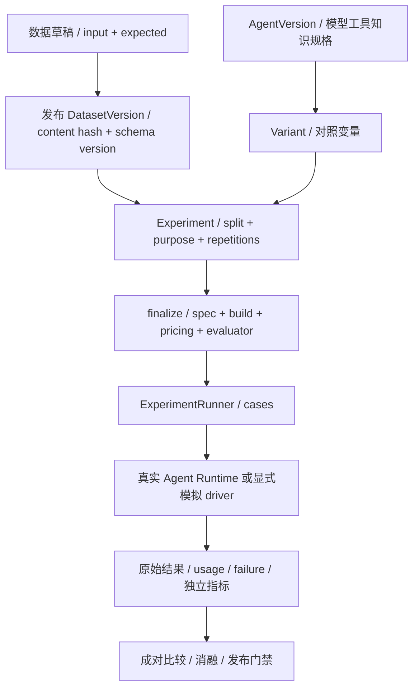

# 08 数据集与评测

[学习首页](README.md) · [上一课：07 Memory](07-memory.md) · [下一课：09 应用、反馈与接管](09-applications-feedback.md)

源码核查基线：`823ac05`，2026-10-09；答案核查补充：2026-10-10。本课中的源码/流程为静态核查；个人练习尚未代你执行，历史证据保留其日期/SHA。

## 这课要解决什么

学习如何把“这次看起来更好”变成**有冻结身份、有对照、有失败记录的实验**，并区分测试、模拟、真实模型、语义抽检和生产收益。

## 源码导读：实验定义、执行与指标不是一个函数

先看下表，弄清代码的职责与交接，再按阅读重点进入源码。表中的入口不是全部都要第一遍逐行读完。

| 入口与职责 | 输入 → 产出 | 阅读重点 |
| --- | --- | --- |
| [ExperimentService.finalize_experiment](../../packages/evaluation/experiments.py)：校验数据和变体后固定实验规格/身份，将草稿推进到冻结状态。 | session/context/experiment_id→冻结 Experiment。 | 先发布数据 hash/schema，再 _validate_stored_variant，后 spec/hash/status/commit；不在此运行全部 case。 |
| [prepare_run](../../packages/evaluation/runner.py) / [claim_run](../../packages/evaluation/runner.py) / [claim_case](../../packages/evaluation/runner.py)：生成执行任务与领取租约，然后按条件领取可执行 case。 | run_id、owner/generation 与 session→任务数、Run 或 case/None。 | 先理解 case×variant×repetition；claim_case 看行锁 skip_locked 和代数条件。 |
| [bind_case_agent_run](../../packages/evaluation/runner.py) / [complete_case](../../packages/evaluation/runner.py) / [fail_case](../../packages/evaluation/runner.py) / [recover_inflight_cases](../../packages/evaluation/runner.py)：记录真实执行关联，保存评分/失败，依据旧 Run 对账中断执行。 | case/Run/lease 与结果→持久结果状态。 | 看绑定时点与 generation 检查；不要在缺证据时盲重跑副作用。 |
| [AgentRuntimeEvaluationDriver](../../packages/evaluation/runner.py)：把冻结 case/variant 接入真实 Runtime；与确定性 driver 的证据级别不同。 | 已冻结变体与 case→执行结果和 judge 输入/输出。 | 先看 prepare/execute 的委托与绑定，再看评分；expected 不该变模型任务答案。 |

## 1. 数据集到实验的链条

不同 driver 的证据等级不同。DeterministicEvaluationDriver 可以验证编排；AgentRuntimeEvaluationDriver 复用真实执行链。不能看到 runner 文件就声称一定是付费真实模型实验。

## 2. 一个 case 要有什么

| 部分 | 回答什么问题 | 例子 |
| --- | --- | --- |
| input | 让执行者做什么 | 多轮客服问题，fixture/scenario |
| expected | 独立预期是什么 | 必要工具、禁止工具、工单数、审批决定、参考答案 |
| split | 可用于开发还是最终验证 | DEV / HOLDOUT |
| identity | 原样数据是什么 | 发布版本、schema 与内容 hash |

expected 不能直接拼成模型答案上下文。HOLDOUT 的 expected 默认在后端投影裁剪；显式读取还需权限，暴露应审计持久化。开发运行不能偷用 holdout 曝光次数或拿结果反复调 prompt。

## 3. 冻结的变量比你想象的多

打开 [ExperimentService.finalize_experiment](../../packages/evaluation/experiments.py)，先看发布数据/schema 完整性，再看 `_validate_stored_variant`，最后找到 `spec`、`spec_hash` 与 status。

冻结内容包括 dataset 内容/schema、split/purpose/repetitions、变体 spec、知识 snapshot/hash、pricing、build SHA 和 evaluator manifest。正式读取历史实验不能再解析今日 LATEST 或换价格后重算成“原实验结果”。

可复现意味着身份可核查，不承诺非确定性供应商输出逐字相同。模型/外部目标环境变化也需要保留限制。

## 4. ExperimentRunner 的并发与恢复

[ExperimentRunner](../../packages/evaluation/runner.py) 依次负责 prepare_run、claim_run、claim_case、执行、complete_case/fail_case、heartbeat 与 inflight 恢复。

| 问题 | 要找的函数 | 要理解的区别 |
| --- | --- | --- |
| 怎么避免两个 worker 同时拿同一个 case？ | claim_case | 数据库 claim/lease，不靠 Python 全局变量 |
| 付费执行关联在哪？ | bind_case_agent_run | 执行身份要在相应时点记录，不能失败后无法对账 |
| worker 死了怎样看旧 case？ | recover_inflight_cases | 对照已有 Run 状态，不盲重做未知写入 |
| 为什么保留失败/取消？ | fail_case / complete_case | 成功率分母与费用不能只取成功样本 |

源码查看不等于这轮跑过整批实验。

## 5. 衡量什么，各自不能替代什么

| 维度 | 所测内容 | 常见说错 |
| --- | --- | --- |
| 业务后置条件 | 工单数量、审批/工具、终态 | 达到后置条件≠答案全部语义正确 |
| 语义评价 | 参考答案/来源/独立 judge 或抽检 | 助手审阅≠真人一致性，judge 也不是绝对真理 |
| 检索 | recall / MRR / 引用身份 | recall=1≠零幻觉 |
| 运维 | TTFT / p50 / p95 / 吞吐 / 失败 | 受控并发≠生产饱和容量 |
| 费用 | 调用 usage、pricing 与全部尝试 | 估算上界≠账单，失败尝试也应计入 |

成对比较尽量固定任务、重复数和其他变量；消融改变一个机制以观察作用。发布门禁评估已有规则与冻结结果，不代表提供生产 SLA。

## 6. 仓库中关键数据在哪里

- [60 条正式客服数据/标注](../reviews/evidence/mi3-mi4-20261002/dataset-reviewed-v3/support-reviewed.json)：合成政策与参考答案，DEV 40/HOLDOUT 20。
- [正式证据目录](../reviews/evidence/mi3-mi4-20261002)：plan、raw results、assistant-review、cost reconciliation、RAG、故障、安全与负载。
- [Memory 11 场景](../../benchmarks/evaluation/memory_quality)：单独的确定性探针。
- [benchmarks 入口](../benchmark/README.md)：原始数据、runner、历史实验的解释与复现。

这些在 Git 中；本机数据库/密钥/模型缓存不等于已上传的数据备份。

## 7. 读一轮真实结果

[正式报告](../reviews/AgentHub-面试增强M-I3-M-I4验收报告-20261003.md)中，两个变体每任务三次，共 360 trial。HOLDOUT 业务 47/60→60/60，结合助手语义 41/60→57/60。

把这两个指标分别对应 raw result 与 assistant-review：为什么业务全通过仍有语义失败？哪些期望是程序检查，哪些依赖审阅？这比只背“效果提升多少”更能说明你理解实验。

RAG 两策略目标召回相同但时延不同；负载并发 1/4/8 各 60 秒不等于系统容量上限；Memory 脚本任务 PASS 不等于真实 LLM USE。必须保留范围、分母与未知。

## 8. 自测与面试追问

纸上设计一个实验：只改变工单登记提示，其余版本/知识/数据/价格/evaluator 固定。列出冻结字段、DEV 调试规则、HOLDOUT 暴露规则、失败记录、语义抽检与费用分母。

**设计题参考答案：** 创建两个发布版本，模型执行计划、工具修订、知识 snapshot、预算和 Memory 规则相同，仅工单 prompt 不同。这里“版本固定”指各 variant 固定各自版本，**不是两个不同 prompt 共用同一个 spec hash**；改变 prompt 必然改变规格身份。

| 设计项 | 应写入的答案 | 原因 |
| --- | --- | --- |
| 冻结字段 | build SHA、各 variant AgentVersion/spec hash、有效知识/Memory 输入身份、发布 DatasetVersion/schema/content hash、pricing snapshot、evaluator 版本 | 防止比较期间偷换输入或评分规则 |
| DEV | 用于查错/修改；改后新建实验身份并记录尝试 | 调过的数据不能冒充独立样本 |
| HOLDOUT | 不用于开发调参；答案暴露遵循权限/显式请求与持久审计 | 暴露会改变独立性，需如实报告 |
| 重复与失败 | 每个 case/variant 的重复次数一致；失败、取消、未知和缺 usage 保留 | 防止只统计成功调用 |
| 语义抽检 | 定义政策正确、条件遗漏、工单动作等判据，记录样本与纠正 | 工具代理通过不等于叙述正确 |
| 费用口径 | 汇总全部所记录尝试的 usage×冻结价格，单列缺失/估算及币种 | 单个成功样本费用不代表总投入 |

可以支持“在这批合成 case 与所测模型条件下，两 prompt 的差异”，不能直接推出真实客服线上收益或所有行业适用。依据：[experiments](../../packages/evaluation/experiments.py)、[runner](../../packages/evaluation/runner.py) 与 [benchmark 索引](../benchmark/README.md)。

**通过标准：** 说明一次实验比较了什么，以及没证明什么；能从报告找到原始 JSON，不把不同轮次测试数量拼成当前覆盖率。

已有核查：[发布数据集](../../tests/integration/test_m7a_evaluation_datasets.py)、[实验冻结](../../tests/integration/test_m7b_experiments.py)、[runner](../../tests/integration/test_m7c_experiment_runner.py)、[release gate](../../tests/integration/test_m7ef_ablation_release_gate.py)。本课未执行。

## 精读增补：把一次评测拆成输入身份、执行任务和指标

### A. 为什么数据集有草稿和发布版

DEV 用来调整 prompt/策略和形成回归，HOLDOUT 用来评估未参与开发的效果。开发者若反复看 HOLDOUT 参考答案改配置，再把同一集合当独立检验，成绩就不再支持原来的泛化结论。

发布 DatasetVersion 冻结 input/expected/schema/split 等内容身份，正式 Experiment 只绑定发布版。expected 是判分参考，不能作为普通用户 input 送给模型；HOLDOUT expected 的查看还有权限、显式参数与审计边界。字段在前端被隐藏并不是后端内容保密的充分条件。

### B. 手算任务数量与账本

设两个教学 case C1/C2、两个 variant V1/V2、每个重复两次，总 case execution 数为 2×2×2=8。它不是八个独立政策问题，只有两个独立 case；重复用于观察同一 case 的运行波动。

| case | variant | repetition | 应记录什么 |
| --- | --- | --- | --- |
| C1 | V1 | 1 / 2 | 输入身份、agent_run_id、输出、工具/usage、判分 |
| C1 | V2 | 1 / 2 | 同 case，不同被控制的配置 |
| C2 | V1 | 1 / 2 | 另一独立任务 |
| C2 | V2 | 1 / 2 | 对应比较结果 |

把 V1→V2 的改动控制为一个明确变量，例如 prompt 改法；若同时换模型、知识、工具和 evaluator，就很难解释成绩变化来自哪里。正式绑定多个 hash 的作用是留下比较条件，不是自动生成合理的实验设计。

### C. 读 runner 的三个时点

**准备：** 确定发布数据、变体有效输入、pricing/evaluator 与 build 身份。 **执行：** claim run/case，调用选定 driver，保存每次结果和费用。 **汇总：** 按实际判分与失败信息聚合，保留原始输出供复查。

在 [runner](../../packages/evaluation/runner.py) 找 `claim_case`：查询关联 case/run/item/variant，要求 Run RUNNING、当前 lease owner 与 generation 一致；按 case/variant/repetition 排序；使用 `with_for_update(skip_locked=True)` 避免并行执行者等待同一行；将 case 改 RUNNING 后提交。

lease generation 是执行权的代数。旧 worker 在 generation=7 接单后卡住，新 owner 以 generation=8 接管；旧 worker 恢复时不应再以 7 写回覆盖新状态。要继续追 heartbeat/结果保存中的身份条件，不能只看到 claim 检查就认定所有回写都被 fence。

skip_locked 用于领取其他可用行，不是把远端执行变成 exactly-once，也不是把没领到 case 解释为整个业务数据集为空。

### D. 成功、评分和费用分别统计

教学八次 execution 中两次失败，六次返回答案，其中五次判业务通过：若按全部尝试计，业务通过是 5/8；若只在完成项判分则是 5/6。二者都能描述某个口径，但必须明确分母并保留失败项，不能只挑更漂亮的数。

运行完成不等于答案正确；业务代理通过不等于语义完全正确；工具违规或 UNKNOWN_OUTCOME 也不能被一个最终文案评分盖掉。阅读实际 evaluator 时逐项找其输入和判据，尤其确认“正确创建工单”和“政策解释正确”是否分开。

费用教学公式：若某 pricing snapshot 的输入单价为每百万 token 1 元，输出为每百万 token 2 元，一次 2,000 输入+500 输出估算为 0.002+0.001=0.003 元。数字只是教学价格；实际模型缓存命中、缺失 usage、币种和供应商账单规则按记录解释，不把估算当最终扣款。

p95 也要看样本与失败：仅统计成功项会遗漏超时，冷启动和预热混在一起会改变结论。小样本的分位数不稳定，不能把本机所测吞吐承诺为生产容量。

### E. 现有数据可以回答什么

合成客服正式实验提供两个变体在同一集合及重复条件下的业务/语义比较；RAG 小语料提供召回、排序和延迟对照；Memory 探针暴露写入/准入不足；本机负载与 crash 记录提供限定窗口的系统行为。它们各有用途，不能合并成“企业级可靠率”。

复盘一条结果时，应能回到原始 case 输入、expected、实际输出、Run/工具证据、判分以及冻结身份。汇总表是入口，原始 JSON 和记录才允许别人核查“为什么这条通过”。

### F. 练习与参考答案

#### Q08-01 · 拿 DEV 满分作最终质量证据有什么问题？

**答案：** DEV 已用于调参；可以证明回归覆盖所测场景，却不能当未接触的独立泛化检验。

**解读：** DEV 已被用于发现错误和调整配置，成绩同时反映对这批样本的适应。它可证明回归改善；要支持独立效果，需要未用于开发的 HOLDOUT 或新数据，并控制暴露及评估口径。

**核查依据：** [对应源码/证据](../../packages/evaluation/service.py)，重点看 `EvaluationDatasetService` 的发布与分组契约。

**常见误解：** 将开发集满分改名为泛化准确率。

#### Q08-02 · 相同 dataset_id 是否意味着完全相同数据？

**答案：** 不意味着。具体 DatasetVersion、content/schema hash 及发布状态才决定所绑定内容。

**解读：** dataset_id 是逻辑数据集，多个草稿/发布版本可以属于它。正式执行绑定具体版本、schema/content hash；仅报逻辑 ID 无法判断参考答案和分组是否被改。

**核查依据：** [对应源码/证据](../../packages/evaluation/experiments.py)，重点看 `正式实验对数据版本的绑定`。

**常见误解：** 用一个逻辑 ID 替代完整冻结身份。

#### Q08-03 · deterministic driver 通过能证明模型答案质量吗？

**答案：** 它主要验证编排和契约；真实 Runtime 模型实验与语义评估有额外不确定性，不能替代。

**解读：** 确定性 driver 用受控响应验证 runner 的领取、记录和聚合路径，不承担真实供应商的推理表现。要证明答案质量，需要实际 Runtime 调用、原始输出与语义标准。

**核查依据：** [对应源码/证据](../../packages/evaluation/runner.py)，重点看 `AgentRuntimeEvaluationDriver 与 driver 调用`。

**常见误解：** 把编排测试成功率当业务模型成功率。

**掌握标准：** 手算任务数量、明确指标分母、说明 lease generation，并从一条汇总结果追到原始输入/输出及完整实验身份。

---

[学习首页](README.md) · [上一课：07 Memory](07-memory.md) · [下一课：09 应用、反馈与接管](09-applications-feedback.md)
