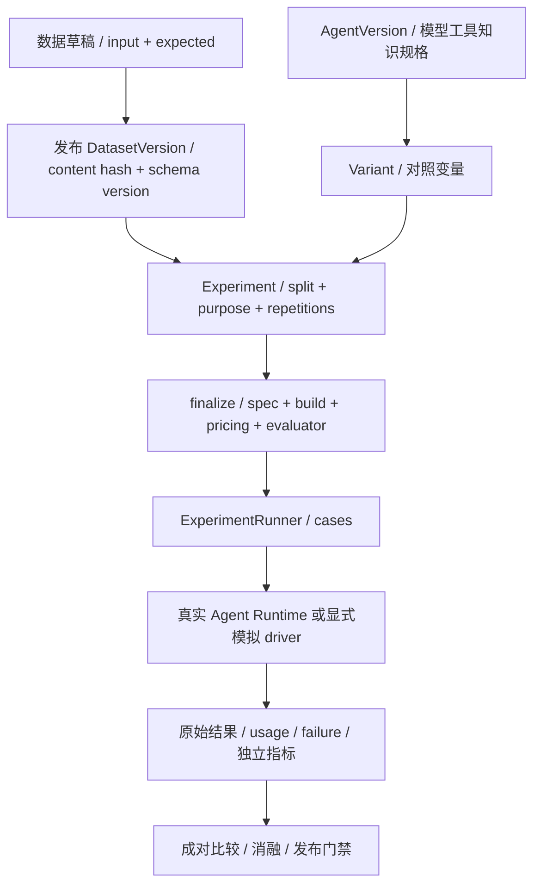

# 08 数据集与评测

[学习首页](README.md) · [上一课：07 Memory](07-memory.md) · [下一课：09 应用、反馈与接管](09-applications-feedback.md)

源码核查基线：`67264b3`，2026-10-09。本课中的源码/流程为静态核查；个人练习尚未代你执行，历史证据保留其日期/SHA。

## 这课要解决什么

学习如何把“这次看起来更好”变成**有冻结身份、有对照、有失败记录的实验**，并区分测试、模拟、真实模型、语义抽检和生产收益。

## 1. 数据集到实验的链条

不同 driver 的证据等级不同。DeterministicEvaluationDriver 可以验证编排；AgentRuntimeEvaluationDriver 复用真实执行链。不能看到 runner 文件就声称一定是付费真实模型实验。

## 2. 一个 case 要有什么

| 部分 | 回答什么问题 | 例子 |
| --- | --- | --- |
| input | 让执行者做什么 | 多轮客服问题，fixture/scenario |
| expected | 独立预期是什么 | 必要工具、禁止工具、工单数、审批决定、参考答案 |
| split | 可用于开发还是最终验证 | DEV / HOLDOUT |
| identity | 原样数据是什么 | 发布版本、schema 与内容 hash |

expected 不能直接拼成模型答案上下文。HOLDOUT 的 expected 默认在后端投影裁剪；显式读取还需权限，暴露应审计持久化。开发运行不能偷用 holdout 曝光次数或拿结果反复调 prompt。

## 3. 冻结的变量比你想象的多

打开 [ExperimentService.finalize_experiment](../../packages/evaluation/experiments.py)，先看发布数据/schema 完整性，再看 `_validate_stored_variant`，最后找到 `spec`、`spec_hash` 与 status。

冻结内容包括 dataset 内容/schema、split/purpose/repetitions、变体 spec、知识 snapshot/hash、pricing、build SHA 和 evaluator manifest。正式读取历史实验不能再解析今日 LATEST 或换价格后重算成“原实验结果”。

可复现意味着身份可核查，不承诺非确定性供应商输出逐字相同。模型/外部目标环境变化也需要保留限制。

## 4. ExperimentRunner 的并发与恢复

[ExperimentRunner](../../packages/evaluation/runner.py) 依次负责 prepare_run、claim_run、claim_case、执行、complete_case/fail_case、heartbeat 与 inflight 恢复。

| 问题 | 要找的函数 | 要理解的区别 |
| --- | --- | --- |
| 怎么避免两个 worker 同时拿同一个 case？ | claim_case | 数据库 claim/lease，不靠 Python 全局变量 |
| 付费执行关联在哪？ | bind_case_agent_run | 执行身份要在相应时点记录，不能失败后无法对账 |
| worker 死了怎样看旧 case？ | recover_inflight_cases | 对照已有 Run 状态，不盲重做未知写入 |
| 为什么保留失败/取消？ | fail_case / complete_case | 成功率分母与费用不能只取成功样本 |

源码查看不等于这轮跑过整批实验。

## 5. 衡量什么，各自不能替代什么

| 维度 | 所测内容 | 常见说错 |
| --- | --- | --- |
| 业务后置条件 | 工单数量、审批/工具、终态 | 达到后置条件≠答案全部语义正确 |
| 语义评价 | 参考答案/来源/独立 judge 或抽检 | 助手审阅≠真人一致性，judge 也不是绝对真理 |
| 检索 | recall / MRR / 引用身份 | recall=1≠零幻觉 |
| 运维 | TTFT / p50 / p95 / 吞吐 / 失败 | 受控并发≠生产饱和容量 |
| 费用 | 调用 usage、pricing 与全部尝试 | 估算上界≠账单，失败尝试也应计入 |

成对比较尽量固定任务、重复数和其他变量；消融改变一个机制以观察作用。发布门禁评估已有规则与冻结结果，不代表提供生产 SLA。

## 6. 仓库中关键数据在哪里

- [60 条正式客服数据/标注](../reviews/evidence/mi3-mi4-20261002/dataset-reviewed-v3/support-reviewed.json)：合成政策与参考答案，DEV 40/HOLDOUT 20。
- [正式证据目录](../reviews/evidence/mi3-mi4-20261002)：plan、raw results、assistant-review、cost reconciliation、RAG、故障、安全与负载。
- [Memory 11 场景](../../benchmarks/evaluation/memory_quality)：单独的确定性探针。
- [benchmarks 入口](../benchmark/README.md)：原始数据、runner、历史实验的解释与复现。

这些在 Git 中；本机数据库/密钥/模型缓存不等于已上传的数据备份。

## 7. 读一轮真实结果

[正式报告](../reviews/AgentHub-面试增强M-I3-M-I4验收报告-20261003.md)中，两个变体每任务三次，共 360 trial。HOLDOUT 业务 47/60→60/60，结合助手语义 41/60→57/60。

把这两个指标分别对应 raw result 与 assistant-review：为什么业务全通过仍有语义失败？哪些期望是程序检查，哪些依赖审阅？这比只背“效果提升多少”更能说明你理解实验。

RAG 两策略目标召回相同但时延不同；负载并发 1/4/8 各 60 秒不等于系统容量上限；Memory 脚本任务 PASS 不等于真实 LLM USE。必须保留范围、分母与未知。

## 8. 自测与面试追问

纸上设计一个实验：只改变工单登记提示，其余版本/知识/数据/价格/evaluator 固定。列出冻结字段、DEV 调试规则、HOLDOUT 暴露规则、失败记录、语义抽检与费用分母。

**通过标准：**说明一次实验比较了什么，以及没证明什么；能从报告找到原始 JSON，不把不同轮次测试数量拼成当前覆盖率。

已有核查：[发布数据集](../../tests/integration/test_m7a_evaluation_datasets.py)、[实验冻结](../../tests/integration/test_m7b_experiments.py)、[runner](../../tests/integration/test_m7c_experiment_runner.py)、[release gate](../../tests/integration/test_m7ef_ablation_release_gate.py)。本课未执行。

---

[学习首页](README.md) · [上一课：07 Memory](07-memory.md) · [下一课：09 应用、反馈与接管](09-applications-feedback.md)
