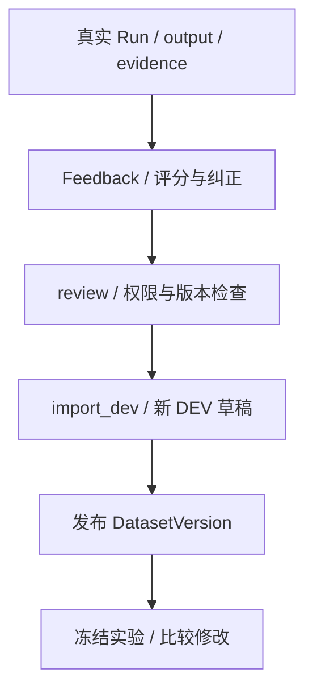

# 09 应用、反馈与接管

[学习首页](README.md) · [上一课：08 数据集与评测](08-evaluation.md) · [下一课：10 实践与面试验收](10-runtime-labs.md)

源码核查基线：`67264b3`，2026-10-09。本课中的源码/流程为静态核查；个人练习尚未代你执行，历史证据保留其日期/SHA。

## 这课要解决什么

把“运行时机制”连接回用户实际看到的应用、Artifact、反馈和人工接管，形成完整业务闭环，并准备面试时可解释的设计取舍。

## 1. 四类应用共用什么，差异在哪里

| 应用 | 任务与工具侧重点 | 展示产物 |
| --- | --- | --- |
| Research | 文献检索、证据选择 | 文献/shortlist 等卡片 |
| Incident | 指标、日志、部署、提交、受控回滚 | 事故时间线与证据 |
| Data Analyst | 指标定义、只读查询与分析 | 结构化分析产物 |
| Customer Support | 政策、客户信息、受控工单 | 客服处理与工具证据 |

模板在 [packages/agent_templates](../../packages/agent_templates)。会话共用 Thread/Turn、执行共用 AgentRunService，产物共用 Artifact。差异来自 prompt、工具组合、投影和页面；不能说四个应用各复制一套审批/图恢复。

## 2. Artifact 为何需要投影

模型叙述和真实工具结果应区分。`ToolResultArtifactRecorder` 识别可投影的调用，校验结构后保存来源 Run/Thread 与内容；未识别或无法表达的结果可被丢弃并记录，不应把产物失败必然等同 Run 失败。

真实投影选择函数：

出处：[packages/artifacts/recorder.py](../../packages/artifacts/recorder.py)，`_build`；原样函数（省略装饰器）。

```python
def _build(self, call: RecordedToolCall, run_id: UUID) -> BuiltArtifact | None:
    for projection in self.projections:
        built = projection(call, run_id)
        if built is not None:
            # First match wins, and the order in PROJECTIONS is therefore
            # part of the contract. In practice they match on disjoint tool
            # names, so the ordering only decides what happens if two
            # applications ever claim the same one -- which they should not.
            return built
    return None
```

出处中 PROJECTIONS 的顺序与工具匹配是契约的一部分。Artifact 类型还有不同生命周期和用户操作规则，不能笼统声称全部“模型绝不产生”或全部不可变。

## 3. 从实际错误形成回归数据



反馈是观察和人工判断，不是天然真值。纠正要可审核、可溯源；导入不能偷偷修改已发布数据集或 HOLDOUT。先去 [FeedbackService.submit / review / import_dev](../../packages/feedback/service.py) 找到 Run 归属、内容权限、状态及新 DEV 草稿构造。

后续可用第 8 课的方法验证修改效果，但不能让同一个被用于开发的 case 又被当作独立最终证据。

## 4. 人工接管不是审批的另一个名字

[HandoffService](../../packages/handoffs/service.py) 提供 OPEN→ASSIGNED→IN_PROGRESS→CLOSED 的运营生命周期，记录来源 Artifact、权限、expected_version、审计和未解决项。

| 机制 | 管什么 | 不能替代什么 |
| --- | --- | --- |
| Approval | 某工具动作是否获批准及执行结果 | 不管理人工案件负责人/运营处理 |
| Handoff | 人工负责、接手、关闭、保留处理理由 | 不自动批准工具、确认 UNKNOWN_OUTCOME 或重跑 Run |
| Feedback | 答案评分、纠正、审核与回归数据 | 不自动执行客户业务或修复模型 |

expected_version 防止拿陈旧卡片覆盖当前处理，数据库锁与权限检查是后端守卫。关闭案件保留原证据，而非删除“已经解决”的失败记录。

## 5. 前端显示状态也需要语义准确

Run timeline、approval card、MCP wizard、T12 分片预览与 T28 代码复制已有实现。成员邀请 UI、逐轮参数、真正新派生关系和完整 Dashboard 设计仍延期，不能从页面/菜单存在推断这些已完成。

SSE 客户端处理 run.started、message.delta、停止与错误；流式文本不是已落库最终输出。用户取消与网络失败要区分，提交 token 的复用/清空也决定下一次是否误重放旧 Turn。

[前端客户端](../../apps/web/lib/api/agent-runtime.ts)、[Incident panes](../../apps/web/components/incidents/incident-panes.tsx)以及 [前端修正报告](../reviews/AgentHub-前端文字排版修正报告-20261003.md)用于核查。脚本存在和专项截图不等于所有交互持续 E2E。

## 6. 安全和可观测性贯穿各课

把下面四条加到你自己的系统图边上：

1. 每个查询/写入校验 workspace 和内容权限，不靠 UI。
2. 工具结果/Memory 为不可信证据，不能变更 actor 或发布规则。
3. REST/MCP 的协议/DNS/重定向/peer SSRF 边界不能省略。
4. trace 默认脱敏/内容 opt-in，凭据加密，不把 debug 文本都写日志。

这不是独立于 Runtime 的四句口号：分别回到第 1、4、5、7 课的真实守卫。

## 7. 从系统链路提炼面试故事

选两个故事：一个机制，一个失败。每个用四步讲：

- 触发场景：用户/模型做什么？
- 代码机制：哪个函数/状态/约束处理？
- 为什么：替代方案会失去什么？
- 证据边界：哪份测试/报告覆盖，哪些没证明？

例如“远端已收写但响应丢失”的故事，必须说 NEEDS_ATTENTION，不说所有 crash 都自动业务恢复。Memory 故事必须说质量不足，不只说跨会话记住了。

个人贡献、AI 帮助范围、开发时长与团队背景只写真实事实；本课不替你认定独立完成全部项目。

## 8. 自测

把一个错误客服回答画成 Run→Feedback→Review→DEV draft→Experiment；再把一个 UNKNOWN_OUTCOME 画成需要人工调查的案件。指出哪个节点可以关闭运营处理，哪个节点不能凭关闭宣称外部动作确定。

已有核查：[feedback/evidence 集成](../../tests/integration/test_mi2_feedback_evidence.py)、[handoff 生命周期](../../tests/integration/test_handoff_lifecycle.py)、[M-I5 报告](../reviews/AgentHub-面试增强M-I5验收报告-20261003.md)。本课未执行。

**通过标准：**说明应用复用、产物来源、反馈回归与接管闭环，并区分用户可见状态与真实执行结果。

---

[学习首页](README.md) · [上一课：08 数据集与评测](08-evaluation.md) · [下一课：10 实践与面试验收](10-runtime-labs.md)
