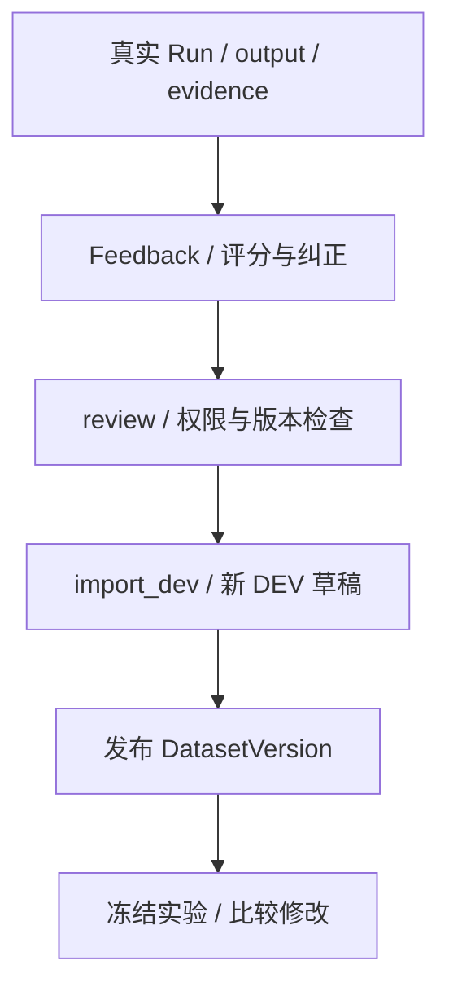

# 09 应用、反馈与接管

[学习首页](README.md) · [上一课：08 数据集与评测](08-evaluation.md) · [下一课：10 实践与面试验收](10-runtime-labs.md)

源码核查基线：`823ac05`，2026-10-09；答案核查补充：2026-10-10。本课中的源码/流程为静态核查；个人练习尚未代你执行，历史证据保留其日期/SHA。

## 这课要解决什么

把“运行时机制”连接回用户实际看到的应用、Artifact、反馈和人工接管，形成完整业务闭环，并准备面试时可解释的设计取舍。

## 1. 四类应用共用什么，差异在哪里

| 应用 | 任务与工具侧重点 | 展示产物 |
| --- | --- | --- |
| Research | 文献检索、证据选择 | 文献/shortlist 等卡片 |
| Incident | 指标、日志、部署、提交、受控回滚 | 事故时间线与证据 |
| Data Analyst | 指标定义、只读查询与分析 | 结构化分析产物 |
| Customer Support | 政策、客户信息、受控工单 | 客服处理与工具证据 |

模板在 [packages/agent_templates](../../packages/agent_templates)。会话共用 Thread/Turn、执行共用 AgentRunService，产物共用 Artifact。差异来自 prompt、工具组合、投影和页面；不能说四个应用各复制一套审批/图恢复。

## 2. Artifact 为何需要投影

模型叙述和真实工具结果应区分。`ToolResultArtifactRecorder` 识别可投影的调用，校验结构后保存来源 Run/Thread 与内容；未识别或无法表达的结果可被丢弃并记录，不应把产物失败必然等同 Run 失败。

真实投影选择函数：

出处：[packages/artifacts/recorder.py](../../packages/artifacts/recorder.py)，`_build`；原样函数（省略装饰器）。

```python
def _build(self, call: RecordedToolCall, run_id: UUID) -> BuiltArtifact | None:
    for projection in self.projections:
        built = projection(call, run_id)
        if built is not None:
            # First match wins, and the order in PROJECTIONS is therefore
            # part of the contract. In practice they match on disjoint tool
            # names, so the ordering only decides what happens if two
            # applications ever claim the same one -- which they should not.
            return built
    return None
```

出处中 PROJECTIONS 的顺序与工具匹配是契约的一部分。Artifact 类型还有不同生命周期和用户操作规则，不能笼统声称全部“模型绝不产生”或全部不可变。

## 3. 从实际错误形成回归数据



反馈是观察和人工判断，不是天然真值。纠正要可审核、可溯源；导入不能偷偷修改已发布数据集或 HOLDOUT。先去 [FeedbackService.submit / review / import_dev](../../packages/feedback/service.py) 找到 Run 归属、内容权限、状态及新 DEV 草稿构造。

后续可用第 8 课的方法验证修改效果，但不能让同一个被用于开发的 case 又被当作独立最终证据。

## 4. 人工接管不是审批的另一个名字

[HandoffService](../../packages/handoffs/service.py) 提供 OPEN→ASSIGNED→IN_PROGRESS→CLOSED 的运营生命周期，记录来源 Artifact、权限、expected_version、审计和未解决项。

| 机制 | 管什么 | 不能替代什么 |
| --- | --- | --- |
| Approval | 某工具动作是否获批准及执行结果 | 不管理人工案件负责人/运营处理 |
| Handoff | 人工负责、接手、关闭、保留处理理由 | 不自动批准工具、确认 UNKNOWN_OUTCOME 或重跑 Run |
| Feedback | 答案评分、纠正、审核与回归数据 | 不自动执行客户业务或修复模型 |

expected_version 防止拿陈旧卡片覆盖当前处理，数据库锁与权限检查是后端守卫。关闭案件保留原证据，而非删除“已经解决”的失败记录。

## 5. 前端显示状态也需要语义准确

Run timeline、approval card、MCP wizard、T12 分片预览与 T28 代码复制已有实现。成员邀请 UI、逐轮参数、真正新派生关系和完整 Dashboard 设计仍延期，不能从页面/菜单存在推断这些已完成。

SSE 客户端处理 run.started、message.delta、停止与错误；流式文本不是已落库最终输出。用户取消与网络失败要区分，提交 token 的复用/清空也决定下一次是否误重放旧 Turn。

[前端客户端](../../apps/web/lib/api/agent-runtime.ts)、[Incident panes](../../apps/web/components/incidents/incident-panes.tsx)以及 [前端修正报告](../reviews/AgentHub-前端文字排版修正报告-20261003.md)用于核查。脚本存在和专项截图不等于所有交互持续 E2E。

## 6. 安全和可观测性贯穿各课

把下面四条加到你自己的系统图边上：

1. 每个查询/写入校验 workspace 和内容权限，不靠 UI。
2. 工具结果/Memory 为不可信证据，不能变更 actor 或发布规则。
3. REST/MCP 的协议/DNS/重定向/peer SSRF 边界不能省略。
4. trace 默认脱敏/内容 opt-in，凭据加密，不把 debug 文本都写日志。

这不是独立于 Runtime 的四句口号：分别回到第 1、4、5、7 课的真实守卫。

## 7. 从系统链路提炼面试故事

选两个故事：一个机制，一个失败。每个用四步讲：

- 触发场景：用户/模型做什么？
- 代码机制：哪个函数/状态/约束处理？
- 为什么：替代方案会失去什么？
- 证据边界：哪份测试/报告覆盖，哪些没证明？

例如“远端已收写但响应丢失”的故事，必须说 NEEDS_ATTENTION，不说所有 crash 都自动业务恢复。Memory 故事必须说质量不足，不只说跨会话记住了。

**四个故事问题的完整参考示例：**触发场景是回滚提议获批准，远端接收后响应丢失；代码机制是 Approval 条件抢占、MCP execute_write 的 dispatch/结果分类及 Runtime 的 NEEDS_ATTENTION 投影；设计原因是无确认重试可能重复副作用，本地事务不能包住远端服务；证据来自第 05 课链接的 MCP/故障记录，证明特定窗口安全处理，不证明全部外部服务 exactly-once 或业务总能自动完成。照此四层组织，既回答“做了什么”，也说明“为什么”和“证明到哪里”。

个人贡献、AI 帮助范围、开发时长与团队背景只写真实事实；本课不替你认定独立完成全部项目。

## 8. 自测

把一个错误客服回答画成 Run→Feedback→Review→DEV draft→Experiment；再把一个 UNKNOWN_OUTCOME 画成需要人工调查的案件。指出哪个节点可以关闭运营处理，哪个节点不能凭关闭宣称外部动作确定。

**两条链的参考答案：**

- 错误 R1→提交带 corrected_answer 的 Feedback→审核当前修订→import_dev 生成新 DEV draft→发布 DatasetVersion→冻结新 Experiment→执行与判分。原 R1、原发布数据和原实验不被改写；导入要求 DEV-only 基版本、正确 review_version，并按 request hash 处理重发。
- 未知 R2/P2→保留 UNKNOWN_OUTCOME/NEEDS_ATTENTION 的证据→从合适来源 Artifact 建 Handoff→分配或接手→人工调查→记录理由/未解决项后 CLOSED。关闭的是案件处理流程，原 Approval 的结果不因它自动变 SUCCEEDED；没有远端证据就仍不能确认外部动作。

依据：[FeedbackService.import_dev](../../packages/feedback/service.py)、[HandoffService.change](../../packages/handoffs/service.py)。常见错误是漏掉“发布数据集”就直接正式评测，或把 CLOSED 当作 Run 成功。

已有核查：[feedback/evidence 集成](../../tests/integration/test_mi2_feedback_evidence.py)、[handoff 生命周期](../../tests/integration/test_handoff_lifecycle.py)、[M-I5 报告](../reviews/AgentHub-面试增强M-I5验收报告-20261003.md)。本课未执行。

**通过标准：**说明应用复用、产物来源、反馈回归与接管闭环，并区分用户可见状态与真实执行结果。


## 精读增补：从一次执行结果走到用户处理闭环

### A. 应用复用具体复用哪些东西

Research、Incident、Data Analyst、Customer Support 使用相同的运行时执行、工具治理、审批恢复和预算接口；模板与工具组合决定任务差异，Artifact projection 和页面决定结果如何呈现。复用的是稳定机制，不是要求四种任务必须有同样的工具/卡片。

加入一个新应用时，先问已有模板、工具契约、投影和会话组件能否表达它。若每个应用复制审批代码，就会出现某处修复并发、其他处仍有漏洞。共用机制使安全修复有统一入口，也要求契约稳定、应用差异不要硬塞进通用 Runtime 条件分支。

### B. Artifact 为什么不是模型一句总结

教学场景：指标 READ 返回服务、时间窗、错误率序列。模型解释“发布后出现异常”；projection 可以把合法的结构结果转换为来源可追踪的事故证据卡。卡片的具体字段必须来自合法记录与投影契约，不能因为文案说有证据就伪造一份图表。

`ToolResultArtifactRecorder._build` 依次调用 projections，首个非 None 结果胜出。增加投影时要考虑匹配范围和顺序；两个投影认领同一工具会让先后顺序改变产物。未识别、结构不合格或记录失败的路径应按实际实现解释，不假设全部结果都生成卡片。

Artifact 记录来源 Run/Thread；内容 hash 用于识别证据版本。用户操作和生命周期因类型而异，因此“产物来源受控”不等于“所有产物从来不能修改”。阅读对应服务，区分原始证据、投影与用户整理层。

### C. 错答案怎样变成 DEV 回归

设客服 R1 错答退款期限。人工提交纠正→审核批准→导入新的 DEV 草稿→发布新的 DatasetVersion→构造比较实验。这条链保存的是错误、纠正与审核来源，不是直接修改 R1 的历史输出或已经发布的参考答案。

打开 [FeedbackService.import_dev](../../packages/feedback/service.py) 逐项检查：

1. 锁定反馈，确保 review version 与 content revision 的状态可信。
2. request hash 绑定导入目标、基版本、预期审核版本和内容修订；已导入且 hash 相同可以复用结果，变更目标则冲突。
3. 状态必须 APPROVED、审核版本匹配，并且 corrected_answer 存在。
4. 基数据版本要属于当前 workspace/dataset；其 split 集合必须恰好是 DEV，混入 HOLDOUT 也不允许。
5. 创建新数据草稿，原发布版保留。后续发布和正式评测是另外的动作。

这解释了为什么“审核通过”还不等于“已成为正式回归”：中间还有导入、发布和实验冻结。

### D. expected_version 与行锁怎样配合

Handoff 面向人工案件，版本用于防止过期页面覆盖他人操作。教学时间线：甲打开案件版本 1，乙将其分配后版本变 2；甲仍提交 expected_version=1，正常状态变更会收到版本冲突，应刷新而不是强行覆盖。

在 [HandoffService.change](../../packages/handoffs/service.py) 中，先检查对应权限，再按 workspace 锁定行，比较 expected_version，验证状态与操作者。行锁序列化同一行的并发更新，expected_version 则表达客户端是否基于最新信息，两者不是重复设计。

当前 close 有特殊幂等分支：同一 actor、expected_version 与 payload 形成的关闭请求 hash 若已成功保存，重发相同请求可返回原 CLOSED 记录，检查顺序在普通版本冲突之前。不能概括为“任何旧版本都必定冲突”；其他操作或变更 payload 仍按实际状态/版本约束处理。

关闭还要求案件已 IN_PROGRESS 且由当前 claimant 处理，保留关闭理由与未解决项。CLOSED 是人工流程结束，不改变原 Approval 的执行证据，不确认 UNKNOWN_OUTCOME，不自动重试外部动作。

### E. 前端要读两层事实

message.delta 是临时流式文本，Run 最终输出是持久结果；审批卡的 APPROVED 是决定，execution_status 是实际动作结果；Handoff CLOSED 是运营状态，原 Run 仍可能 NEEDS_ATTENTION。把两层事实合并成一个绿色“成功”会误导用户。

遇到停止生成，前端要发送取消请求/中断本地流并正确处理 token；网络失败需要保存可重试关联信息。遇到角色变化，UI 提示方便用户理解，但最终操作仍由后端即时判断。

### F. 练习与参考答案

### Q09-01 · 纠正直接改历史输出不是更方便吗？

**答案：**会丢失原错误证据，影响评分、审计和故障复盘；应该追加反馈并建立新的回归身份。

**解读：**R1 是当时产生的原始输出，评分/故障分析依赖该事实。追加 Feedback 保存纠正内容与审核身份，导入新 DEV 草稿再评测，使原错误和修正都能追溯。

**核查依据：**[对应源码/证据](../../packages/feedback/service.py)，重点看 `submit / review / import_dev`。

**常见误解：**回写旧答案后再声称原版本没有出错。

### Q09-02 · 两次关闭按钮请求为何有时不冲突？

**答案：**完全相同且已完成的 close 可走幂等 hash 分支；不同请求不能据此复用旧结果。

**解读：**close_request_hash 包含 actor、expected_version 和 payload。已经 CLOSED 且同 hash 的重发先返回旧结果，普通版本校验随后才执行；改变理由/actor等会走冲突路径。

**核查依据：**[对应源码/证据](../../packages/handoffs/service.py)，重点看 `change 的 close 幂等分支`。

**常见误解：**说所有旧 expected_version 都一律 409。

### Q09-03 · 为什么评测改进还要保留原错误 case？

**答案：**需要证明修改前后的可比性，并持续防止回归；但用它开发后不再将其当全新 HOLDOUT。

**解读：**新版本要继续面对已知错误，避免修复后再退化；但这个 case 已参加开发，所以只能作为回归，不能再声称它从未暴露、可作为独立 HOLDOUT。

**核查依据：**[对应源码/证据](../../packages/feedback/service.py)，重点看 `import_dev`。

**常见误解：**为了展示新版本好而删除原错误案例。

**掌握标准：**解释一次 Run 怎样形成 Artifact、Feedback、DEV 和 Handoff；说清每份记录的状态、来源与不可替代的职责。

---

[学习首页](README.md) · [上一课：08 数据集与评测](08-evaluation.md) · [下一课：10 实践与面试验收](10-runtime-labs.md)
