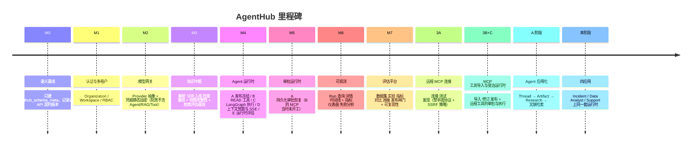

# 01 · 项目全景

## 1. 这是什么

**AgentHub = Enterprise Agent Runtime & Control Plane（企业级 Agent 运行时与控制平面）。**

一句话区分它和市面上常见的东西：

| 常见形态 | 它解决的问题 | AgentHub 的差别 |
|---|---|---|
| ChatGPT 套壳 | 让模型能聊天 | AgentHub 关心的是模型**调用工具改动真实系统**之后的后果 |
| LangChain Demo | 让链路跑通 | AgentHub 关心跑通之后**谁批准的、用的哪版 prompt、能不能复现** |
| Dify / Coze | 低代码编排 | AgentHub 把治理（冻结、审批、审计、评估）做成一等公民，而不是配置项 |
| RAG 问答系统 | 让回答有出处 | RAG 只是这里的一个能力，且强制走**知识快照**保证可复现 |

它的用户画像是**企业内部的平台团队**：他们要给业务方提供 Agent 能力，但必须回答
「这个 Agent 昨天为什么退了这笔款」「谁授权的」「换了模型之后效果是变好还是变差」。

## 2. 解决的四个真实痛点

1. **不可解释**——Agent 三天前做了件事，但 prompt 已经改过五版，没人知道当时用的是什么。
   → 发布即冻结（Frozen Execution Snapshot）。
2. **不可控**——Agent 能调用退款接口，但没人能在它按下去之前拦一下。
   → 工具治理 + 审批闸门（Approval Runtime）。
3. **不可复现**——同样的问题问两次，答案不一样，无法判断是模型变了还是知识库变了。
   → 知识快照 + 评估平台（Evaluation Platform）+ 可复现性哈希。
4. **会编**——模型把没查到的字段编出来，而且编得很像真的。
   → Artifact 投影 + 反幻觉 prompt 契约 + 上下文预算的语义化截断。

## 3. 技术栈

### 后端

| 层 | 选型 | 为什么 |
|---|---|---|
| Web 框架 | FastAPI | 原生 async、Pydantic v2 集成、OpenAPI 自动产出 |
| ORM | SQLAlchemy 2.x（async） | 2.0 风格 `select()`，类型友好 |
| 迁移 | Alembic（25 个版本，单一 head） | 「绝不制造 multiple heads」是硬约束 |
| 数据库 | PostgreSQL | 业务事实的唯一真相源 |
| 队列/缓存 | Redis | 知识入库、评估任务 |
| 向量库 | Qdrant（适配器隔离） | 可替换，不让 SDK 类型穿过应用契约 |
| 编排 | LangGraph | 要的不是「图」，要的是 **checkpoint + interrupt** |
| 模型 | 多 Provider 网关（含 DeepSeek 实测） | 模型是可替换的插件，不是依赖 |
| 嵌入/重排 | BGE-M3 / BGE reranker（本地） | CI 注入确定性假模型，不下载权重 |
| 协议 | 官方 MCP Python SDK v2（`mcp>=2,<3`） | 禁止手搓 JSON-RPC / initialize / 分页 |
| 可观测 | 供应商中立的脱敏结构化 trace sink | Langfuse/OTel 可后挂在同一契约后面 |

### 前端

Next.js 15.2.4（App Router）+ React 19.1.0 + TypeScript 5.8.2，110 个 ts/tsx 文件。
零 UI 框架、零组件库，纯手写 CSS——13 个样式文件共 1705 行。

**`globals.css` 只做 import，而 import 顺序就是级联顺序**，是被刻意排过的：

```
tokens → base → shell → session → primitives → pages
       → auth → menus → components → compare
       → research → applications → responsive
```

`tokens` 在最前（所有颜色的唯一来源），`responsive`（断点）在最后，
所以断点永远赢——不需要在媒体查询里堆 `!important` 或提特异性。

**主题是 token 覆盖，不是第二套样式表**：`:root[data-theme="light"]` 只覆盖颜色 token，
间距、圆角、字体两套主题共享，因此结构上严格同构。

**图标**：`components/ui/icon.tsx` 一个文件，16 个内联 SVG，`currentColor` 描边。
不引图标库——按需 16 个图标，一个依赖换不来这点收益。

i18n 的写法值得一提：`en-US.ts` **本身就是 schema**

```ts
export type MessageSchema = typeof enUS;
export const zhCN: MessageSchema = { ... };
```

所以中文少一个 key 是**编译错误**，不是运行时兜底。
另有 `i18n/format.ts` 承担数字/时间/时长的本地化格式化——
这一层的存在是为了让「1234567」在界面里读作「123.5 万」而不是一串数字。

### 工程化

- Ruff（py312，line-length 100）为 lint 闸门
- pytest，92 个测试文件，单元 / 集成分离（集成需真实 PostgreSQL URL）
- GitHub Actions：每次冻结审计跑一次 **exact-head CI**（精确到 SHA，不允许「差不多那个提交」）

## 4. 代码结构

```
AgentHub/
├─ apps/                      # 进程边界
│  ├─ api/                    # FastAPI：routes/ + schemas/ + dependencies
│  ├─ worker/                 # 异步任务进程
│  ├─ web/                    # Next.js 前端
│  ├─ literature_mcp/         # MCP Server：search_papers / get_paper
│  ├─ ops_mcp/                # MCP Server：query_metrics / query_logs /
│  │                          #   get_deployments / get_commit / rollback_deployment
│  ├─ warehouse_mcp/          # MCP Server：list_tables / describe_table /
│  │                          #   get_metric_definition / query_sql（含 SQL 守卫）
│  └─ commerce_mcp/           # MCP Server：query_customer / get_order /
│                             #   get_refund_status / issue_refund
├─ packages/                  # 领域层（不依赖 FastAPI）
│  ├─ core/                   # config / errors / auth / execution_context / canonical
│  ├─ control_plane/          # 租户、RBAC、审计
│  ├─ model_gateway/          # Provider 抽象、凭据加密、档案解析
│  ├─ knowledge/              # 解析、分块、入库、检索、快照、引用问答
│  ├─ tools/                  # 工具契约、策略、内置工具、审计
│  ├─ mcp/                    # 远程工具：client / security / runtime / service
│  ├─ agent_runtime/          # 发布、冻结、执行图、上下文预算、SSE
│  ├─ approvals/              # 审批状态机、对账
│  ├─ threads/                # 会话与轮次
│  ├─ artifacts/              # 产出物：schema / 投影 / 记录器
│  ├─ agent_templates/        # 四个应用模板
│  ├─ evaluation/             # 数据集、实验、指标、消融、发布闸门
│  └─ observability/          # 运行观测投影
├─ migrations/versions/       # 0001 → 0025，单链
├─ tests/{unit,integration}/  # 92 个测试文件
├─ benchmarks/                # 检索评估基线数据
├─ plan/                      # plan.md + extend-plan.md（分阶段计划）
└─ docs/                      # 架构、契约、里程碑验收、安全、ADR
```

**依赖方向是单向的**：

```
Transport/API  →  Application  →  Domain/Contract  →  Infrastructure Adapter
```

LangGraph 的 checkpoint 原始载荷、Qdrant 的 SDK 类型、Provider SDK 的类型
**都不允许穿过应用契约**。这是面试里很容易被问到的「你怎么保证可替换」的答案。

## 5. 里程碑演进（讲故事的主线）



关键的讲法：**每一个里程碑都是「一个不变量被建立」，不是「一个功能被堆上去」**。

- M2 刻意不含 Agent/RAG/Tool——证明模型网关是独立可用的边界。
- M5-A 冻结了审批状态机，之后所有加固都不允许改它。
- 3A 交付后明确 STOP，不许顺手做 3B——这是工程纪律，面试官会欣赏。

## 6. 规模数据（可以直接报的数字）

| 指标 | 数值 |
|---|---|
| Python 文件 | 335 |
| Python 代码行（apps + packages + migrations） | 43,731 |
| 前端 ts/tsx 文件 | 110 |
| 前端手写 CSS 行数 | 1,705（13 个文件，零框架） |
| 测试文件 | 92 |
| Alembic 迁移 | 25（单 head） |
| API 路由模块 | 16 |
| MCP Server | 4 个自研（文献 / 运维 / 数仓 / 商务） |
| Agent 应用 | 4（共用一套运行时） |
| Artifact 类型 | 7 |
| RBAC 权限 | 8 个常量 + 操作类权限集（本阶段**未新增**任何权限） |

## 7. 最容易被问的一句话

> **「这个项目和调 OpenAI API 写个循环有什么区别？」**

答：区别在于那个循环跑完之后你能回答的问题。
调 API 的循环跑完，你只有一段文本。
AgentHub 跑完，你有：这次用的是哪个冻结版本、上下文里哪些证据被装入哪些被截断（按语义分类）、
调了哪些工具、哪些工具因为是 WRITE 被拦住等人批准、谁批准的、远端返回是确定成功还是
不确定、产出的 Artifact 每一条事实来自哪次工具调用。

**这些不是日志，是可查询的领域模型。**
