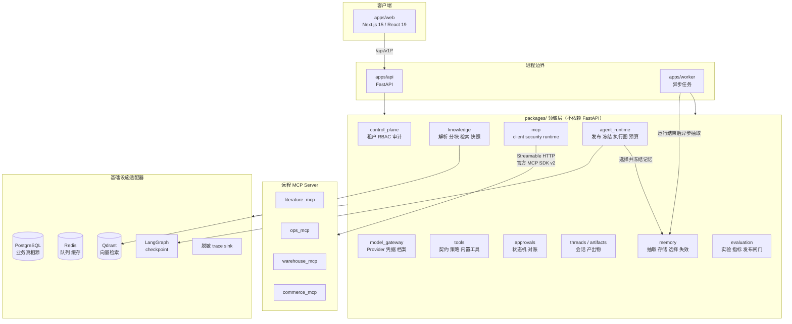
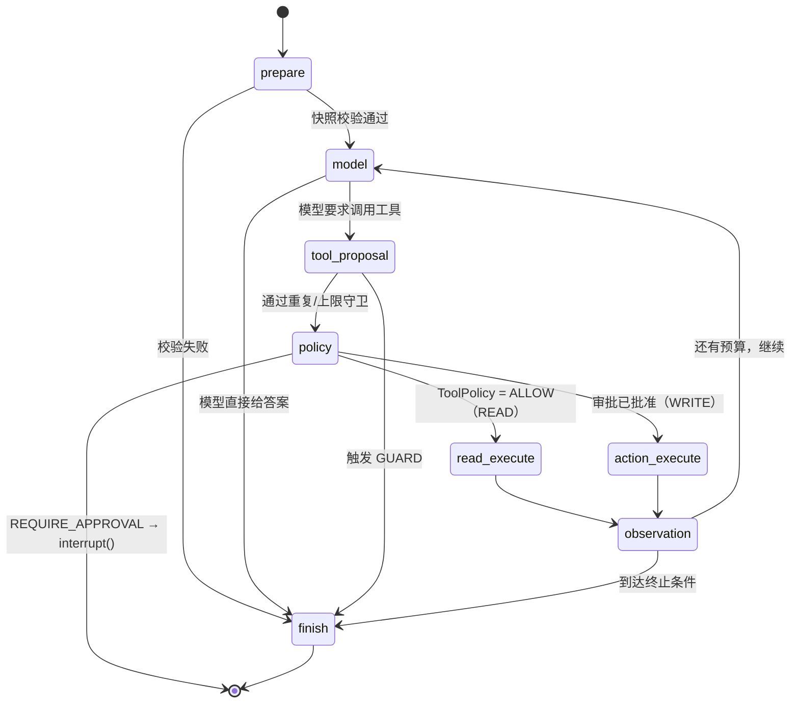
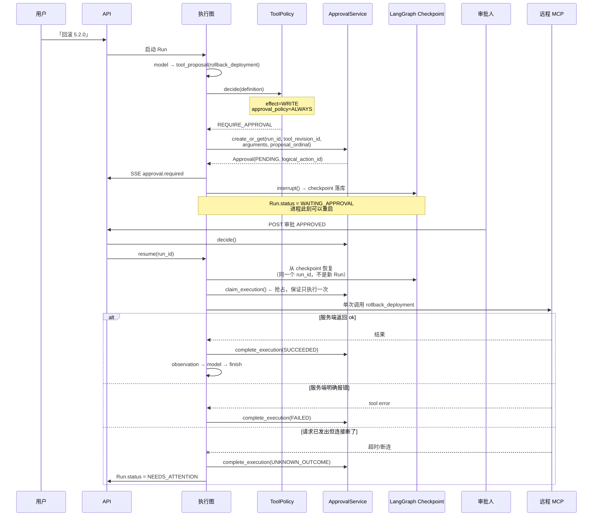
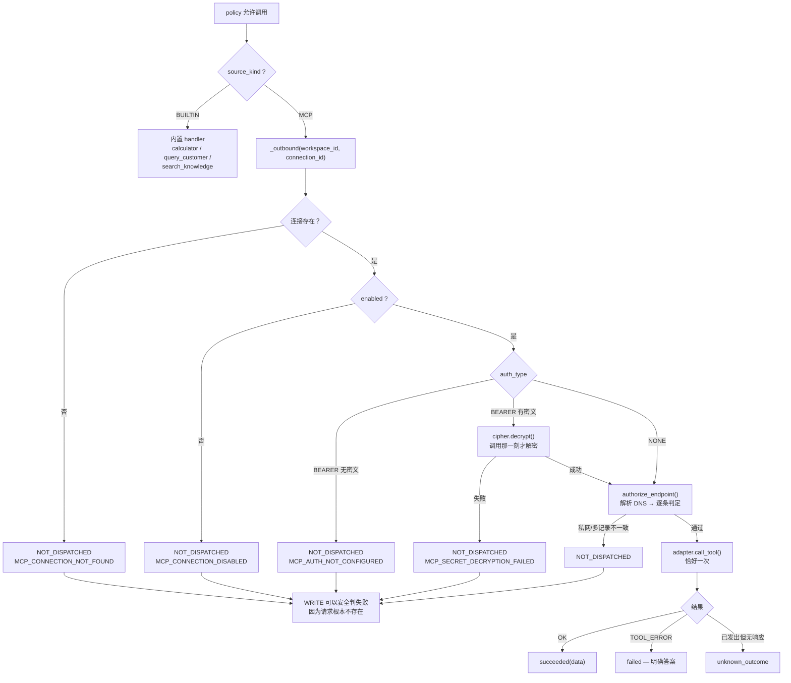
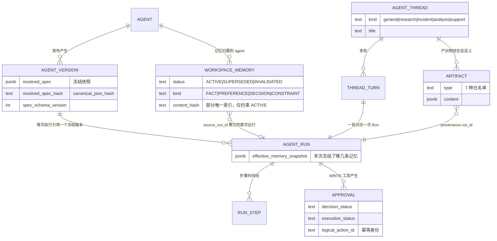
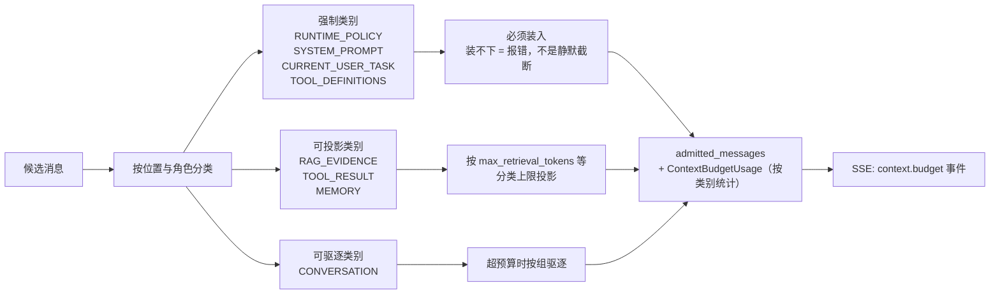

# 02 · 架构与数据流

这一篇是「白板讲解稿」。五张图，按顺序画完，一个中高级后端面试的架构轮次就够了。

---

## 图 1 · 系统分层



**要说的三句话**

1. 单体模块化 + Worker：一个仓库、一个 API 进程、一个 Worker 进程、一个前端。
   不是微服务——因为这个阶段的瓶颈是**领域边界要清晰**，不是部署要弹性。
2. 依赖方向严格单向：`Transport/API → Application → Domain/Contract → Infrastructure Adapter`。
3. **LangGraph 的 checkpoint 原始载荷、Qdrant 的 SDK 类型、Provider SDK 的类型，
   都不允许穿过应用契约。** 这是「可替换」的实际含义，不是口号。

---

## 图 2 · 一次 Run 的完整生命周期

执行图只有 8 个节点（`packages/agent_runtime/runtime.py:1155` 附近的 `compile_agent_graph`）：



### `prepare` 做的三件事（面试高频）

```python
# packages/agent_runtime/runtime.py:1224 prepare()
1. canonical_json_hash(version.resolved_spec) == version.resolved_spec_hash  # 版本自身完整性
2. run.resolved_spec_hash == version.resolved_spec_hash                       # 这次 Run 认领的就是它
3. parse_frozen_agent_spec(...)                                               # 解析成不可变结构
```

任何一条不成立 → `AGENT_VERSION_INTEGRITY_ERROR`。
**意思是：发布之后有人偷偷改了数据库里的 spec，这次 Run 会拒绝执行，而不是照跑。**

然后组装上下文，**顺序是有语义的**：

```
[0] system: _RUNTIME_POLICY      ← 运行时策略，永不可驱逐
[1] system: spec.system_prompt   ← 冻结的应用 prompt，永不可驱逐
[2] system: 长期记忆（若开启）      ← 一条消息装全部记忆，可驱逐（MEMORY 类别）
[3..n] 历史轮次                    ← 可驱逐
[n+1] user: 本次问题               ← 永不可驱逐
```

代码注释原话：*"That ordering is not cosmetic: the budget categorizer reads position,
and history placed anywhere else would either become unevictable or displace the question
being asked."*

记忆那一条把这句注释的意思演示得最清楚：

- 它写成 `system` role，是因为只有这样供应商才会把它当上下文，而不是当用户的又一次发言；
- 但它**不能因此继承 `SYSTEM_PROMPT` 的必留待遇**——记忆是证据不是指令，
  如果按 role 分类，足够多的记忆就会把「用户当前问的那个问题」挤出窗口。
  所以类别是按**位置**判定的，落在独立的 `MEMORY` 档里，可被驱逐。
- 它和工具结果一样被强制盖 `UNTRUSTED`。记忆是「更早的模型写的、关于更早对话的文本」，
  它没有资格自称可信，哪怕它的 payload 里自带一个 `"trust": "SYSTEM"`。
- **一条消息装全部记忆，不是一条一个**：八条独立条目可能被裁掉一半，
  留给模型一个它无从察觉的残缺信念集——半套记忆比没有记忆更危险。

---

## 图 3 · 审批中断与同一 Run 内恢复（**最核心的一张**）



### 为什么这张图值钱

1. **`interrupt()` 而不是轮询等待**——进程不占线程、不占连接。审批可能等三天。
2. **同一个 run 内恢复**——不是「新开一次 Run 继续」。所以 `run_id` 串起来的
   step 序列是完整的一条，审计的时候不需要跨 Run 拼接。
3. **`claim_execution()` 是并发闸门**——两个人同时点批准、或者恢复被触发两次，
   只有一个能 claim 成功，剩下的看到已被认领。
4. **三态而不是两态**——见下一节。

### 审批的两个独立状态维度

```python
# packages/approvals/contracts.py
ApprovalDecisionStatus  = PENDING | APPROVED | DENIED | EXPIRED | CANCELLED
ApprovalExecutionStatus = NOT_STARTED | CLAIMED | SUCCEEDED | FAILED | UNKNOWN_OUTCOME
```

**「批准了」和「执行成功了」是两件事。**
很多系统把它们合成一个 `status` 字段，然后在「批准了但执行失败」的时候就没法表达了。

---

## 图 4 · 远程 MCP 工具调用链路



**这张图的两个关键句**

1. *"Every refusal before the adapter is reached is reported as NOT_DISPATCHED,
   which is what makes it safe to fail a WRITE outright: no request existed to be
   half-delivered."*
   —— 「没发出去」和「发出去了不知道结果」在语义上必须分开，否则 WRITE 无法安全失败。

2. **凭据在调用那一刻才解密，不在发布时冻结。**
   代码注释：*"The contract is immutable; the credential is not, and that asymmetry
   is deliberate."* 换 token 不需要重新发布；吊销 token 立刻生效。

3. **READ 永远没有「不确定」**——重读一次是免费的，所以未确认的 READ 就是普通错误。
   只有 WRITE 才需要 `UNKNOWN_OUTCOME`。

---

## 图 5 · Thread / Run / Artifact 三层关系



### 为什么 Thread 和 Run 不能合并

这是被明确写进约束的一条（「Thread/Run 必须不合并」）：

| | Thread | Run |
|---|---|---|
| 生命周期 | 长期，可几周 | 一次执行，秒到分钟 |
| 身份 | 业务工作单元（一次故障排查、一个客户案件） | 一次模型+工具的执行 |
| 失败语义 | 不会「失败」 | 会 FAILED / NEEDS_ATTENTION / CANCELLED |
| 可重跑 | 不重跑 | 同一 Thread 可以再开一个 Run |
| 观测 | 「这个案子怎么样了」 | 「这次执行为什么慢」 |

合并的后果：Run 失败会变成「会话失败」，而会话其实只是「这轮没成」。

### Artifact 的 provenance

```json
{
  "provenance": {
    "run_id": "…",
    "tool_call_id": "call-2-0",
    "tool_identity": "query_sql",
    "step_sequence": 7
  }
}
```

**模型从不写 Artifact。** Artifact 由 `ToolResultArtifactRecorder` 从工具结果投影产生
（`packages/artifacts/projections.py`）。模型只能决定**问什么**，不能决定**记录成什么**。

### `agent_runs.effective_memory_snapshot` 为什么是对象

`JSONB NOT NULL DEFAULT '{}'::jsonb`，里面装的是
`{"selected_at": ..., "memory_ids": [...]}` ——**是对象，不是裸数组**。

理由只有一条，但它就是整个确定性主张本身：
「这次选过了，但一条都没选中」和「这次还没选过」，作为数组都是 falsy，分不开。
分不开，快照就退化成装饰品——你无法判断一次没有记忆的运行是因为
agent 当时确实什么都不知道，还是因为记忆选择那一步根本没跑。
详见 ADR-011。

---

## 补图 · 上下文预算的语义化准入



**三个设计点**

1. **类别不是按 role 分的，是按位置分的。**
   长期记忆用 `system` role 写，但它落在 `MEMORY` 类别里——和 `RAG_EVIDENCE`、
   `TOOL_RESULT` 同属**证据档**，可被投影、可被驱逐。
   如果按 role 判，它就会混进必留的 `SYSTEM_PROMPT`：
   记忆一多，被挤出窗口的会是「用户当前问的那个问题」。
   这也是为什么 history 的区间判定必须是闭区间——开区间会让记忆那条被 history 吞掉。
2. **按「组」驱逐，不按「条」驱逐。**
   assistant 的 `tool_calls` 和对应的 `tool` 结果被绑成同一个 group
   （`("tool_exchange", index, *ids)`）。只驱逐其中一半会产生孤儿 tool 消息，
   多数 Provider 会直接 400。
3. **用量按类别上报。** `ContextBudgetUsage` 分别给出每个类别的
   estimated / retained / truncated token 数，并通过 `context.budget` SSE 事件推给前端。
   所以「为什么这次没引用到那篇文档」是可以回答的，答案是
   「RAG_EVIDENCE 类别被截断了 3200 token」。

---

## SSE 事件协议（AgentHub Event Protocol）

```
run.started
  context.budget
  message.started → message.delta* → message.completed
  retrieval.started → retrieval.completed → rerank.completed
  tool.requested → tool.started → tool.completed | tool.failed
  approval.required → approval.resolved
  run.cancel_requested
  usage
run.completed | run.failed | run.cancelled
```

前端据此画运行时间线；`approval.required` 是 UI 弹出审批卡片的触发点。
