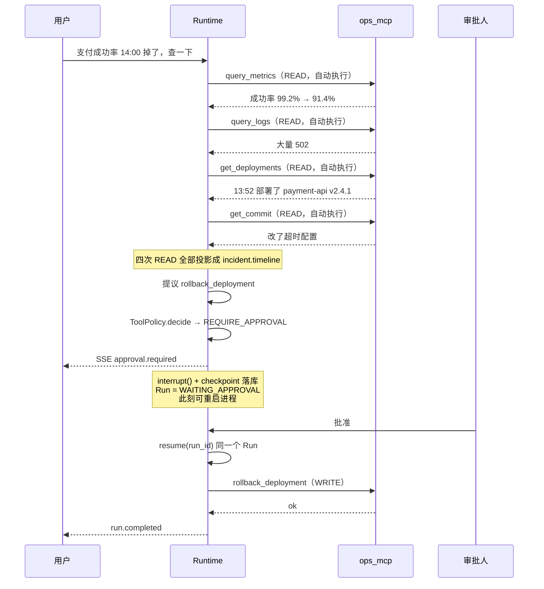

# 04 · 四个应用，一套运行时

这一章回答的问题是：**「你做了四个应用，是不是复制粘贴了四遍？」**

答案是没有，而且可以证明。

---

## 1. 核心论证：加一个应用需要改什么

| 需要改动的东西 | 加一个新应用时是否需要 |
|---|---|
| Agent 运行时（`packages/agent_runtime/`） | ❌ 不需要 |
| LangGraph 执行图（8 个节点） | ❌ 不需要 |
| 工具策略判定（`ToolPolicy.decide`） | ❌ 不需要 |
| 审批状态机（`packages/approvals/`） | ❌ 不需要 |
| 上下文预算 | ❌ 不需要 |
| SSE 事件协议 | ❌ 不需要 |
| RBAC 权限 | ❌ 不需要（本阶段**新增 0 个权限**） |
| API 路由前缀 | ❌ 不需要（复用 `/threads`、`/artifacts`、`/runs`） |
| per-agent 记忆开关 | ❌ 不需要（属运行时配置 `runtime_config.memory.*`，两个开关默认关） |
| — | — |
| 一个 `AgentTemplate` 常量 | ✅ 需要（约 40 行 prompt） |
| 一个 MCP Server（如果要新工具） | ✅ 需要 |
| `ThreadKind` 枚举加一个值 | ✅ 需要（一行） |
| `ArtifactType` 白名单加条目 + 投影函数 | ✅ 需要 |
| 前端一个三栏页面 | ✅ 需要 |

**改动全部在「配置与展示」侧，运行时侧是零。** 这就是论证。

两条需要说清楚的补注：

- **「新增 0 个权限」这条结论到长期记忆这一轮仍然成立。** 三个记忆管理接口
  复用的是既有权限：列表用 `workspace_read`，invalidate / reactivate 用 `agent_edit`。
  能改一个 agent 记得什么，和能改它的提示词是同一种权限——
  单开一个权限只会多一样忘记授予、或者授予过宽的东西。
- **记忆是 per-agent 的运行时配置，不是应用的属性。** 它挂在
  `runtime_config.memory.*` 上，两个开关默认关；加第五个应用时既不需要碰它，
  也不会因为它而让既有版本的 `resolved_spec` 哈希变化（全 false 时整段省略）。

面试里可以这样收尾：
> 如果我加第五个应用要去改 `runtime.py`，那说明前四个也不是共用的，
> 只是长得像而已。判断一个抽象是真是假，不看它现在服务几个实现，
> 看新增一个实现时它自己要不要动。

---

## 2. 深度对照（用户给定的目标深度）

```
Research  ██████████ 100%  旗舰：完整检索 → 卡片 → shortlist
Incident  ██████░░░░  60%  完整 Read → Approval → Write 走一遍
Data      ████░░░░░░  40%  查数据 → 连续分析 → 产出 Artifact
Support   ████░░░░░░  40%  查客户 → Knowledge → 创建/审批动作
```

**深度不同是故意的，不是没做完。** 四个应用分别承担不同的展示职责：

- Research 展示**完整的产品形态**（三栏、结构化卡片、多轮追问、人工综合）
- Incident 展示**治理闭环**（这是唯一一个走完 READ → 审批 → WRITE 的）
- Data 展示**安全边界**（SQL 双层守卫）
- Support 展示**混合能力**（远程工具 + 本地知识库 RAG + 升级产出）

面试时主推 Research + Incident，另外两个作为「同一套东西的第三、第四个实例」带过。

---

## 3. 四个应用逐个说明

### 3.1 Research Assistant（科研助理）

| 项 | 内容 |
|---|---|
| ThreadKind | `research` |
| MCP Server | `apps/literature_mcp`（端口 8931） |
| 工具 | `search_papers`（READ/LOW/NEVER）、`get_paper`（READ/LOW/NEVER） |
| 数据源 | OpenAlex（单一来源，v1 刻意不做多源聚合） |
| Artifact | `research.paper_search`（投影）、`research.paper_shortlist`（人工） |
| 前端 | `/research`，三栏 `Research Threads │ Conversation │ Artifacts` |

**值得讲的点**：

1. **论文永远以结构化卡片呈现，绝不是纯编号列表**——
   标题 / 作者 / 年份 / 出处 / 引用数 / DOI / OA 链接。
   因为「第 3 篇」在多轮对话里会错位，而 DOI 不会。
2. **`search_papers` 的返回被投影成 `research.paper_search` Artifact**，
   带 provenance。所以「模型说这篇引用 512 次」可以和 Artifact 对账。
3. **shortlist 是人按按钮生成的**，不是模型产出的——
   它是人的判断（「我认为这 5 篇相关」），不应伪装成检索事实。

### 3.2 Incident Investigator（故障排查）—— 治理闭环的样板

| 项 | 内容 |
|---|---|
| ThreadKind | `incident` |
| MCP Server | `apps/ops_mcp`（端口 8941） |
| READ 工具 | `query_metrics`、`query_logs`、`get_deployments`、`get_commit` |
| WRITE 工具 | **`rollback_deployment`（WRITE / HIGH / ALWAYS）** |
| Artifact | `incident.timeline`（投影）、`incident.report`（人工） |
| 前端 | `/incidents` |

**这是四个应用里最重要的一个**，因为它是唯一走完整条治理链路的：



**面试里这一条链路值 20 分钟。** 它同时命中：工具治理、默认拒绝、
持久中断、同 Run 恢复、Artifact 投影、SSE 协议、UNKNOWN_OUTCOME 的适用场景。

`incident.timeline` 的价值：故障复盘时，时间线上每一条都带
`{run_id, tool_call_id, tool_identity, step_sequence}`，
「13:52 部署」这个事实可以追回到具体那次 `get_deployments` 调用。

### 3.3 Data Analyst（数据分析）—— 安全边界的样板

| 项 | 内容 |
|---|---|
| ThreadKind | `analysis` |
| MCP Server | `apps/warehouse_mcp`（端口 8942） |
| 工具 | `list_tables`、`describe_table`、`get_metric_definition`、`query_sql`（全部 READ/LOW/NEVER） |
| Artifact | `analysis.query_result`（投影）、`analysis.finding`（人工） |
| 前端 | `/analytics` |

**值得讲的点**：

1. **双层 SQL 守卫**（详见 03 章机制 12）——解析器负责解释，只读连接负责保证。
2. **`get_metric_definition` 这个工具的存在本身是设计**：
   「活跃用户」在不同团队定义不同。让模型自己猜定义，就是在生成一个
   看起来正确的错误答案。所以定义是**查出来的**，不是**推出来的**。
3. **连续分析**：第二轮「按渠道再拆一下」时，模型**必须重新调用 `query_sql`**，
   不能从上一轮的摘要里读数字——这是 `THREAD_CONTEXT_RULES` 强制的
   （见 03 章机制 9 第二层）。
4. 行数上限 1000 + 5 秒超时，保证一个失控的 join 不会拖垮 MCP 进程。

### 3.4 Customer Support（客户支持）—— 混合能力

| 项 | 内容 |
|---|---|
| ThreadKind | `support` |
| MCP Server | `apps/commerce_mcp`（端口 8943） |
| READ 工具 | `query_customer`、`get_order`、`get_refund_status` + 本地 `search_knowledge` |
| WRITE 工具 | **`issue_refund`、`create_ticket`（均 WRITE / HIGH / ALWAYS）** |
| Artifact | `support.handoff`（人工） |
| 前端 | `/support` |

**值得讲的点**：

1. **唯一一个同时用「远程 MCP 工具」和「本地知识库 RAG」的应用**——
   证明两条能力路径在同一个 Run 里能共存，且上下文预算能分别计量
   （`RAG_EVIDENCE` 与 `TOOL_RESULT` 是不同类别，有独立上限）。
2. **`support.handoff` 是「升级给人」这件事本身的产出物**
   （`apps/web/components/support/handoff-pane.tsx`）。
   它记的是：问的是什么、已经查过什么、查到了什么、接手的人该做什么。
   代码注释里写得很清楚：

   > *"The handoff is the case's most valuable artifact because it is the one
   > that stops the work being repeated."*

3. 一个小设计：同一个 case 第二次升级时，`customer_ref` / `case_ref`
   从上一份 handoff 继承，但**保持可编辑**——
   因为第一次升级没有可继承的，而开错客户的 case 必须能在原地改。

---

## 4. 连接四者的抽象：`AgentTemplate`

**位置**：`packages/agent_templates/base.py`、`registry.py`

```python
@dataclass(frozen=True)
class AgentTemplate:
    key: str
    name: str
    description: str
    system_prompt: str
    tool_hints: tuple[str, ...]
    thread_kind: ThreadKind

_ORDERED = (RESEARCH, INCIDENT, DATA_ANALYST, SUPPORT)
```

**共享的两段常量**（这是抽象真正的价值所在）：

- `GROUNDING_RULES` —— 反幻觉规则，四个应用一字不差地共用。
  理由在 docstring 里：
  > *"A literature assistant that invents a DOI, an incident agent that invents
  > a deployment SHA, an analyst that invents a row count and a support agent
  > that invents a refund deadline are the same defect wearing four costumes."*

  **同一个缺陷穿了四件衣服**——这句话很适合在面试里原样说出来。

- `THREAD_CONTEXT_RULES` —— 多轮对话里历史轮次只含「说过什么」和
  Artifact 引用行，不含工具结果本身，所以任何具体数值都必须本轮重查。

**差异只在**：`system_prompt` 的领域段落、`tool_hints`、`thread_kind`。

---

## 5. `ThreadKind` 是路由标签，仅此而已

`packages/threads/kinds.py`：

```
general | research | incident | analysis | support
```

**没有任何运行时行为分支在它上面。** 它只决定：
- 前端把这个 Thread 列在哪个页面的列表里
- 新建 Thread 时预选哪个 Agent 模板

**为什么这条要专门强调**：如果 `if kind == "incident": ...` 出现在 runtime 里，
那么「一套运行时」就是谎话，应用之间会开始互相渗透，
六个月后每加一个应用都要回归测试另外四个。

面试官如果问「你怎么保证不会退化成四套」，答案就是这条：
**把领域差异挡在数据层，不让它进入控制流。**

---

## 6. 前端的对称性

四个页面用同一套骨架（`apps/web/app/styles/applications.css`）：

```
┌──────────────┬─────────────────────┬──────────────────┐
│  Threads     │   Conversation      │   Artifacts /    │
│  列表         │   （SSE 流式）        │   Context Pane   │
│              │   + 审批卡片          │                  │
└──────────────┴─────────────────────┴──────────────────┘
```

差异只在**第三栏**：
- Research → Paper cards + Shortlist composer
- Incident → Timeline + Report composer
- Analytics → Query results + Finding composer
- Support → Customer context + Handoff composer

共用组件：Thread 列表、消息流、SSE 订阅、审批卡片、`Run #xxx / View Run` 入口。

**`Run #xxx / View Run` 必须一直暴露在应用界面上**——
这是把「应用外壳」和「可观测的运行时」连起来的那根线。
产品化不等于把底层藏起来；藏起来之后，
这个项目就退化成又一个聊天框了。

同一条理由下，agent 详情页多了一个 **memories 标签页**：
列出记忆的内容 / 类型 / 状态 / 权重 / 最近使用 / 来源运行，
支持按状态与类别筛选、按内容关键词搜索、分页，
并提供「停止使用」「重新启用」两个按钮（**没有删除**）。
它和 `View Run` 是同一类入口：agent 记住了什么，必须是**看得见、且人能推翻**的，
否则「它为什么这么说」就只剩下猜。

### 首页也要讲同一件事

首页 `/` 的信息层级不是随手排的，它就是「四个应用，一套运行时」这句话的视觉版：

```
┌─ 四个应用 ──────────────────────────────┐
│  科研助理   故障排查   数据分析   客户支持  │   ← 用户看见的
└──────────────────────────────────────┘
┌─ 一套运行时 ─────────────────────────────┐
│  Runs · 审批 · Agent 版本 · 工具 · 知识 · 评估 │   ← 支撑它们的
└──────────────────────────────────────┘
```

演示时在这一页停 20 秒，比任何一张架构图都省事——
**因为观众在界面上直接看到了分层，而不是听你说有分层。**

### 一致性靠的是 token 不是自觉

四个页面之所以长得一样，不是因为我每次都记得抄上一个页面，
而是因为颜色、间距、圆角**全部来自 `tokens.css` 的变量**，
图标全部来自 `components/ui/icon.tsx` 的同一套 16 个内联 SVG。
主题切换也因此只是覆盖颜色 token——两套主题结构上严格同构，
不存在「浅色主题下某个页面忘了适配」这种可能。
