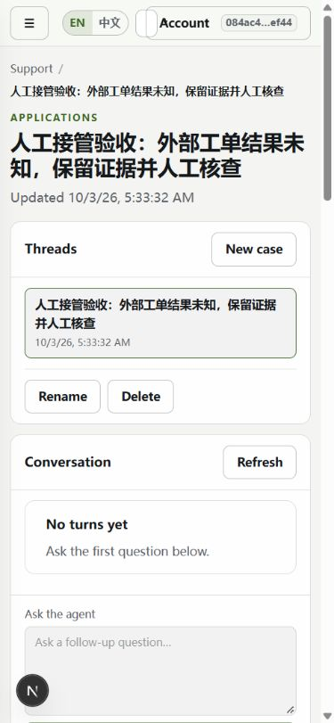
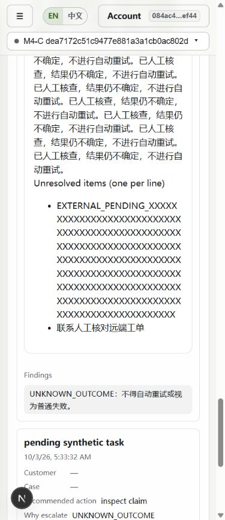

# 前端文字排版修正报告

日期：2026-10-03。基线 `e064c36`（M-I5 已验收并推送）。本轮使用本机隔离数据库与合成内容，未调用付费模型。最终代码对应本报告所在提交。

## 修复的问题

| 问题与复现 | 原因 | 修正 |
| --- | --- | --- |
| 1280px 客服/应用工作台右侧内容仅 240px，右边大幅空白 | 两列断点仅给 research artifacts 设置跨列，应用的 app-pane-stack 未覆盖 | 复用现有断点，三种应用 stack 在中等宽度跨两列，手机恢复单列 |
| 手机工作区选择器被挤成小框，与账户区域相邻挤压 | 顶栏所有控件共用一行，选择器空间低于自身内边距 | ≤480px 工作区选择器独占第二行；工作区/组织名称有限宽省略，完整名称仍由原控件提供 |
| 手机 Dashboard 首登引导提示逐字换行 | 引导主标题 nowrap 占用大部分宽度，说明只剩窄列 | ≤640px stat-row 单列，主标题允许换行，值及说明左对齐 |
| 长 Agent 名称把面包屑撑到约 1300px | 面包屑 flex 子项默认最小内容宽度且连续字符串不换行 | 限制子项宽度，min-width:0，允许连续字符串换行 |
| 加载长接管记录后，卡片内部被撑到约 2000px；滚动容器掩盖了页面级溢出 | 内部 grid 自动列按长字符串的内容宽度扩张 | pane-body/artifact-card 使用 minmax(0,1fr)，子项和字段可收缩，长事项与引用允许换行 |

同时加固共享标题/说明的长字符串换行、表单控件最小宽度、按钮换行与最大宽度、panel actions 折行、手机键值布局，以及列表文本子项最小宽度。沿用既有令牌和样式文件，没有新 CSS 依赖或 i18n 键。

## 浏览器验证

使用 computer-use/CUA 操作真实本机页面，API 经项目已有同源代理访问隔离数据库。

- 11 个核心页面 × 6 个宽度（360/390/768/1024/1280/1440）× 中英文 = **132** 个组合。
- 12 个扩展页面 × 3 个宽度（360/768/1280）× 中英文 = **72** 个组合。
- Dashboard、Agent 详情、Support 详情 × 4 个边界宽度（320/481/901/1281）× 中英文 = **24** 个组合。
- 合计 **228** 个组合，页面/元素越界、顶栏按钮碰撞及可见文本矩形交叠检查均通过。

核心页面：Dashboard、Agents、Knowledge、Tools、Runs、Approvals、Evaluations、Settings、Support 详情、Agent 详情、Run 详情。扩展页面：Research、Incidents、Analytics、Support 入口、Retrieval Playground、Run Compare、模型设置、Datasets、Experiments、Release Gates、Pricing、MCP Import。

Support 的 12 个主矩阵组合显式等待长未解决事项加载后重新测量，覆盖长问题、客户/工单连续 ID、URL、长关闭原因、连续英文未解决项，以及 NEEDS_ATTENTION/UNKNOWN_OUTCOME 对话。实际 UI 再次完成开启→接手→关闭，并保留两条未解决事项。没有触发远端工具或模型。

另检查手机端展开的检索参数、账户菜单及长接管卡片截图。菜单有不透明浮层遮盖下层内容，属于正常浮层；人工核实，不将跨层遮盖判成文字交叠。

## 自动检查与证据

- [主矩阵](evidence/layout-20261003/matrix.json)、[边界矩阵](evidence/layout-20261003/edges.json) 保存逐页测量。
- `scripts/layout_audit.mjs` 为可复用的只读 DOM 几何检查器；排除已裁剪文字和关闭的 details 内容，避免省略号/折叠区误报。
- `node scripts/check_layout_report.cjs` 验证覆盖数、失败项及证据/样式 SHA-256；包含 4 类注入坏记录的拒绝检查，退出 0。样式变化会要求重做证据，不能沿用旧通过记录。
- `node scripts/test_web_review.cjs`：12 组前端行为回归通过，退出 0。
- `tsc --noEmit`：退出 0。
- 最终 `next build`：退出 0；本机完整日志 `.scratch/mi34-20261002/layout-build-final-job/`。
- `git diff --check`：退出 0。本轮只改 CSS/检查脚本/文档；后端复用上一轮 1232 通过、4 跳过结果，没有重复运行不受影响的后端套件。

### 视觉对照

手机顶栏修复前：

长接管事项修复后：

另保存长名称复现、长卡片修复前后及展开检索参数的截图于同目录。

## 范围与限制

这些结果验证本机浏览器与所列视口/样本，不代表全部浏览器、所有弹窗或任意数据的布局保证。Knowledge、Approvals、评测子页、MCP 等主要覆盖空列表与初始表单；已加载长内容重点覆盖 Agent/Run/Support。没有伪造审批/远端 MCP 数据。

DOM 矩形检测是回归辅助：文本矩形无法完全表示字形和浮层遮挡；滚动表格、SVG 图表、pre 代码块不纳入普通页面越界判定，仍保留各自滚动行为。初轮记录中的省略号及折叠区误报已核实并修正检测器；最终矩阵采用修正后的可见性规则。本轮不宣称补齐旧收尾清单里的其他独立特性。
