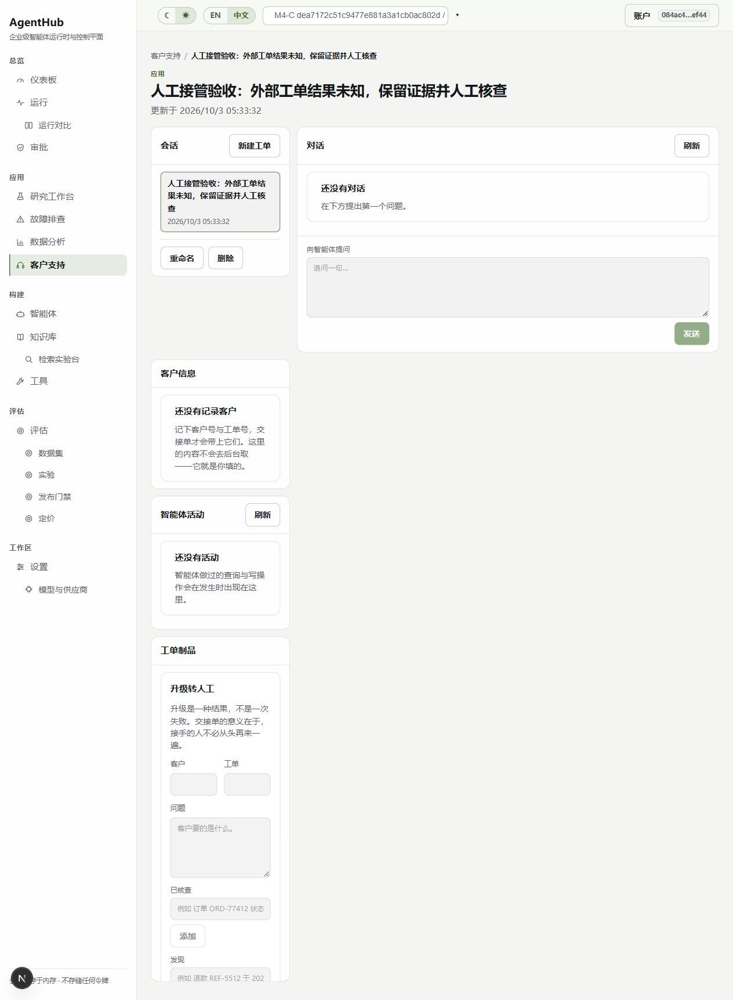

# M-I5 人工接管验收报告

日期：2026-10-03。承接 F07/T32，代码基线 `0c773a6`，最终代码为本报告所在提交。M-I3/M-I4 已按选定范围验收；本轮不新增付费模型调用，累计预算分配仍为 6.478488 元（包括未知调用预留，非账单）。

## 实现

- 新增 `packages/handoffs`、迁移 `0031`、工作区 API 与前端客户端；四态 OPEN/ASSIGNED/IN_PROGRESS/CLOSED 独立于审批与 Run。
- 管理员分配或重分配；有效操作成员接手；当前接手人填写关闭原因与未解决项。事务内重新核查用户及组织/工作区成员，未知前端权限禁用动作。
- 行锁加严格整数版本保护并发修改。相同关闭请求幂等，不重复审计；不同内容、操作者或陈旧版本冲突。
- 原始 artifact 哈希与内容留存，禁止修改/删除及所属 thread 删除，关闭后仍保留。复合外键限制跨租户绑定和级联销毁。
- 审计只记录 ID、状态、版本和内容哈希；关闭不会批准工具、重跑或消除 UNKNOWN_OUTCOME。
- UI 复用现有 handoff 卡片、workspace hooks、StatusBadge、HashValue；加载失败与尚未开启分开显示，409 刷新当前记录，工作区/会话切换重置表单。新增双语言 `handoffLifecycle` 文案。

完整状态、权限及 API 见 [首版契约](AgentHub-人工接管首版契约-20261003.md)。补充读取接口为 `GET /artifacts/{artifact_id}/handoff`，返回记录或 null。

## 验证与证据

| 检查 | 结果 |
| --- | --- |
| 全量单元及 PostgreSQL 集成 | 1232 通过、4 跳过，退出 0；[XML](evidence/mi3-mi4-20261002/handoff-all.xml) |
| 本轮后端专用用例 | 14 契约单元 + 9 PostgreSQL 集成，已包含在全量结果 |
| 前端回归 | `node scripts/test_web_review.cjs` 12 组通过，退出 0 |
| TypeScript | `tsc --noEmit`，退出 0 |
| 生产构建 | 最终代码构建，退出 0；本机日志 `.scratch/mi34-20261002/handoff-build-final-job/` |
| Ruff | 本轮新增与修改的 Python 文件，退出 0 |
| 浏览器 | 隔离合成账户，真实 API：开启→分配给自己→接手→填写原因与两条未解决项→关闭；切换英文后 Closed 及留存内容正确 |

集成覆盖并发开启/抢单、管理员重分配、成员失权/移除/禁用、VIEWER、跨工作区、陈旧版本、重复关闭、源证据和线程留存、审计失败事务回滚、真实 bearer API 错误 envelope。NEEDS_ATTENTION/UNKNOWN_OUTCOME 的 Run 在关闭后保持原状态。浏览器样本为合成摘要，没有模拟成真实模型故障；实际故障状态的隔离性由集成测试验证。

## 限制与后续

4 个真实 worker 环境用例按原条件跳过；既有 httpx 等依赖弃用警告保留。当前不支持取消、重开、排班、自动恢复 Run 或删除历史。T32 的生命周期范围已实现，原前端收尾清单其他独立项不能据此标完成。

浏览器发现中等宽度下应用右侧内容落入 240px 窄列；这是已记录的排版缺陷，按用户授权转入下一轮前端文字专项修正，尚未宣称排版验收完成。
